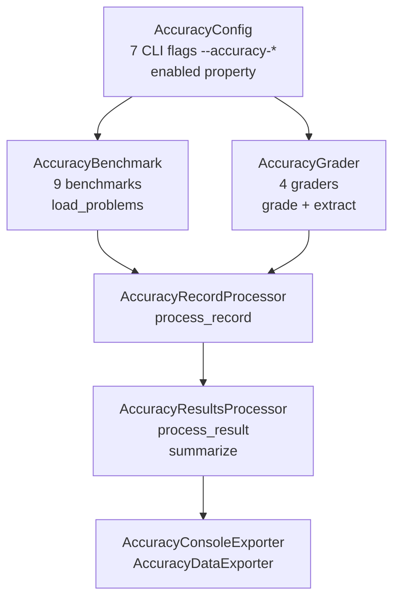

<!--
# SPDX-FileCopyrightText: Copyright (c) 2025-2026 NVIDIA CORPORATION & AFFILIATES. All rights reserved.
# SPDX-License-Identifier: Apache-2.0
-->

# Accuracy Benchmarking: Stub Implementation Guide

This document catalogs every stubbed method in the accuracy benchmarking scaffolding. The scaffolding is fully integrated into the plugin system, CLI, and config pipeline — the performance benchmarking path is unaffected.

**Status summary:** With the MATH-500 loader landing on top of the AIME25 / AIME24 / BigBench / HellaSwag stack, `MultipleChoiceGrader`, `MathGrader`, `CodeExecutionGrader`, `LightevalExprGrader`, `LightevalLatexGrader`, `LightevalGPQAGrader`, `ExactMatchGrader`, `MMLUBenchmark`, `AIMEBenchmark`, `HellaSwagBenchmark`, `BigBenchBenchmark`, `AIME24Benchmark`, `AIME25Benchmark`, and `Math500Benchmark` are fully implemented; the remaining benchmarks (`gpqa_diamond`, `lcb_codegeneration`) are still stubs and ship behind `NotImplementedError` until each follow-up branch lands. Use the implemented classes as canonical references when filling in the remaining stubs.

## Table of Contents

- [Architecture Overview](#architecture-overview)
- [Data Models](#data-models)
- [Protocols](#protocols)
- [CLI Configuration](#cli-configuration)
- [Graders](#graders)
- [Benchmarks](#benchmarks)
- [Processors](#processors)
- [Exporters](#exporters)
- [Plugin Registration](#plugin-registration)
- [Implementation Notes](#implementation-notes)

---

## Architecture Overview



All processors and exporters **self-disable** when `cfg.accuracy.enabled is False` by raising their respective `Disabled` exceptions in `__init__`. This is the same pattern used by `RawRecordWriterProcessor`, `ServerMetricsCsvExporter`, etc.

---

## Data Models

**File:** `src/aiperf/accuracy/models.py`

### GradingResult

Return type for all grader `grade()` methods.

```python
class GradingResult(AIPerfBaseModel):
    correct: bool           # Whether the response was graded as correct
    confidence: float       # Confidence score (0.0 to 1.0)
    reasoning: str          # Explanation of the grading decision
    extracted_answer: str   # Answer extracted from the model response
    ground_truth: str       # Expected correct answer
    unparsed: bool = False  # True when fallback parsing was needed
```

### BenchmarkProblem

Return type for all benchmark `load_problems()` methods.

```python
class BenchmarkProblem(AIPerfBaseModel):
    prompt: str                       # The prompt to send to the LLM
    ground_truth: str                 # The expected correct answer
    task: str                         # Task/subtask name within the benchmark
    metadata: dict = {}               # Additional problem metadata
    raw_messages: list[dict] | None = None # Preformatted messages, when supplied by a loader
```

---

## Protocols

**File:** `src/aiperf/accuracy/protocols.py`

### AccuracyGraderProtocol

```python
@runtime_checkable
class AccuracyGraderProtocol(Protocol):
    def __init__(self, run: BenchmarkRun, **kwargs) -> None: ...
    async def grade(self, response_text: str, ground_truth: str, **kwargs) -> GradingResult: ...
    def extract_answer(self, response_text: str, **kwargs) -> str: ...
```

### AccuracyBenchmarkProtocol

```python
@runtime_checkable
class AccuracyBenchmarkProtocol(Protocol):
    def __init__(self, run: BenchmarkRun, **kwargs) -> None: ...
    async def load_problems(self, tasks: list[str] | None, n_shots: int, enable_cot: bool) -> list[BenchmarkProblem]: ...
```

---

## CLI Configuration

**File:** `src/aiperf/config/accuracy.py`

All 7 flags appear under the `Accuracy` group in `aiperf profile --help`.

| CLI Flag | Field | Type | Default | Description |
|----------|-------|------|---------|-------------|
| `--accuracy-benchmark` | `benchmark` | `str \| None` | `None` | Benchmark to run (e.g., `mmlu`, `aime`). **Enables accuracy mode when set.** |
| `--accuracy-tasks` | `tasks` | `list[str] \| None` | `None` | Subtasks to evaluate (e.g., MMLU subjects) |
| `--accuracy-n-shots` | `n_shots` | `int | None` (0-32 when set) | `None` | Number of few-shot examples; `None` uses the benchmark default |
| `--accuracy-enable-cot` | `enable_cot` | `bool` | `False` | Enable chain-of-thought prompting |
| `--accuracy-grader` | `grader` | `str \| None` | `None` | Override benchmark's default grader |
| `--accuracy-system-prompt` | `system_prompt` | `str \| None` | `None` | Custom system prompt override |
| `--accuracy-verbose` | `verbose` | `bool` | `False` | Show per-problem grading details |

**Key property:** `AccuracyConfig.enabled -> bool` returns `self.benchmark is not None`.

**Stub-plugin validator** lives in `AccuracyConfig._reject_stub_plugins()`, which rejects accuracy plugins that still advertise stub status. Update that validator when converting a stub into a supported plugin.

---

## Graders

All graders inherit from `BaseGrader(AIPerfLoggerMixin)` and must implement 2 methods.

### Base Class

**File:** `src/aiperf/accuracy/graders/base.py`

```python
class BaseGrader(AIPerfLoggerMixin):
    def __init__(self, run: BenchmarkRun, **kwargs) -> None
    async def grade(self, response_text: str, ground_truth: str, **kwargs) -> GradingResult     # raises NotImplementedError
    def extract_answer(self, response_text: str, **kwargs) -> str                               # raises NotImplementedError
```

### Implemented

| # | Class | File | Plugin Key | Description |
|---|-------|------|------------|-------------|
| 1 | `MultipleChoiceGrader` | `graders/multiple_choice.py` | `multiple_choice` | **IMPLEMENTED in PR #815** — canonical reference for new graders. Matches choice labels (A/B/C/D) by regex extraction then exact comparison. |
| 2 | `MathGrader` | `graders/math.py` | `math` | **IMPLEMENTED with the AIME loader.** Extracts the last `\boxed{...}` (balanced braces), falls back to "the answer is X" / last-number heuristics. Comparison uses a sympy + latex2sympy2-extended symbolic parsing path when the `[accuracy]` extras are installed (ported from the trt-llm benchmark recipe's `math_equal`/`strip_string`); when those packages are missing, the grader transparently falls back to a stdlib `Fraction` parsing + normalized string equality comparison and emits a one-time warning. |
| 3 | `CodeExecutionGrader` | `graders/code_execution.py` | `code_execution` | **IMPLEMENTED with the AIME loader.** Wraps lighteval's `codegen_metrics` to grade LCB-style code-generation responses by sandboxed execution: extracts the response's code block via lighteval's `extract_code`, runs it against the bundled public + private test cases in a `ProcessPoolExecutor` with `num_process_evaluate=8`, and reports pass@1. Requires the `[accuracy]` extras (lighteval); raises `RuntimeError` at construction if missing. Used by AIP-881 (LCB CodeGen). |
| 4 | `LightevalExprGrader` | `graders/lighteval_grader.py` | `lighteval_expr` | **IMPLEMENTED with the AIME loader.** Wraps lighteval's `MultilingualExtractiveMatchMetric` configured with `ExprExtractionConfig` for gold and `(ExprExtractionConfig, LatexExtractionConfig(boxed_match_priority=0))` for predictions — matches the trt-llm recipe's `expr_gold_metric`. Used by AIP-875/876 (AIME24/25). Requires the `[accuracy]` extras. |
| 5 | `LightevalLatexGrader` | `graders/lighteval_grader.py` | `lighteval_latex` | **IMPLEMENTED with the AIME loader.** Same shape as `LightevalExprGrader` but the gold extractor uses `LatexExtractionConfig` — matches the trt-llm recipe's `latex_gold_metric`. Used by AIP-879 (MATH-500). Requires the `[accuracy]` extras. |
| 6 | `LightevalGPQAGrader` | `graders/lighteval_grader.py` | `lighteval_gpqa` | **IMPLEMENTED with the AIME loader.** Wraps `MultilingualExtractiveMatchMetric` with `IndicesExtractionConfig(prefix_for_extraction="NativeLetters")` to extract A/B/C/D in both gold and prediction — matches the trt-llm recipe's `gpqa_metric`. Used by AIP-880 (GPQA-Diamond). Requires the `[accuracy]` extras. |

| 7 | `ExactMatchGrader` | `graders/exact_match.py` | `exact_match` | **IMPLEMENTED with the HellaSwag loader.** Strict `pred.strip() == gold.strip()` grader matching DeepEval's `Scorer.exact_match_score` (case-sensitive, no normalization). Used by HellaSwag and BigBench-Hard for trt-llm reference parity. |

### Still Stubbed

_All graders are now implemented._

**Each grader has 2 methods to implement:**

```python
async def grade(self, response_text: str, ground_truth: str, **kwargs) -> GradingResult
def extract_answer(self, response_text: str, **kwargs) -> str
```

---

## Benchmarks

All benchmarks use `AIPerfLoggerMixin` and must implement 1 method.

### Implemented

| # | Class | File | Plugin Key | Default Grader | Default N-Shots | Notes |
|---|-------|------|------------|----------------|-----------------|-------|
| 1 | `MMLUBenchmark` | `benchmarks/mmlu.py` | `mmlu` | `multiple_choice` | 5 | **IMPLEMENTED in PR #815** — canonical reference for new benchmarks. Downloads via HuggingFace datasets, handles few-shot formatting and CoT. |
| 2 | `AIMEBenchmark` | `benchmarks/aime.py` | `aime` | `math` | 8 | **IMPLEMENTED.** Loads `Maxwell-Jia/AIME_2024`, instructs the model to wrap its final integer in `\boxed{}`, supports few-shot priming and chain-of-thought. `default_enable_cot=true`. |
| 3 | `HellaSwagBenchmark` | `benchmarks/hellaswag.py` | `hellaswag` | `exact_match` | 10 | **IMPLEMENTED.** Loads `Rowan/hellaswag` (validation split filtered per task by `activity_label`; train split feeds the "one few-shot per unique activity_label" rule). Prompt rendering delegates to `deepeval.benchmarks.HellaSwag`'s `HellaSwagTemplate.generate_output`, so output is byte-equal to the trt-llm recipe's DeepEval-backed path. Pairs with `exact_match` for strict `Scorer.exact_match_score` semantics. Requires the `[accuracy]` extras (deepeval). |
| 4 | `BigBenchBenchmark` | `benchmarks/bigbench.py` | `bigbench` | `exact_match` | 3 | **IMPLEMENTED.** Loads `lukaemon/bbh` (27 BBH subtasks). Prompt rendering delegates to `deepeval.benchmarks.BigBenchHard`'s `BigBenchHardTemplate.generate_output`, which reads the 27 canonical CoT/shot prompt files DeepEval ships as package data. Pairs with `exact_match` for the recipe's strict `Scorer.exact_match_score` semantics. `default_n_shots=3`, `default_enable_cot=true`. Requires the `[accuracy]` extras (deepeval). |
| 5 | `AIME24Benchmark` | `benchmarks/aime24.py` | `aime24` | `lighteval_expr` | 0 | **IMPLEMENTED.** Loads `HuggingFaceH4/aime_2024` (train split) and emits the bare problem text as a single user message — no instruction prefix, no few-shot priming. Mirrors the trt-llm benchmark recipe's `acc_bench_lighteval.py` configuration (`few_shots_split=None`, `generation_size=32768`). Pairs with `lighteval_expr` for the recipe's `expr_gold_metric` extraction. |
| 6 | `AIME25Benchmark` | `benchmarks/aime25.py` | `aime25` | `lighteval_expr` | 0 | **IMPLEMENTED.** Same lighteval-aligned shape as `AIME24Benchmark` but pointed at `yentinglin/aime_2025` (the recipe's `aime25` task config). Identical prompt rendering, generation size, and grader pairing. |
| 7 | `Math500Benchmark` | `benchmarks/math_500.py` | `math_500` | `lighteval_latex` | 0 | **IMPLEMENTED.** Loads `HuggingFaceH4/MATH-500` (test split). Same lighteval-aligned shape as AIME24/25, but `ground_truth` is the full `solution` text (containing `\boxed{answer}`); `LightevalLatexGrader` extracts the boxed expression at grade time. Per-row `task` = `subject` so the accuracy CSV breaks down by MATH subject. |

### Still Stubbed

| # | Class | File | Plugin Key | Default Grader | Default N-Shots |
|---|-------|------|------------|----------------|-----------------|
| 1 | `GPQADiamondBenchmark` | `benchmarks/gpqa_diamond.py` | `gpqa_diamond` | `multiple_choice` | 0 |
| 2 | `LCBCodeGenerationBenchmark` | `benchmarks/lcb_codegeneration.py` | `lcb_codegeneration` | `code_execution` | 0 |

**Each benchmark has 1 method to implement:**

```python
async def load_problems(
    self, tasks: list[str] | None, n_shots: int, enable_cot: bool
) -> list[BenchmarkProblem]
```

Default grader and n-shots are stored in `plugins.yaml` metadata and can be read at runtime via:
```python
plugins.get_metadata(PluginType.ACCURACY_BENCHMARK, "mmlu")  # -> {"default_grader": "multiple_choice", "default_n_shots": 5}
```

---

## Processors

### AccuracyRecordProcessor — IMPLEMENTED in PR #815

**File:** `src/aiperf/accuracy/accuracy_record_processor.py`
**Parent:** `AIPerfLifecycleMixin`
**Implements:** `RecordProcessorProtocol`
**Plugin key:** `accuracy_record` (under `record_processor`)
**Disables via:** `PostProcessorDisabled` when `not cfg.accuracy.enabled`

This class is fully implemented and serves as the canonical reference for wiring grading into the record processing pipeline.

```python
async def process_record(
    self, record: ParsedResponseRecord, metadata: MetricRecordMetadata
) -> MetricRecordDict                                                          # IMPLEMENTED in PR #815
```

**Reference implementation:** `MetricRecordProcessor` in `src/aiperf/post_processors/metric_record_processor.py`

### AccuracyResultsProcessor — IMPLEMENTED in PR #815

**File:** `src/aiperf/accuracy/accuracy_results_processor.py`
**Parent:** `AIPerfLifecycleMixin`
**Implements:** `ResultsProcessorProtocol`
**Plugin key:** `accuracy_results` (under `results_processor`)
**Disables via:** `PostProcessorDisabled` when `not cfg.accuracy.enabled`

This class is fully implemented and serves as the canonical reference for aggregating per-task accuracy metrics.

```python
async def process_result(self, record_data: MetricRecordsData) -> None         # IMPLEMENTED in PR #815
async def summarize(self) -> list[MetricResult]                                # IMPLEMENTED in PR #815
```

**Reference implementation:** `MetricResultsProcessor` in `src/aiperf/post_processors/metric_results_processor.py`

---

## Exporters

### AccuracyConsoleExporter — IMPLEMENTED in PR #815

**File:** `src/aiperf/accuracy/accuracy_console_exporter.py`
**Parent:** `AIPerfLoggerMixin`
**Implements:** `ConsoleExporterProtocol`
**Plugin key:** `accuracy` (under `console_exporter`)
**Disables via:** `ConsoleExporterDisabled` when `not cfg.accuracy.enabled`

This class is fully implemented and serves as the canonical reference for displaying accuracy results in the terminal.

```python
async def export(self, console: Console) -> None                               # IMPLEMENTED in PR #815
```

**Reference implementation:** `ConsoleMetricsExporter` in `src/aiperf/exporters/console_metrics_exporter.py`

### AccuracyDataExporter — IMPLEMENTED in PR #815

**File:** `src/aiperf/accuracy/accuracy_data_exporter.py`
**Parent:** `AIPerfLoggerMixin`
**Implements:** `DataExporterProtocol`
**Plugin key:** `accuracy_csv` (under `data_exporter`)
**Disables via:** `DataExporterDisabled` when `not cfg.accuracy.enabled`

This class is fully implemented and serves as the canonical reference for writing accuracy results to CSV.

```python
def get_export_info(self) -> FileExportInfo                                    # IMPLEMENTED in PR #815
async def export(self) -> None                                                 # IMPLEMENTED in PR #815
```

**Reference implementation:** `MetricsCsvExporter` in `src/aiperf/exporters/metrics_csv_exporter.py`

---

## Plugin Registration

All stubs are registered in `src/aiperf/plugin/plugins.yaml` and `src/aiperf/plugin/categories.yaml`.

### New Plugin Categories

| Category | Protocol | Generated Enum |
|----------|----------|----------------|
| `accuracy_grader` | `AccuracyGraderProtocol` | `AccuracyGraderType` |
| `accuracy_benchmark` | `AccuracyBenchmarkProtocol` | `AccuracyBenchmarkType` |

### New PluginType Members

- `PluginType.ACCURACY_GRADER`
- `PluginType.ACCURACY_BENCHMARK`

### Registrations in Existing Categories

| Category | Plugin Key | Class |
|----------|-----------|-------|
| `record_processor` | `accuracy_record` | `AccuracyRecordProcessor` |
| `results_processor` | `accuracy_results` | `AccuracyResultsProcessor` |
| `console_exporter` | `accuracy` | `AccuracyConsoleExporter` |
| `data_exporter` | `accuracy_csv` | `AccuracyDataExporter` |

---

## Implementation Notes

### Method Count Summary

| Component | Implemented | Still Stubbed | Methods per Stub | Remaining Methods |
|-----------|-------------|---------------|------------------|-------------------|
| Graders | 7 (all) | 0 | — | 0 |
| Benchmarks | 7 (incl. MMLU, AIME, HellaSwag, BigBench, AIME24, AIME25, Math500) | 2 | 1 (`load_problems`) | 2 |
| Record Processor | 1 (`AccuracyRecordProcessor`) | 0 | — | 0 |
| Results Processor | 1 (`AccuracyResultsProcessor`) | 0 | — | 0 |
| Console Exporter | 1 (`AccuracyConsoleExporter`) | 0 | — | 0 |
| Data Exporter | 1 (`AccuracyDataExporter`) | 0 | — | 0 |
| Stub-plugin Validator | 0 | 1 | 1 (`AccuracyConfig._reject_stub_plugins`) | 1 |
| **Total** | **18** | **3** | | **3** |

### Self-Disabling Pattern

Processors and exporters raise their `Disabled` exception **in `__init__`** when accuracy is off. The existing framework catches these and silently skips the plugin. No code changes needed to support this — it uses the same pattern as `RawRecordWriterProcessor` and `ServerMetricsCsvExporter`.

### Suggested Implementation Order

The processors, exporters, all graders, and seven benchmarks (`MMLUBenchmark`, `AIMEBenchmark`, `HellaSwagBenchmark`, `BigBenchBenchmark`, `AIME24Benchmark`, `AIME25Benchmark`, `Math500Benchmark`) are already wired end-to-end. The remaining work is the two stub benchmarks; mirror the existing loader whose grader matches:

1. **`gpqa_diamond`** — mirror `MMLUBenchmark` (`benchmarks/mmlu.py`); pair with the `lighteval_gpqa` grader.
2. **`lcb_codegeneration`** — mirror `MMLUBenchmark`'s scaffolding; pair with the `code_execution` grader.
3. **Stub-plugin validator** — update `AccuracyConfig._reject_stub_plugins()` whenever a benchmark moves from stubbed to supported.

### Key Files for Reference

| What | Where |
|------|-------|
| **Canonical grader** | `src/aiperf/accuracy/graders/multiple_choice.py` |
| **Canonical benchmark** | `src/aiperf/accuracy/benchmarks/mmlu.py` |
| **Canonical record processor** | `src/aiperf/accuracy/accuracy_record_processor.py` |
| **Canonical results processor** | `src/aiperf/accuracy/accuracy_results_processor.py` |
| **Canonical console exporter** | `src/aiperf/accuracy/accuracy_console_exporter.py` |
| **Canonical data exporter** | `src/aiperf/accuracy/accuracy_data_exporter.py` |
| Disabled exception pattern | `src/aiperf/post_processors/raw_record_writer_processor.py:47` |
| Record processor protocol | `src/aiperf/post_processors/protocols.py` |
| Exporter protocols | `src/aiperf/exporters/protocols.py` |
| Plugin lookup API | `plugins.get_class(PluginType.ACCURACY_GRADER, "exact_match")` |
| Metadata lookup API | `plugins.get_metadata(PluginType.ACCURACY_BENCHMARK, "mmlu")` |
