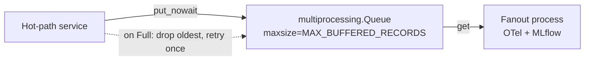

# AIPerf Code Patterns

Code examples for common development tasks. Referenced from CLAUDE.md.

## CLI Command Pattern

Commands live in `src/aiperf/cli_commands/`, one file per command. They are
lazily loaded via import strings in `aiperf.cli` — modules are only imported
when their command is invoked:

```python
# aiperf/cli.py — register with lazy import strings
app.command("aiperf.cli_commands.profile:app", name="profile")
```

```python
# aiperf/cli_commands/profile.py — thin command definition
from cyclopts import App
from aiperf.config.flags import CLIConfig

app = App(name="profile")

@app.default
def profile(*, cli_config: CLIConfig) -> None:
    """Run the Profile subcommand."""
    from aiperf.cli_utils import exit_on_error
    from aiperf.config.loader.errors import ConfigurationError

    with exit_on_error(title="Error Running AIPerf System", show_traceback=False):
        from aiperf.config.flags.resolver import resolve_config
        from aiperf.config.loader import build_benchmark_plan

        config = resolve_config(cli_config, cli_config.config_file)
        plan = build_benchmark_plan(config)

    with exit_on_error(
        title="Error Running AIPerf System",
        quiet_for=(ConfigurationError,),
    ):
        from aiperf.cli_runner import run_benchmark  # heavy import deferred

        run_benchmark(plan)
```

**Conventions:**
- Export a single `App` named `app`.
- Hyphenate multi-word commands: `App(name="analyze-trace")`.
- Keep module-level imports minimal; heavy deps go inside the function body.
- Heavy implementation logic lives in a `cli.py` inside the owning domain
  package (e.g. `aiperf/plugin/cli.py`), lazily imported at call time.

## Adding a New CLI Flag

CLIConfig is a flat DTO — every CLI flag is a top-level field on
`CLIConfig` with an `Annotated[...]` annotation that carries Pydantic
metadata + the cyclopts CLI binding. **Never add a new nested config
class.** Disambiguate collisions with a section prefix
(e.g. `image_batch_size` vs `audio_batch_size`).

```python
# src/aiperf/config/flags/cli_config.py — add the field in its section block
my_new_flag: Annotated[
    int | None,
    Field(
        ge=1,
        description="One-line user-facing description rendered in --help "
        "and docs/cli-options.md. Mention units, defaults, and obvious "
        "interactions with other flags.",
    ),
    CLIParameter(
        name=("--my-new-flag",),       # CLI flag name (independent of attr name)
        group=Groups.LOAD_GENERATOR,   # cyclopts --help group; pick from list below
    ),
] = None
```

**Pick a `Groups.X` from `src/aiperf/config/cli_parameter.py`:**

`ENDPOINT`, `INPUT`, `FIXED_SCHEDULE`, `GOODPUT`, `OUTPUT`, `HTTP_TRACE`,
`TOKENIZER`, `LOAD_GENERATOR`, `WARMUP`, `USER_CENTRIC`,
`REQUEST_CANCELLATION`, `CONVERSATION_INPUT`, `ISL`, `OSL`, `PROMPT`,
`PREFIX_PROMPT`, `RANKINGS`, `SYNTHESIS`, `AUDIO_INPUT`, `IMAGE_INPUT`,
`VIDEO_INPUT`, `SERVICE`, `SERVER_METRICS`, `GPU_TELEMETRY`, `UI`,
`WORKERS`, `ZMQ_COMMUNICATION`, `ACCURACY`, `MULTI_RUN`.

If none fit, prefer adding a new `Groups.X` constant in
`src/aiperf/config/cli_parameter.py` over reusing an unrelated group.

Then:

1. Add the attr name to the appropriate `<SECTION>_FIELDS` frozenset in
   `src/aiperf/config/flags/_section_fields.py` so the resolver/converter
   can scope `cli.model_fields_set & <SECTION>_FIELDS` queries.
2. If the flag maps to an existing `AIPerfConfig` key, add an entry to that section's
   field map (e.g. `_ENDPOINT_FIELD_MAP` in `_converter_endpoint.py`).
   Otherwise, read it directly in the relevant `_converter_*.py` builder.
3. Run `make generate-cli-docs` to regen `docs/cli-options.md`. Run
   `make generate-env-vars-docs` if you also added a corresponding env var.
4. Add a unit test under `tests/unit/config/` constructing
   `CLIConfig(my_new_flag=...)` and asserting the converter emits the
   right `AIPerfConfig` shape.
5. The disjointedness invariant in
   `tests/unit/config/v1/test_section_fields.py` will catch any
   cross-section name collision automatically.

**CLI flag DTO charter (enforced):**
- No validators on CLIConfig fields. `BeforeValidator(parse_str_or_list)` for
  CLI input coercion is fine; domain validation (range checks across fields,
  cross-field constraints) lives on `AIPerfConfig`, not CLIConfig.
- The CLI-to-envelope converter is the only module outside `cli_commands/` that may
  read `CLIConfig` attributes.

## Service Pattern

Services run in separate processes via `bootstrap.py`:

```python
class MyService(BaseComponentService):
    @on_message(MessageType.MY_MSG)
    async def _handle(self, msg: MyMsg) -> None:
        await self.publish(ResponseMsg(data=msg.data))
```

Register in `plugins.yaml`:

```yaml
service:
  my_service:
    class: aiperf.my_module.my_service:MyService
    description: My custom service
    metadata:
      required: true
      auto_start: true
```

**Config types:**
- `CLIConfig`: unified CLI input DTO carrying both benchmark params (endpoints, loadgen) and service-runtime knobs (ZMQ ports, logging level)

## Model Pattern

Use `AIPerfBaseModel` for data, `BaseConfig` for configuration:

```python
from pydantic import Field
from aiperf.common.models import AIPerfBaseModel

class Record(AIPerfBaseModel):
    ts_ns: int = Field(description="Timestamp in nanoseconds")
    value: float = Field(description="Measured value")
```

## Message Pattern

Messages require `message_type` field and handler decorator:

```python
from aiperf.common.messages import Message, MessageTypeT
from aiperf.common.hooks import on_message

class MyMsg(Message):
    message_type: MessageTypeT = MessageType.MY_MSG
    data: list[Record] = Field(description="Records to process")

# In service class:
@on_message(MessageType.MY_MSG)
async def _handle(self, msg: MyMsg) -> None:
    await self.publish(OtherMsg(data=msg.data))
```

Auto-subscription happens during `@on_init` phase.

## Plugin System Pattern

YAML-based registry with lazy-loading:

```yaml
# plugins.yaml
endpoint:
  chat:
    class: aiperf.endpoints.openai_chat:ChatEndpoint
    description: OpenAI Chat Completions endpoint
    metadata:
      endpoint_path: /v1/chat/completions
      supports_streaming: true
      produces_tokens: true
      tokenizes_input: true
      supports_audio: true
      supports_images: true
      supports_videos: true
      metrics_title: LLM Metrics
```

Local GPU telemetry collectors declare themselves via `is_local`. Each collector class implements `validate_environment()` to surface missing native bindings before the benchmark starts; DCGM is a passthrough no-op.

```yaml
# plugins.yaml
gpu_telemetry_collector:
  my_local_gpu:
    class: my_package.gpu:MyLocalGPUCollector
    description: Local GPU telemetry collector using vendor Python bindings.
    metadata:
      is_local: true
```

```python
from aiperf.plugin import plugins
from aiperf.plugin.enums import PluginType

EndpointClass = plugins.get_class(PluginType.ENDPOINT, 'chat')
```

## Error Handling Pattern

Log errors and publish `ErrorDetails` in messages:

```python
try:
    await risky_operation()
except Exception as e:
    self.error(f"Operation failed: {e!r}")
    await self.publish(ResultMsg(error=ErrorDetails.from_exception(e)))
```

## Platform Branching

Platform-conditional code MUST branch on `IS_WINDOWS` / `IS_MACOS` / `IS_LINUX`
from `aiperf.common.constants` — never on `platform.system()` directly. The
constants are evaluated once at import time, are uniformly greppable, and
produce smaller diffs.

```python
# Yes — uniform pattern across the codebase
from aiperf.common.constants import IS_WINDOWS, IS_MACOS

if IS_WINDOWS:
    ctypes.WinDLL("winmm").timeBeginPeriod(1)
elif IS_MACOS:
    _redirect_stdio_to_devnull()

# No — re-imports `platform`, hits `platform.system()` per call, harder to grep
import platform
if platform.system() == "Windows":
    ...
```

Canonical examples:
- `src/aiperf/common/bootstrap.py` — event-loop policy switch, timer-resolution bump, stdio FD redirect (Windows + macOS branches)
- `src/aiperf/config/comm/ipc.py` — `build_socket_address` (ipc:// on POSIX vs tcp:// loopback on Windows)
- `src/aiperf/common/base_service.py` — force-kill path (`os._exit` on Windows vs SIGKILL on POSIX)

For tests that exercise both branches from non-target hosts, patch the constant at its consumer site (not at the source) — see `tests/unit/common/test_bootstrap_windows.py` for the pattern.

## Logging Pattern

Use lambda for expensive log messages:

```python
# Expensive - lambda defers evaluation
self.debug(lambda: f"Processing {len(self._items())} items")

# Cheap - direct string is fine
self.info("Starting service")
```

## NaN/Inf Discipline Pattern

NaN/+inf/-inf in metric data corrupts downstream artifacts in three ways:
`orjson.dumps` (and Pydantic `model_dump_json`) silently coerce them to JSON
`null`, which is indistinguishable from "metric was missing"; CSV writers
emit literal `"nan"`/`"inf"` strings that pandas/duckdb parse
inconsistently; and `np.mean`/`np.std`/`polyfit` poison downstream decision
logic (Pareto fronts, BO acquisition maxima, plateau detectors) without
raising.

The `aiperf.common.finite` module centralizes the discipline as four
primitives. Use them at every numeric boundary.

### `FiniteFloat` for Pydantic metric fields

```python
from pydantic import Field
from aiperf.common.finite import FiniteFloat
from aiperf.common.models import AIPerfBaseModel

class MetricSummary(AIPerfBaseModel):
    mean: FiniteFloat = Field(description="Sample mean (must be finite)")
    std: FiniteFloat | None = Field(
        default=None,
        description="Sample stddev; None means insufficient samples",
    )
    p99: FiniteFloat | None = Field(
        default=None,
        description="99th percentile latency in ms; None means no samples",
    )
```

The `AfterValidator` rejects NaN/+inf/-inf at config-load and
`model_validate` time with a debuggable message. For
finite-or-explicitly-missing semantics, use `FiniteFloat | None` — the
validator only fires when a non-None value is provided.

### `scrub_non_finite` before every JSON exporter

```python
import orjson
from aiperf.common.finite import scrub_non_finite

def export_records_json(records: list[Record], out_path: Path) -> None:
    payload = {"records": [r.model_dump() for r in records]}
    out_path.write_bytes(orjson.dumps(scrub_non_finite(payload)))
```

`scrub_non_finite` recursively walks `dict`/`list`/`tuple` containers and
rewrites non-finite numeric values to `None`. It leaves `str`/`bytes`/`bool`
alone and handles numpy scalar types correctly (`numpy.float32`,
`numpy.float64`).

### `is_finite_value` for the canonical finiteness check

```python
from aiperf.common.finite import is_finite_value

def maybe_record_throughput(value: float) -> None:
    if not is_finite_value(value):
        self.warning(lambda: f"Skipping non-finite throughput: {value!r}")
        return
    self._records.append(value)
```

Use `is_finite_value` instead of `math.isfinite` or `not math.isnan`:
`isinstance(x, float)` misses numpy scalar types on some numpy versions,
and `math.isfinite` raises on non-numeric inputs.

### `nan_safe_mean` / `nan_safe_std` for aggregation

```python
from aiperf.common.finite import nan_safe_mean, nan_safe_std

# Partial-failure samples may contain NaN; np.mean would propagate.
samples = [r.latency_ms for r in records]  # may contain NaN
mean = nan_safe_mean(samples)               # None if no finite values
std = nan_safe_std(samples, ddof=1)         # None if < 2 finite values
```

Both functions return `None` (not NaN) when the input has too few finite
values, so callers can distinguish "no data" from "data averaged to NaN".

### Don't: the bug pattern these primitives prevent

```python
# WRONG: raw float field accepts NaN silently
class BadSummary(AIPerfBaseModel):
    p99: float = Field(description="99th percentile latency")  # accepts NaN

# WRONG: orjson silently coerces NaN/inf to JSON null
out_path.write_bytes(orjson.dumps({"p99": float("nan")}))
# Result on disk: {"p99": null}  -- indistinguishable from "missing"

# WRONG: np.mean propagates NaN through Pareto/BO downstream
import numpy as np
mean = float(np.mean([1.0, 2.0, float("nan")]))  # NaN, poisons callers
```

Mechanical CI invariants in `tests/unit/property/test_finite_invariants.py`
reject all three patterns for new code; see
[`global-invariants.md`](global-invariants.md) for the full contract and
the baseline-ratchet mechanism.

## Safe Filesystem Reads Pattern

User-supplied filesystem paths reaching AIPerf (e.g. `--extra-inputs
payload_template=<path>`, `endpoint.template.body` in a YAML config) must
go through `aiperf.common.path_safety.safe_read_template_path` rather than
inline `Path(...).read_text()` / `open(...).read()`. The helper is the
canonical CWE-22 path-traversal sanitizer recognized by SAST tools — every
inline read regenerates that finding.

### What the helper does

```python
from aiperf.common.path_safety import safe_read_template_path

body = safe_read_template_path(user_string)
if body is None:
    # safety check failed — caller picks the fallback semantic
    body = user_string          # template "path or inline" idiom
    # or: raise ValueError(f"Template file not readable: {user_string!r}")
```

Sanitizer chain (in the order SAST engines walk it):

1. `Path(ts).expanduser()` — catches `TypeError` / `ValueError` /
   `RuntimeError` (the last fires on unresolvable `~user` prefixes).
2. Reject if `path` or any component in `path.parents` is a symlink.
   `resolve()` alone is insufficient because it follows symlinked parent
   directories silently.
3. `path.resolve(strict=True)` — the canonical sanitizer that
   Snyk/CodeQL/Semgrep recognize; raises on missing paths.
4. Require `resolved.is_file()` — rejects directories, devices, fifos.
5. `read_text(encoding="utf-8")` — explicit decode; no platform default. Catches `UnicodeError` alongside `OSError` so non-UTF-8 files fall back to the literal-string branch rather than crashing config conversion.

Returning `None` on any failure preserves the existing "treat as a literal
value" fallback that both call sites (`_converter_endpoint` and
`TemplateEndpoint.__init__`) already implement.

### When this pattern does NOT apply

- **Path joining of trusted strings** — `Path(__file__).parent / "data.yaml"`,
  `artifact_dir / "inputs.json"`. These never resolve untrusted input; no
  sanitizer needed.
- **Binary reads** — `open(p, "rb")` for parquet/orjson/etc. The helper is
  UTF-8-text only. If a hardened binary variant is needed, add it to
  `aiperf.common.path_safety` alongside the existing helper rather than
  inlining `read_bytes()`.
- **Reads where missing-file should hard-fail rather than fall back** — the
  helper still works (returns `None`); the caller is responsible for
  raising instead of substituting a literal.

## Externally-Injected Derived Metric Pattern

A normal `BaseDerivedMetric` computes its value from peer metrics in the
`MetricResultsDict` via `_derive_value`. Some derived metrics, however, are
computed from data that never lives in the `MetricResultsDict` at all —
GPU power and energy come from telemetry scrapes, not from request
records, so their values must be injected by the accumulator that owns
the sensor data rather than derived by the standard registry walk.

Reference file: [`src/aiperf/metrics/types/power_efficiency_metrics.py`](https://github.com/ai-dynamo/aiperf/blob/main/src/aiperf/metrics/types/power_efficiency_metrics.py).
Injection site: `GPUTelemetryAccumulator.compute_efficiency_metrics`
([`src/aiperf/gpu_telemetry/accumulator.py`](https://github.com/ai-dynamo/aiperf/blob/main/src/aiperf/gpu_telemetry/accumulator.py)).

### The three-part contract

A metric class that participates in registry listings but is computed
externally must spell out the contract in three places so future agents
don't copy-paste the shape as the canonical derived-metric pattern.

**1. `Invariant:` paragraph in the class docstring.** Name the injection
site and the catching path explicitly:

```python
class TotalGpuEnergyMetric(BaseDerivedMetric[float]):
    """Sum of GPU energy consumed across all GPUs during the benchmark phase, in joules.

    Invariant: externally injected by
    `GPUTelemetryAccumulator.compute_efficiency_metrics` from
    energy_consumption counter deltas. `_derive_value` is intentionally
    non-functional; `MetricResultsProcessor.update_derived_metrics` is
    expected to catch NoMetricValue and skip the tag during its
    derivation walk.
    """
```

**2. `_derive_value` returns `NoReturn`.** The body unconditionally
raises, so the truthful annotation is `NoReturn` from `typing`. Returning
`float` would lie to type-checkers and downstream code that assumes the
derivation succeeded.

```python
from typing import NoReturn
from aiperf.common.exceptions import NoMetricValue
from aiperf.metrics.metric_dicts import MetricResultsDict

def _derive_value(self, metric_results: MetricResultsDict) -> NoReturn:
    raise NoMetricValue(
        "Cannot derive 'total_gpu_energy' from MetricResultsDict: this metric "
        "is externally injected by "
        "GPUTelemetryAccumulator.compute_efficiency_metrics. If this exception "
        "surfaces, the derivation walk is missing its NoMetricValue handler "
        "(see MetricResultsProcessor.update_derived_metrics)."
    )
```

**3. Error message names the operation, the injection site, and the catching
path.** A message that only names the source ("X is computed by the GPU
telemetry accumulator") gives debugging agents no clue where the contract
is enforced. The recommended shape is:

- *Operation*: what derivation was attempted (`Cannot derive 'X' from
  MetricResultsDict`).
- *Injection site*: which method is the source of truth
  (`GPUTelemetryAccumulator.compute_efficiency_metrics`).
- *Catching path*: where the exception is expected to be absorbed
  (`MetricResultsProcessor.update_derived_metrics`). If this fires in
  production, the catching path has a bug.

### Why not just skip the class entirely?

The class is still required because the rest of the system reads class
attributes (`tag`, `header`, `unit`, `display_order`, `flags`) when
emitting `MetricResult`s, ordering the console table, and gating display
behavior. The registry entry is structural metadata; the *value* is the
external injection.

### Where the injection happens

`RecordsManager._apply_gpu_efficiency_metrics` calls
`GPUTelemetryAccumulator.compute_efficiency_metrics`, which constructs
`MetricResult` objects directly with the relevant tags and appends them
to the records list before `ProcessRecordsResult` is built. The standard
`update_derived_metrics` walk sees these tags too, raises `NoMetricValue`
via `_derive_value`, catches it, and skips — so the externally-injected
values are not overwritten.

### Test contract

The error-message invariants are pinned by
[`tests/unit/metrics/test_power_efficiency_metrics.py`](https://github.com/ai-dynamo/aiperf/blob/main/tests/unit/metrics/test_power_efficiency_metrics.py)
(parametrized over the three classes): every `_derive_value` call must
raise `NoMetricValue` with a message that names the tag, the operation
source (`MetricResultsDict`), and the injection site
(`compute_efficiency_metrics`). A future weakening of any message fails
the test rather than silently drifting.

## Testing Pattern

```python
import pytest
from aiperf.plugin import plugins
from aiperf.plugin.enums import PluginType
from tests.harness import mock_plugin

@pytest.mark.asyncio
async def test_async_operation():
    result = await some_async_func()
    assert result.status == "ok"

@pytest.mark.parametrize("input,expected",
    [
        ("a", 1),
        ("b", 2),
    ]
)  # fmt: skip
def test_with_params(input, expected):
    assert process(input) == expected

def test_with_mock_plugin():
    with mock_plugin(PluginType.ENDPOINT, "test", MockClass):
        assert plugins.get_class(PluginType.ENDPOINT, "test") == MockClass
```

**Auto-fixtures** (always active): asyncio.sleep runs instantly, RNG=42, singletons reset.

## Console Exporter Pattern

Console exporters subclass `ConsoleMetricsExporter` and configure rendering via class attributes — no method overrides required for the common case. The base class handles filtering, grouping, table construction, and printing; subclasses just declare what to show and when to run.

```python
# src/aiperf/exporters/internal_metrics_console_exporter.py — gated single-table
class ConsoleInternalMetricsExporter(ConsoleMetricsExporter):
    """Console exporter for INTERNAL framework metrics, gated on dev mode."""

    title = "[yellow]NVIDIA AIPerf | Internal Metrics[/yellow]"
    require_flags = MetricFlags.INTERNAL    # records must have this flag
    exclude_flags = MetricFlags.ERROR_ONLY  # records with this flag are hidden
    console_groups = None                   # single combined table; ignore groups

    def _check_enabled(self, exporter_config: ExporterConfig) -> None:
        if not (Environment.DEV.MODE and Environment.DEV.SHOW_INTERNAL_METRICS):
            raise ConsoleExporterDisabled("Internal metrics are not enabled, ...")
```

| Class attribute  | Type                                     | Purpose                                                                                  |
|------------------|------------------------------------------|------------------------------------------------------------------------------------------|
| `title`          | `str | None`                             | Static title; `None` derives from endpoint metadata.                                     |
| `require_flags`  | `MetricFlags`                            | Records must have ALL of these. Default `MetricFlags.NONE` (no requirement).             |
| `exclude_flags`  | `MetricFlags`                            | Records with ANY of these are hidden. Default `ERROR_ONLY | INTERNAL | EXPERIMENTAL`.    |
| `console_groups` | `tuple[MetricConsoleGroup, ...] | None`  | Groups to include, in render order. `None` disables group filtering (single table).      |
| `split_by_group` | `bool`                                   | `True` → one table per non-empty group. `False` → single combined table.                 |

Override `_check_enabled(self, exporter_config)` to raise `ConsoleExporterDisabled` when the exporter shouldn’t run (env var, user-config flag, dev mode). The base class no-ops (always-enabled). The flag-driven sibling exporters (`ConsoleInternalMetricsExporter`, `ConsoleExperimentalMetricsExporter`, `HttpTraceConsoleExporter`) follow this pattern verbatim — copy one of them as a starting point.

## Uncertainty Plot Pattern

The latency-throughput uncertainty plot uses a one-data-contract, three-renderers architecture.

### Data Contract

```python
from aiperf.plot.models.uncertainty import BenchmarkPoint, LatencyThroughputUncertaintyData

point = BenchmarkPoint(
    x_mean=10.0, y_mean=100.0,
    x_ci_low=8.0, x_ci_high=12.0,
    y_ci_low=90.0, y_ci_high=110.0,
    cov_xy=5.0,  # enables rotated ellipses; None for axis-aligned
    label="concurrency=4",
)
data = LatencyThroughputUncertaintyData(
    points=[point],
    confidence_level=0.95,
    title="Latency vs Throughput",
    x_label="Latency (ms)",
    y_label="Throughput (tok/s)",
)
```

### Multi-Series Data Contract

```python
from aiperf.plot.models.uncertainty import (
    BenchmarkPoint, LatencyThroughputUncertaintyData, UncertaintySeries,
)

# One series per experiment variant (e.g., request_count=20 vs 50).
# When `series` is non-empty it overrides `points`; see get_series().
data = LatencyThroughputUncertaintyData(
    series=[
        UncertaintySeries(name="request_count=20", points=[
            BenchmarkPoint(x_mean=5.0, y_mean=50.0, x_ci_low=4.0, x_ci_high=6.0,
                           y_ci_low=45.0, y_ci_high=55.0, label="c=2", n_runs=10),
            BenchmarkPoint(x_mean=15.0, y_mean=120.0, x_ci_low=13.0, x_ci_high=17.0,
                           y_ci_low=110.0, y_ci_high=130.0, label="c=10", n_runs=8),
        ]),
        UncertaintySeries(name="request_count=50", points=[
            BenchmarkPoint(x_mean=6.0, y_mean=48.0, x_ci_low=4.5, x_ci_high=7.5,
                           y_ci_low=42.0, y_ci_high=54.0, label="c=2", n_runs=10),
            BenchmarkPoint(x_mean=18.0, y_mean=110.0, x_ci_low=15.0, x_ci_high=21.0,
                           y_ci_low=100.0, y_ci_high=120.0, label="c=10", n_runs=10),
        ]),
    ],
    confidence_level=0.95,
    title="Latency vs Throughput by Request Count",
    x_label="Latency (ms)",
    y_label="Throughput (tok/s)",
)
```

### Plotly Renderer (interactive + Kaleido PNG)

```python
from aiperf.plot.core.plot_generator import PlotGenerator

pg = PlotGenerator()
fig = pg.create_uncertainty_plot(data)
fig.write_image("output.png")  # Kaleido export
```

### Matplotlib Renderer (code-gen reports)

```python
from aiperf.plot.exporters import export_uncertainty_matplotlib
from pathlib import Path

export_uncertainty_matplotlib(data, Path("output.png"))
```

### Ellipse Geometry Utility

```python
from aiperf.plot.geometry import compute_ellipse_vertices, compute_axis_aligned_ellipse_vertices
import numpy as np

cov = np.array([[4.0, 1.0], [1.0, 9.0]])
vertices = compute_ellipse_vertices(cov, center=(10.0, 100.0), confidence_level=0.95)
# Returns list of (x, y) tuples forming a closed polygon
```


## Plot Envelope (`plot:`)

`AIPerfConfig` accepts an optional top-level `plot:` key that fully describes
which plots are rendered after the run. Two forms are supported:

```yaml
# Form A: bare-string path reference (resolved relative to the AIPerf YAML's directory)
plot: ./plots/baseline.yaml
```

```yaml
# Form B: inline mapping (mirrors src/aiperf/plot/default_plot_config.yaml)
plot:
  visualization:
    multi_run_defaults: [pareto_curve_throughput_per_gpu_vs_latency]
    single_run_defaults: [ttft_over_time]
    multi_run_plots:
      pareto_curve_throughput_per_gpu_vs_latency:
        type: pareto
        x: {metric: request_latency, stat: avg}
        y: {metric: output_token_throughput_per_gpu, stat: avg}
        labels: [concurrency]
        groups: [model]
    single_run_plots:
      ttft_over_time:
        type: scatter
        x: request_number
        y: time_to_first_token
  settings:
    server_metrics_downsampling:
      enabled: true
      window_size_seconds: 5.0
      aggregation_method: mean
  experiment_classification:
    baselines: ["*baseline*"]
    treatments: ["*treatment*"]
```

When `plot:` is set, `~/.aiperf/plot_config.yaml` is ignored and
`artifacts.auto_plot` flips to `True` unless explicitly `false`. The auto-plot
callback writes the resolved envelope to `<artifact_dir>/.aiperf-plot-config.yaml`
as a reproducibility receipt, so `aiperf plot <run>` later picks it up
automatically without needing the original AIPerf YAML. Pydantic models live in
`src/aiperf/config/plot.py`.

## Validator Pattern

Per-feature load-time validators (e.g. `BranchOrchestrator` v1) run from the
end of dataset loaders. Unsupported constructs raise ``NotImplementedError``
with a ``<loc>: <reason>`` prefix where ``<loc>`` identifies the offending
conversation/turn so misconfigurations surface before any credit is issued:

```python
# src/aiperf/common/validators/orchestrator_v1.py - gate convention
raise NotImplementedError(
    f"conversation '{conv.conversation_id}' turn {idx}: "
    f"prerequisite kind '{prereq.kind}' not supported by v1 orchestrator"
)
```

## Endpoint Mixin Pattern

Reusable response-parsing behavior lives in mixins applied to endpoint classes:

```python
# src/aiperf/endpoints/raw_endpoint.py - composing a mixin
class RawEndpoint(JMESPathResponseMixin, BaseEndpoint):
    def __init__(self, model_endpoint: ModelEndpointInfo, **kwargs: Any) -> None:
        super().__init__(model_endpoint, **kwargs)
        self._init_response_parser()
```

The mixin in ``src/aiperf/endpoints/response_mixin.py`` compiles an optional
``endpoint.extra.response_field`` JMESPath query at construction time, with
auto-detect fallback when the query fails or no JSON body is present.

## Per-turn dataset `extra`

Custom dataset rows use `extra` for non-native request-body fields. Loaders map that user-facing field into internal `Turn.extra_body`. Every endpoint formatter that builds a JSON request body shallow-merges `Turn.extra_body` into the wire body at the very end of payload construction, AFTER `model_endpoint.endpoint.extra`. The merge is shallow `dict.update`; user-provided keys win on collision.

**Rules new formatters and loaders must follow:**

- **Dispatch-turn scoping.** Endpoint formatters read `turn.extra_body`, `turn.max_tokens`, and `turn.model` from `request_info.turns[-1]` only. Parent turns earlier in the conversation history must never leak these request-control fields into a child payload, so DAG/FORK children stay clean of parent vendor knobs, limits, or model overrides.
- **Tools-as-system-prompt.** Only `raw_tools` walks `request_info.turns` from the end via `BaseEndpoint._latest_turn_attr`. Tool definitions behave like a system prompt and persist across a multi-turn or FORK conversation when the dispatching turn does not redeclare them.
- **Dataset user-facing field is `extra`.** Custom dataset row schemas (`SingleTurn`, inner `MultiTurn` turns, `MooncakeTrace`, `DagTurn`) declare a per-turn `extra: dict[str, Any] | None`. Loaders translate `row.extra` into `Turn.extra_body` at construction time. `DagTurn` uses Pydantic's `extra="forbid"` so a typo'd `extra_body` is rejected at load time; the other dataset schemas are `extra="allow"` so an unrecognized `extra_body` is silently ignored — author the supported field instead.

Coverage:

- Chat-style formatters with full history flattening (`openai_chat`, `chat_embeddings` via inheritance, `openai_responses`).
- Single-turn formatters (`openai_completions`, `openai_embeddings` and `nim_embeddings`, `openai_image_generation`, `openai_video_generation`, `openai_image_edit`, `nim_image_retrieval`, `huggingface_generate`, `solido_rag`, the rankings family via `BaseRankingsEndpoint`, and `template_endpoint`).

`huggingface_generate` deliberately merges `extra_body` at the TOP level of the wire body (not nested under `parameters`).

`openai_image_edit` filters reserved keys (`prompt`, `image`, `url`, `mask`) out of both endpoint extras and `extra_body` to protect the multipart upload contract.

`raw_endpoint` intentionally skips this merge — it ships the user-authored `Turn.raw_payload` verbatim.

## Strategy Protocol Pattern

The OTel results processor uses a strategy protocol to dispatch incoming data
to specialised handlers. Each strategy declares what data it supports and
processes matching records independently:

```python
from typing import Protocol, runtime_checkable

from aiperf.common.messages.inference_messages import MetricRecordsData
from aiperf.common.models import CreditPhaseStats

OTelResultData = MetricRecordsData | CreditPhaseStats


@runtime_checkable
class OTelResultsStrategyProtocol(Protocol):
    """Public extension point for new streamed OTel result domains.

    A strategy owns exactly one ``OTelResultData`` variant and emits its
    telemetry via ``OTelStrategyContextProtocol``. Strategies MUST NOT touch
    OTel instruments, the fanout queue, or the MLflow client directly — the
    context owns instrument lifecycle and cross-strategy state so fanout
    stays consistent across strategies.
    """

    def supports(self, record_data: OTelResultData) -> bool:
        """Return True iff ``record_data`` is the variant this strategy consumes.

        Implementations use ``isinstance`` against a single concrete type —
        strategies are mutually exclusive by record type.
        """
        ...

    async def process(self, record_data: OTelResultData) -> None:
        """Emit telemetry for ``record_data`` without blocking the hot path.

        Instrument access goes through the context's ``get_or_create_*``
        factories, which enqueue fanout events rather than touching the OTel
        SDK inline. Raising is permitted; the processor is best-effort, so
        the records manager logs and swallows the failure.
        """
        ...
```

Concrete strategies accept a context object at construction time and implement
the two-method interface:

```python
from aiperf.post_processors.strategies.core import (
    OTelResultData,
    OTelResultsStrategyProtocol,
    OTelStrategyContextProtocol,
)


class MetricResultsStrategy(OTelResultsStrategyProtocol):
    """Streams per-request metric records as histogram observations."""

    def __init__(self, context: OTelStrategyContextProtocol) -> None:
        self._context = context

    def supports(self, record_data: OTelResultData) -> bool:
        return isinstance(record_data, MetricRecordsData)

    async def process(self, record_data: OTelResultData) -> None:
        # Emit histogram observations for each metric in the record.
        ...


class TimingResultsStrategy(OTelResultsStrategyProtocol):
    """Streams phase-level timing snapshots using counters and gauges."""

    def __init__(self, context: OTelStrategyContextProtocol) -> None:
        self._context = context

    def supports(self, record_data: OTelResultData) -> bool:
        return isinstance(record_data, CreditPhaseStats)

    async def process(self, record_data: OTelResultData) -> None:
        # Emit counter deltas and gauge snapshots for timing data.
        ...
```

The processor iterates registered strategies on each incoming record:

```python
for strategy in self._strategies:
    if strategy.supports(record_data):
        await strategy.process(record_data)
```

**Conventions:**
- One strategy class per file under `post_processors/strategies/`.
- `supports()` uses `isinstance` checks — no dynamic dispatch tables.
- `OTelStrategyContextProtocol` exposes instrument factories (`get_or_create_histogram`, etc.) so strategies never construct OTel instruments directly.

## Drop-Oldest Fanout Queue

`OTelMetricsResultsProcessor` fans out metric events to a dedicated child
process via a bounded `multiprocessing.Queue`. The queue uses drop-oldest
semantics so the hot path (the main benchmark loop) is never blocked by a slow
downstream consumer.



**Queue sizing:**

```python
import multiprocessing as mp
from aiperf.common.environment import Environment

event_queue = mp.Queue(maxsize=Environment.OTEL.MAX_BUFFERED_RECORDS)  # default 10 000
```

**Backpressure algorithm:**

1. Attempt `queue.put_nowait(event)`.
2. On `queue.Full`, call `queue.get_nowait()` to discard the oldest event.
3. Retry `queue.put_nowait(event)` once.
4. If the retry also fails, increment `_fanout_dropped_events` and log at
   thresholds (1, 100, 1 000 drops).

```python
from queue import Empty, Full

def _queue_fanout_event(self, event_type: str, payload: dict[str, Any]) -> None:
    """Enqueue streaming event for the fanout process without blocking the event loop."""
    if self._fanout_queue is None:
        return

    event = {"type": event_type, "payload": payload}
    try:
        self._fanout_queue.put_nowait(event)
        self._fanout_sent_events += 1
    except Full:
        if self._drop_oldest_fanout_event():
            try:
                self._fanout_queue.put_nowait(event)
                self._fanout_sent_events += 1
                return
            except Full:
                pass
        self._record_fanout_drop(
            "OTel fanout queue remained full; dropping newest event"
        )
    except Exception as exc:
        self.warning(f"Failed to enqueue OTel fanout event: {exc!r}")
```

**Design rationale:**
- The benchmark hot path must never block on telemetry I/O.
- Dropping the oldest event (rather than the newest) preserves the most recent
  state, which is more useful for live dashboards.
- The counter `_fanout_dropped_events` is reported at shutdown so operators can
  tune `AIPERF_OTEL_MAX_BUFFERED_RECORDS` if drops are frequent.
