<!--
SPDX-FileCopyrightText: Copyright (c) 2025-2026 NVIDIA CORPORATION & AFFILIATES. All rights reserved.
SPDX-License-Identifier: Apache-2.0
-->

# Sweep + Orchestrator Developer Reference

Developer reference for AIPerf's sweep + adaptive-search machinery. Three zoom levels below: mental model -> seven-stage tour -> class/module map.

- [Part 1 — Mental model](#part-1--mental-model)
- [Part 2 — Seven-stage tour](#part-2--seven-stage-tour)
- [Part 3 — Class & module map](#part-3--class--module-map)

---

## Part 1 — Mental model

### The big idea

Every AIPerf run — single benchmark, parameter grid, or Bayesian search — is the same pipeline with different cardinalities:

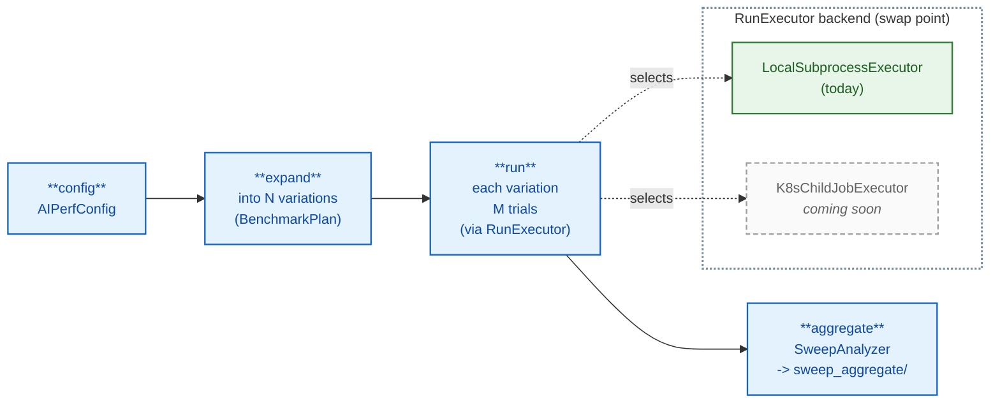

> **One pipeline, every scale — by design.** A single benchmark, a
> local multi-run for confidence intervals, a grid or scenarios
> sweep, a Sobol or Latin-Hypercube characterization, a local
> Bayesian-Optimization adaptive search, and a cluster-side BO
> running across hundreds of pods are not seven different code paths.
> They are seven cardinalities of **one** pipeline: `BenchmarkPlan`
> describes *what* to run, `MultiRunOrchestrator` decides *when* and
> *in what order*, a `SearchPlanner` (optional) decides *what to try
> next*, and a `RunExecutor` decides *how to actually run one cell*.
> Each piece owns exactly one concern and knows nothing about the
> others.
>
> That separation is what makes the system extensible without
> churn. Want a new sweep shape? Add a discriminated-union variant to
> `SweepConfig` — `expand_sweep` does the rest, and every executor,
> exporter, and analyzer picks it up for free. Want a new planner
> (a different acquisition function, a 1D SLA-saturation algorithm,
> a multi-fidelity scheme)? Implement `SearchPlanner.ask`/`tell` and
> register it under the `search_planner` plugin category — the
> orchestrator and executors don't change. Want to run the whole
> thing on Kubernetes? Implement `RunExecutor.execute` to create an
> `AIPerfJob` CR and HTTP-pull its results instead of forking a
> subprocess (this is the *coming-soon* `K8sChildJobExecutor`) — the
> plan, orchestrator, planner, analyzer, and exporters are reused
> byte-for-byte. The progression from a single-shot `aiperf profile`
> to a cluster-distributed BO search isn't a rewrite; it's the same
> machinery at a different cardinality with a different executor at
> the bottom.

### Execution

Today only `LocalSubprocessExecutor` ships: `aiperf profile -f config.yaml` runs the orchestrator in the same Python process and forks `aiperf.orchestrator.subprocess_runner` per cell.

> [!NOTE]
> **Cluster execution (coming soon).** `K8sChildJobExecutor` lives on the K8s integration branch (not `main` yet). It runs in-cluster in a `sweep-controller` pod (from an `AIPerfSweep` CR). Each cell becomes an `AIPerfJob` CR, watched to completion; the operator results server supplies the child export (same shape as local). Orchestrator logic is unchanged—only `RunExecutor` differs. CLI: `aiperf kube sweep` (alongside `aiperf kube profile`).

### Key types

The whole flow uses about a dozen types. If you know these, you can read any sweep code.

| Type | Role |
|------|------|
| **`AIPerfConfig`** | Top-level envelope. Holds a `BenchmarkConfig` body plus envelope-level knobs: `sweep`, `multi_run`, `variables`, `random_seed`. |
| **`BenchmarkConfig`** | The actual benchmark settings (models, endpoint, datasets, phases, artifacts, …). The unit of "what to benchmark." |
| **`SweepConfig`** | Discriminated union: `GridSweep` (YAML: `type: grid`, cartesian over `parameters`), `ZipSweep` (`type: zip`, lockstep / element-wise over `parameters`, all lists equal length), `ScenarioSweep` (`type: scenarios`, deep-merge `runs[i]`), or `AdaptiveSearchSweep` (`type: adaptive_search`, BO / monotonic). |
| **`SobolSweep` / `LatinHypercubeSweep`** | Fixed-budget space-filling samplers. N = `samples`; each variation drawn from `scipy.stats.qmc`. Reuses the grid-style `iteration_order` / `cooldown` / SLA-filter mechanics. |
| **`MultiRunConfig`** | Trial mechanics: `num_runs` (= trials per variation), cooldown, optional `convergence: ConvergenceConfig`. |
| **`SweepVariation`** | `{index, label, values}`. One per variation; carries the parameter values that differ from base. Also exposes `dir_name`: the `{leaf}_{value}` form (e.g. `concurrency_10`) used as the per-variation directory name. |
| **`BenchmarkPlan`** | The "expanded" form: `configs[N]`, `variations[N]`, `trials=M`, plus the originating `sweep` + `multi_run`. Output of `build_benchmark_plan`. |
| **`BenchmarkRun`** | One cell: `(cfg, variation, trial, artifact_dir)`. The smallest unit of work. |
| **`RunResult`** | `{success, summary_metrics, artifacts_path, variation_label, variation_values, trial_index, error}`. One per `BenchmarkRun`. |
| **`MultiRunOrchestrator`** | Drives the N×M loop. Picks REPEATED (trials outer) or INDEPENDENT (variations outer) based on `sweep.iteration_order`; dispatches to `execute_adaptive_search` if the sweep is adaptive. |
| **`RunExecutor`** | ABC with `execute(run) -> RunResult` plus a second abstract `derive_id(plan, var_idx, trial) -> str` for stable per-cell identifiers. `LocalSubprocessExecutor` is the only shipping implementation today; `K8sChildJobExecutor` (one child `AIPerfJob` CR per call) is finalized but unmerged — see Execution above. |
| **`SweepAnalyzer`** | Post-hoc aggregator. CLI helpers group `list[RunResult]` by `variation_values` into `per_combination_stats`; `SweepAnalyzer.compute()` then produces `best_configurations`, `pareto_optimal`, `per_combination_metrics`. Written to `sweep_aggregate/profile_export_aiperf_sweep.{json,csv}`. |

### End-to-end pipeline (canonical)

```mermaid
%%{init: {'flowchart': {'nodeSpacing': 50, 'rankSpacing': 60, 'htmlLabels': true}, 'themeVariables': {'fontSize': '14px'}}}%%
flowchart TD
    subgraph S1["1. parse"]
        yaml["**YAML file**"]
        cli["**aiperf profile**<br/>--flag --flag …"]
        uc["**CLIConfig**<br/><i>lenient, CLI-shaped</i>"]
    end

    subgraph S2["2. typed envelope (one source of truth)"]
        ac["**AIPerfConfig**<br/>benchmark · sweep · multi_run<br/>· variables · random_seed"]
    end

    subgraph S3["3. expand"]
        es["**expand_sweep**<br/>+ per-variation Jinja overlay"]
        bp["**BenchmarkPlan**<br/>configs · variations · trials · sweep"]
    end

    subgraph S4["4. orchestrator dispatch"]
        mo["**MultiRunOrchestrator.execute**<br/>adaptive? -> execute_adaptive_search<br/>else iteration_order:<br/>REPEATED · INDEPENDENT"]
    end

    subgraph S5["5. cell scheduling (per variation × trial)"]
        strategy["**ExecutionStrategy**<br/>FixedTrials · Adaptive<br/>cooldown · cancel · failure-policy"]
        br["**BenchmarkRun**<br/>cfg · variation · trial"]
    end

    subgraph S6["6. execute one cell"]
        re["**RunExecutor** (ABC)"]
        loc["**LocalSubprocessExecutor**<br/>forks subprocess_runner"]
        k8s["**K8sChildJobExecutor**<br/><i>coming soon</i>"]
        run["aiperf workload run<br/><i>full service mesh — see<br/>docs/architecture.md</i>"]
        rr["**RunResult**<br/>metrics · variation_values · artifacts_path"]
    end

    subgraph S7["7. aggregate"]
        sa["**SweepAnalyzer.compute**<br/>group by variation_values"]
        out["sweep_aggregate/<br/>profile_export_aiperf_sweep.json · .csv<br/><i>best_configurations · pareto_optimal<br/>· per_combination_metrics</i>"]
    end

    yaml -->|loader<br/>model_validate| ac
    cli -->|cyclopts| uc
    uc -->|convert_cli_to_aiperf| ac
    ac --> es --> bp --> mo --> strategy --> br --> re
    re --> loc
    re -.coming soon.-> k8s
    loc --> run --> rr
    rr --> sa --> out

    classDef data fill:#e3f2fd,stroke:#1565c0,stroke-width:1.5px,color:#0d47a1
    classDef proc fill:#fff3e0,stroke:#e65100,stroke-width:1.5px,color:#bf360c
    classDef art fill:#e8f5e9,stroke:#2e7d32,stroke-width:1.5px,color:#1b5e20
    classDef coming fill:#fafafa,stroke:#9e9e9e,stroke-width:1.5px,stroke-dasharray:5 3,color:#616161
    classDef decision fill:#f3e5f5,stroke:#6a1b9a,stroke-width:1.5px,color:#4a148c

    class yaml,cli,uc data
    class ac,bp data
    class es,sa,run proc
    class mo,strategy,br,re,loc decision
    class rr,out art
    class k8s coming

    style S1 fill:transparent,stroke:#78909c,stroke-width:2px,stroke-dasharray:5 3
    style S2 fill:transparent,stroke:#78909c,stroke-width:2px,stroke-dasharray:5 3
    style S3 fill:transparent,stroke:#78909c,stroke-width:2px,stroke-dasharray:5 3
    style S4 fill:transparent,stroke:#78909c,stroke-width:2px,stroke-dasharray:5 3
    style S5 fill:transparent,stroke:#78909c,stroke-width:2px,stroke-dasharray:5 3
    style S6 fill:transparent,stroke:#78909c,stroke-width:2px,stroke-dasharray:5 3
    style S7 fill:transparent,stroke:#78909c,stroke-width:2px,stroke-dasharray:5 3
```

The orchestrator forks a subprocess per cell at stage 6; aggregation is pure post-hoc compute over the collected `RunResult`s. YAML configs reach `AIPerfConfig` directly through `load_config` → `AIPerfConfig.model_validate`; only CLI flags travel through `CLIConfig` first so cyclopts can parse magic-list affordances (`--concurrency 1,2,4`) before they're lifted into a typed `SweepConfig`.

### What happens between runs (per-cell loop)

A "cell" is one `(variation, trial)` slot. Inside a cell, an `ExecutionStrategy` decides whether to keep going. `FixedTrialsStrategy` stops after M trials. `AdaptiveStrategy` (selected automatically when `multi_run.convergence` is set) keeps going until a `ConvergenceCriterion` is satisfied, capped by `multi_run.num_runs`. Around each `executor.execute(run)`, the orchestrator threads cancel-checking, sweep-wide failure thresholds, and inter-run cooldowns. Two distinct cooldown fields are in play: `multi_run.cooldown_seconds` (between trials within a cell, returned by `strategy.get_cooldown_seconds()`) and `sweep.cooldown_seconds` (between variations, applied in the outer loop).

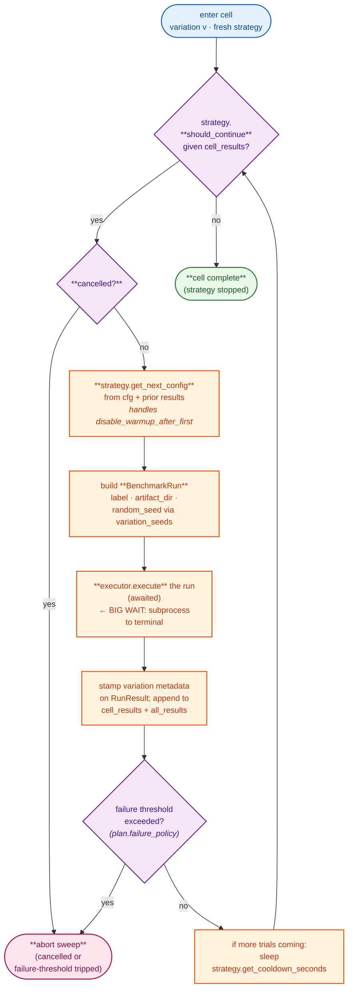

The strategy is fresh per cell in INDEPENDENT mode, so adaptive trial-convergence resets between variations. In REPEATED mode there's only one trial per cell — the "outer trial loop" replays the whole grid.

### REPEATED vs INDEPENDENT — loop nesting

Two ways to traverse the same `N variations × M trials` grid. `sweep.iteration_order` picks; default is REPEATED. The numbers below are the order in which cells execute (example: 3 variations, 3 trials).

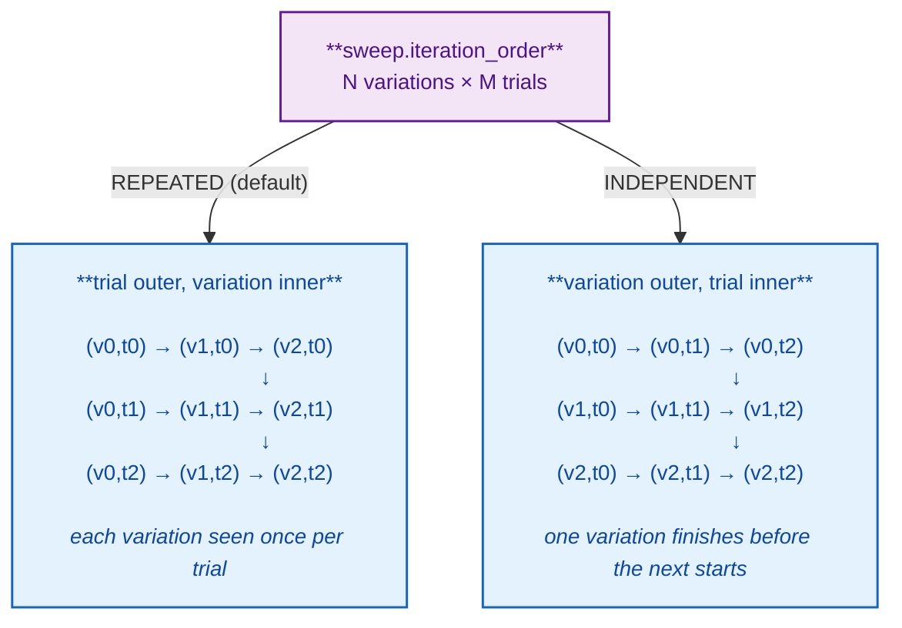

REPEATED interleaves trials across variations so transient effects (warm caches, thermal drift) hit every variation similarly — better for cross-variation comparison. INDEPENDENT runs one variation to completion before moving on — required for convergence-based adaptive trials, since a strategy needs to observe all of one cell's results in sequence. Cooldowns and per-cell strategy reuse follow from the nesting; see [`MultiRunOrchestrator`](https://github.com/ai-dynamo/aiperf/blob/main/src/aiperf/orchestrator/orchestrator.py).

### Artifact directory layout reference

The artifact tree branches on three flags: whether a sweep is configured
(`is_sweep`), whether multiple trials run per cell (`trials > 1`), and
the sweep iteration order (`REPEATED` vs `INDEPENDENT`). Implemented in
`_resolve_artifact_dir` in `src/aiperf/orchestrator/orchestrator.py`.

| sweep | trials | order       | layout                                          |
|-------|--------|-------------|-------------------------------------------------|
| no    | 1      | -           | `<base>/`                                       |
| no    | >1     | -           | `<base>/profile_runs/run_NNNN/`                 |
| yes   | 1      | -           | `<base>/<dir_name>/`                            |
| yes   | >1     | REPEATED    | `<base>/profile_runs/trial_NNNN/<dir_name>/`    |
| yes   | >1     | INDEPENDENT | `<base>/<dir_name>/profile_runs/trial_NNNN/`    |
| adaptive | any | -      | `<base>/search_iter_NNNN/profile_runs/run_NNNN/` |

`<dir_name>` is the `{leaf_param_name}_{value}` form (e.g.
`concurrency_10`, `request_rate_5.0`); multi-dim sweep cells join
components with `__` (e.g. `concurrency_10__isl_512`). Inner-dir
naming is asymmetric on purpose — the no-sweep multi-run case uses
`run_NNNN`, the sweep + INDEPENDENT case uses `trial_NNNN`. Downstream
consumers (plotters, dashboards) account for this asymmetry.

The sweep-level aggregate path follows a parallel rule:

- REPEATED + multi-run: `<base>/aggregate/sweep_aggregate/`
- everything else (sweep-only, sweep + INDEPENDENT): `<base>/sweep_aggregate/`

Per-variation aggregates land at `<base>/aggregate/<dir_name>/` in
REPEATED mode and `<base>/<dir_name>/aggregate/` otherwise (INDEPENDENT
is the explicit default fallback in `_per_variation_aggregate_dir`; any
non-REPEATED mode takes the else branch).

### Adaptive outer loop (ask / tell)

Adaptive search is the same pipeline with one swap: instead of "expand a fixed grid into N configs up front," the planner *generates* configs one at a time, learning from each result.

- The sweep block is `AdaptiveSearchSweep` (`type: adaptive_search`) instead of `GridSweep` / `ZipSweep` / `ScenarioSweep`.
- `BenchmarkPlan.configs` starts with one seed config; the planner extends it as it asks.
- `MultiRunOrchestrator` dispatches to `execute_adaptive_search`, which runs `planner.ask() -> execute trials -> planner.tell(results)` until `planner.ask()` returns `None` (or cancellation / abort).
- Four planner plugins ship: `BayesianSearchPlanner` (curated Optuna+BoTorch preset; auto-selects qLogNEI / qLogNEHVI based on objective count), `MonotonicSLASearchPlanner` (1D probe + bisection), `SmoothIsotonicSLAPlanner` (isotonic regression on bootstrap-resampled trials), `OptunaSearchPlanner` (TPE / GP / BoTorch samplers, expert-mode flag exposure). The `BayesianSearchPlanner` is implemented as a thin subclass of `OptunaSearchPlanner` that locks in the BoTorch sampler and the curated acquisition; it is not a separate engine.
- Optional `search_recipe` plugins build the whole `AdaptiveSearchSweep` from a higher-level recipe (e.g. `max-concurrency-under-sla`, `prefill-ttft-curve`, `pareto-sweep`).
- An optional `post_process` handler (`degradation_knee_detect`, `ttft_curve_fit`, `itl_surface_fit`, `sla_breach_knee`, `pareto_sweep_export`) runs after the final iteration.

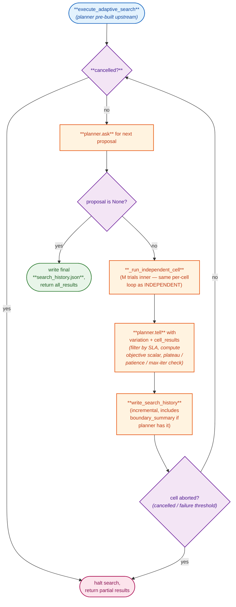

Each iteration adds one `SearchIteration` to `planner.history()`. Convergence terminates the loop via `planner.ask()` returning `None`; the reason (plateau / improvement-patience / max-iterations) comes from `planner.convergence_reason()`. `search_history.json` is rewritten after every iteration so a crashed sweep still has a usable trail.

### Fan-out math

The cardinality of any sweep is `N variations × M trials = N×M cells`. Where N and M come from depends on the path.

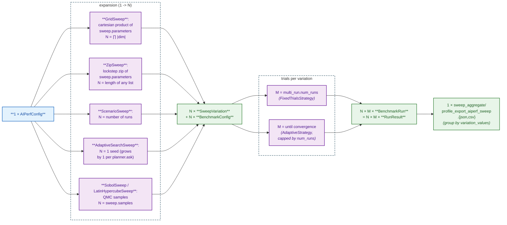

For adaptive search, `N` is the iteration count: bounded above by `max_iterations`, possibly less if the planner converges early. `M` (trials per iteration) still applies — adaptive runs M trials per planner-proposed point, then `tell()`s the planner the aggregate.

### Where the code lives

| Concept | File |
|---|---|
| Envelope, body | `src/aiperf/config/config.py` (`AIPerfConfig`, `BenchmarkConfig`) |
| Multi-run / convergence | `src/aiperf/config/sweep/multi_run.py` |
| Sweep variants | `src/aiperf/config/sweep/config.py` + `sampling.py` (QMC) + `adaptive.py` |
| Sweep expansion | `src/aiperf/config/sweep/expand.py` + `expand_qmc.py` |
| Plan loader (CLI/YAML -> plan) | `src/aiperf/config/loader/plan.py` |
| `BenchmarkPlan` / `BenchmarkRun` models | `src/aiperf/config/resolution/plan.py` |
| Orchestrator | `src/aiperf/orchestrator/orchestrator.py` |
| Executors | `src/aiperf/orchestrator/{executor,local_executor}.py` |
| Aggregation | `src/aiperf/orchestrator/aggregation/sweep.py` |
| Search planners + recipes | `src/aiperf/orchestrator/search_planner/`, `src/aiperf/search_recipes/` |

For a fully-indexed file map covering every entry point, see [Where to look in the code](#where-to-look-in-the-code) in Part 3.

---

## Part 2 — Seven-stage tour

A guided tour of the sweep / multi-run / adaptive-search flow, focused on the **big picture** and the **names of the types** that move data between stages. Read this when you want to know *what happens when you press enter*.

### The seven stages

Every `aiperf profile` invocation walks the same seven stages. The shape of each
stage's input and output is named — those names are the things to remember.

```mermaid
%%{init: {'flowchart': {'nodeSpacing': 50, 'rankSpacing': 60, 'htmlLabels': true}, 'themeVariables': {'fontSize': '14px'}}}%%
flowchart LR
    s1["**1. Parse**<br/>YAML / CLI"]
    s2["**2. Convert**<br/>-> AIPerfConfig"]
    s3["**3. Expand**<br/>-> BenchmarkPlan"]
    s4["**4. Dispatch**<br/>grid vs adaptive"]
    s5["**5. Iterate**<br/>BenchmarkRun per cell"]
    s6["**6. Execute**<br/>-> RunResult"]
    s7["**7. Aggregate**<br/>-> sweep_aggregate/"]

    s1 --> s2 --> s3 --> s4 --> s5 --> s6 --> s7

    classDef data fill:#e3f2fd,stroke:#1565c0,stroke-width:1.5px,color:#0d47a1
    classDef proc fill:#fff3e0,stroke:#e65100,stroke-width:1.5px,color:#bf360c
    classDef decision fill:#f3e5f5,stroke:#6a1b9a,stroke-width:1.5px,color:#4a148c
    classDef art fill:#e8f5e9,stroke:#2e7d32,stroke-width:1.5px,color:#1b5e20

    class s1,s2 data
    class s3 proc
    class s4,s5 decision
    class s6,s7 art
```

The pipeline doesn't change shape between a single benchmark, a multi-run, a
grid sweep, a scenarios sweep, or a Bayesian search. Only **how many cells
stage 5 produces** and **what decides each next cell** changes:

| Mode             | N (variations)                                            | M (trials per variation)              | Total cells       |
| :--------------- | :-------------------------------------------------------- | :------------------------------------ | :---------------- |
| Single benchmark | 1                                                         | 1                                     | 1                 |
| Multi-run        | 1                                                         | `MultiRunConfig.num_runs` (1–10)      | M                 |
| Grid sweep       | cartesian product of `sweep.parameters`                   | `MultiRunConfig.num_runs` (default 1) | N × M             |
| Scenarios sweep  | `len(runs[])`                                             | `MultiRunConfig.num_runs` (default 1) | N × M             |
| Adaptive search  | grows by 1 every `planner.ask()`; capped by `max_iterations` | `MultiRunConfig.num_runs` (default 1) | ≤ max_iter × M    |

Each cell is one `BenchmarkRun` -> one `RunResult`. The next section unpacks
the N / M dimensions in detail.

### Two dimensions: N variations × M trials

The sweep cardinality has **two** independent dimensions. Mixing them up is the
single most common source of "wait, why did this run that many times?" surprise.

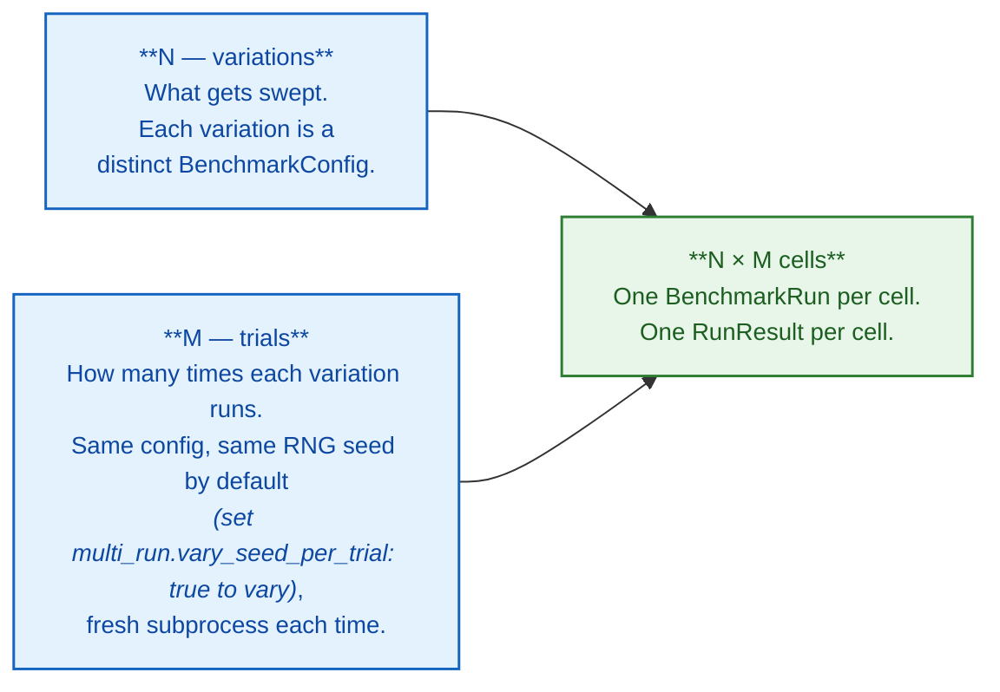

**N comes from `SweepConfig`** (the sweep block on `AIPerfConfig`):
the `sweep.parameters` cartesian product, the `runs[]` list, or the planner's
proposals. Without a sweep block, N = 1.

**M comes from `MultiRunConfig`** (the multi-run block on `AIPerfConfig`):

| Field                  | Default | Meaning                                                                     |
| :--------------------- | :------ | :-------------------------------------------------------------------------- |
| `num_runs`             | `1`     | Trial count per variation. `M = 1` is "single run, no repeats." Max `10` (both CLI flag and typed field share the cap). |
| `cooldown_seconds`     | `0`     | Sleep between trials so server caches / thermals reset.                     |
| `convergence`          | unset   | Optional `ConvergenceConfig` — stop early when results stabilize.           |

```text
Total runs = N × M

  N=1, M=1   ->  1 run     single benchmark, no confidence
  N=1, M=5   ->  5 runs    one config, repeated for confidence intervals
  N=4, M=1   ->  4 runs    a 4-point sweep, one shot per point
  N=4, M=3   ->  12 runs   sweep with 3-trial confidence per variation
```

When `M > 1`, **`SweepAnalyzer.compute`** automatically produces a confidence
block (mean / std / 95% CI) per metric per variation. When `M = 1` you get
point estimates only.

**Trials are not iterations.** For an adaptive search, `--search-max-iterations`
controls **N** (how many points the planner gets to try), and `--num-profile-runs`
controls **M** (how many times each proposed point is benchmarked before the
planner sees the aggregate). They multiply: a `max_iterations=30, num_profile_runs=3`
adaptive run executes up to **90** subprocess benchmarks.

### Stages 1–2 — User input -> typed config

Two entry points converge on the same typed envelope `AIPerfConfig`, but by
different paths. **YAML skips `CLIConfig` entirely:** `load_config` /
`load_config_from_string` parse the file and call `AIPerfConfig.model_validate`
directly. **CLI flags** are parsed by cyclopts into a `CLIConfig` (the
human-friendly, CLI-shaped surface), then `convert_cli_to_aiperf` lifts magic
flags into the typed envelope. From here on, `AIPerfConfig` is the single
source of truth.

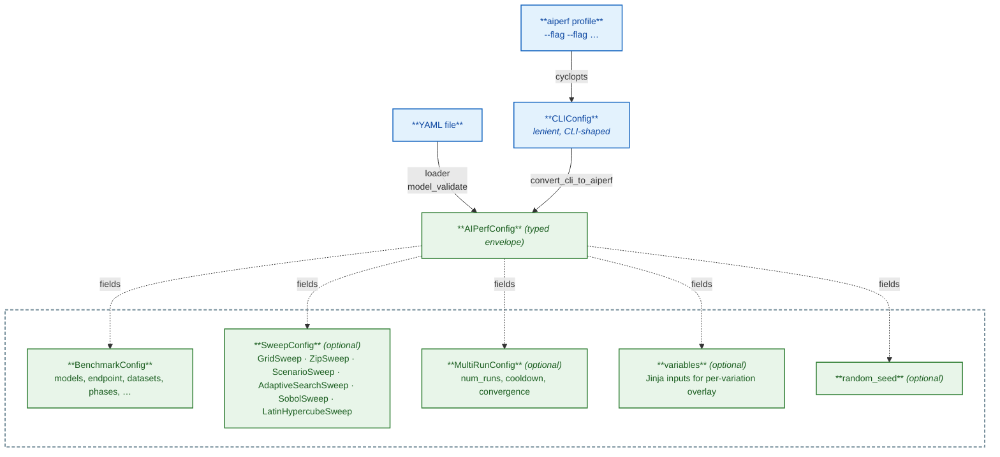

**Why the CLI -> envelope hop?** `CLIConfig` is the human-friendly CLI shape — magic-lists like
`--concurrency 1,2,4`, `--prefill-concurrency 1,2,4`, or `--request-rate 10,20,50` mean
"sweep that field over those values." The converter lifts those affordances into a typed
sweep block on `AIPerfConfig`. After conversion, every flag has one canonical home in the
envelope. YAML configs don't need this hop — they're already written in envelope shape, so
`load_config` constructs `AIPerfConfig` directly via `model_validate` and skips `CLIConfig`
entirely.

#### `SweepConfig` is a discriminated union

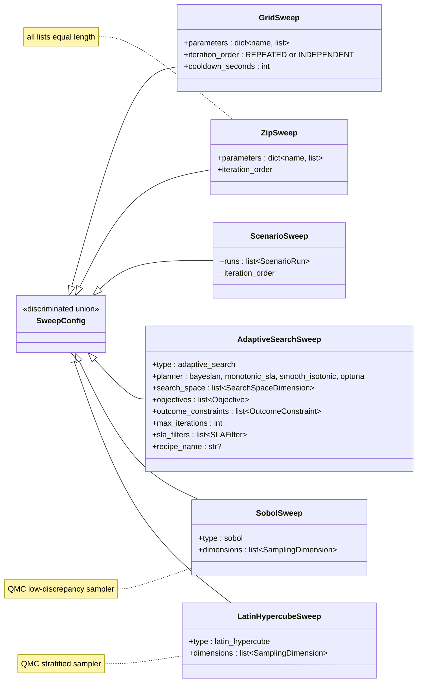

Pydantic discriminates by a `type` field on the YAML / dump (each variant sets a
default for `type`, so YAML authors do not need to write it explicitly). The orchestrator
never inspects the variant directly — it reads `BenchmarkPlan.is_adaptive_search`,
which is true exactly when the variant is `AdaptiveSearchSweep`.

### Stage 3 — Expand into a `BenchmarkPlan`

`AIPerfConfig` describes intent; `BenchmarkPlan` lists the actual cells the
orchestrator will run. The plan-builder either short-circuits to a single seed
variation (for adaptive runs and for no-sweep runs) or calls `expand_sweep`
(cartesian product for grid, lockstep zip for zip, deep-merge for scenarios —
also Sobol / Latin-hypercube for QMC sweeps), then renders any per-variation
Jinja and emits one `BenchmarkConfig` per variation.

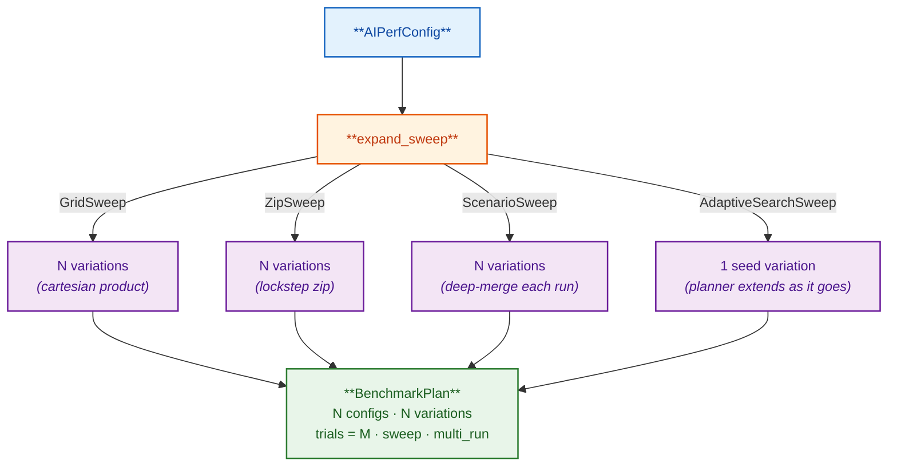

A few useful invariants:

- **`SweepVariation`** — `{index, label, values}`. One per variation. `values` is
  the dict of swept parameters that differ from the base config; the label is built
  from those for artifact directory names.
- **`trials = M`** comes from `MultiRunConfig.num_runs` (default `1`, max `10`).
  It's the per-cell repeat count for confidence aggregation, not the total run count.
- **For adaptive search**, `configs` starts with one seed and grows as the planner
  asks. The plan-builder doesn't know the final length up front.
- **`plan.is_adaptive_search`** is the orchestrator's only branch on the sweep
  variant — every other piece of code is variant-agnostic.

### Stages 4–5 — Orchestrator dispatch

`MultiRunOrchestrator.execute(plan, executor, search_planner=...)` is the single
entry point. It dispatches on `plan.is_adaptive_search`:

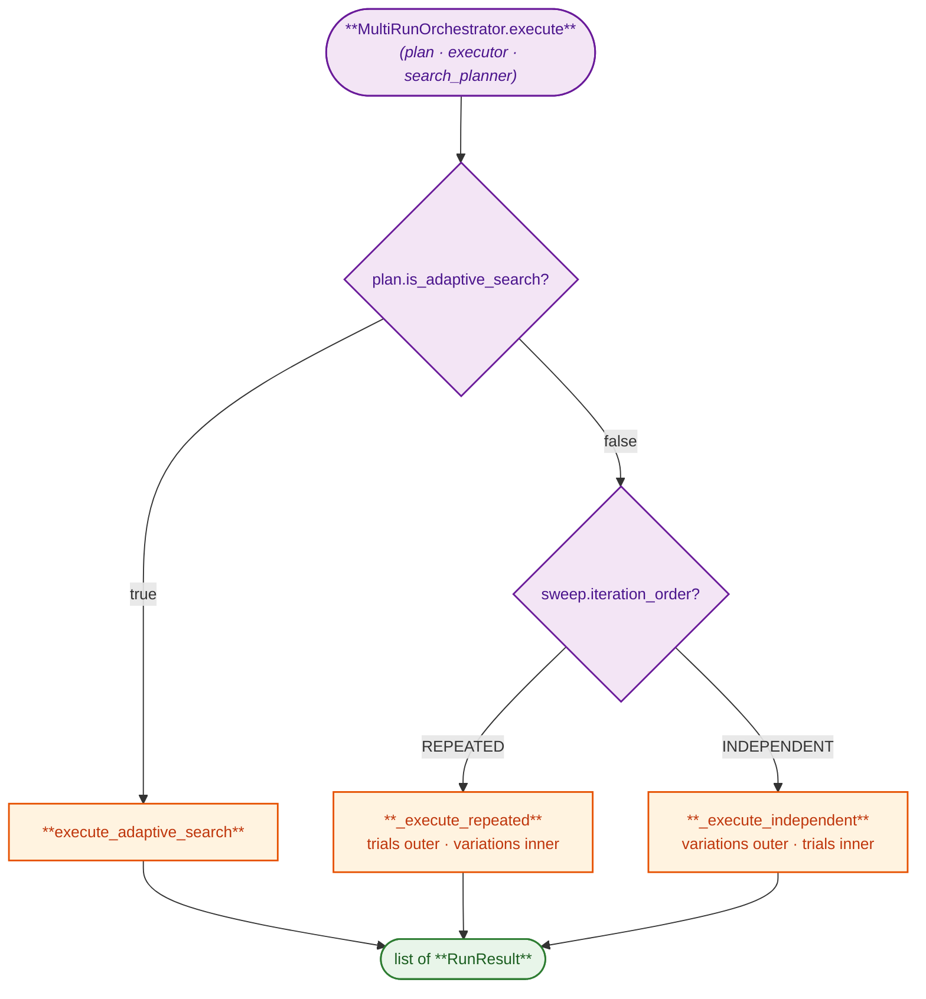

#### Grid / scenarios — REPEATED vs INDEPENDENT

For an N×M grid (N variations, M trials), there are two ways to interleave the
work. Both produce the same N×M cells; they differ only in which loop is outer.
`iteration_order` is a field on the grid family of sweeps (`GridSweep`, `ZipSweep`,
`ScenarioSweep`); `AdaptiveSearchSweep` does not expose this knob.

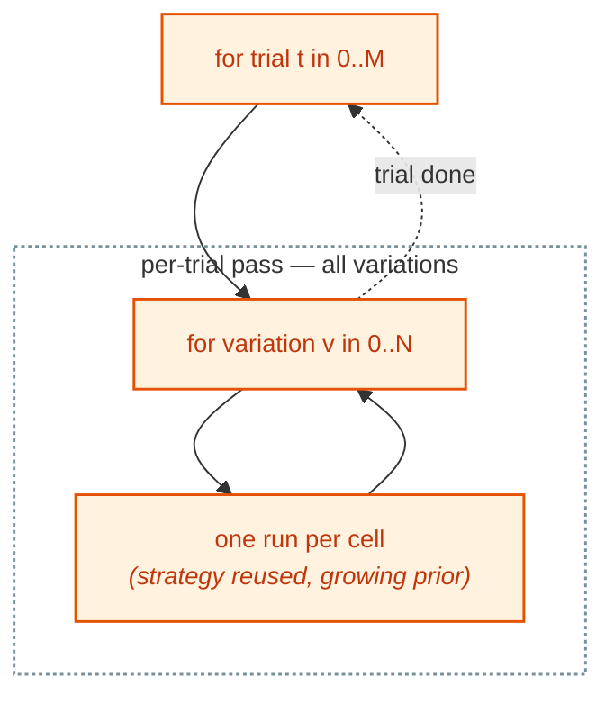

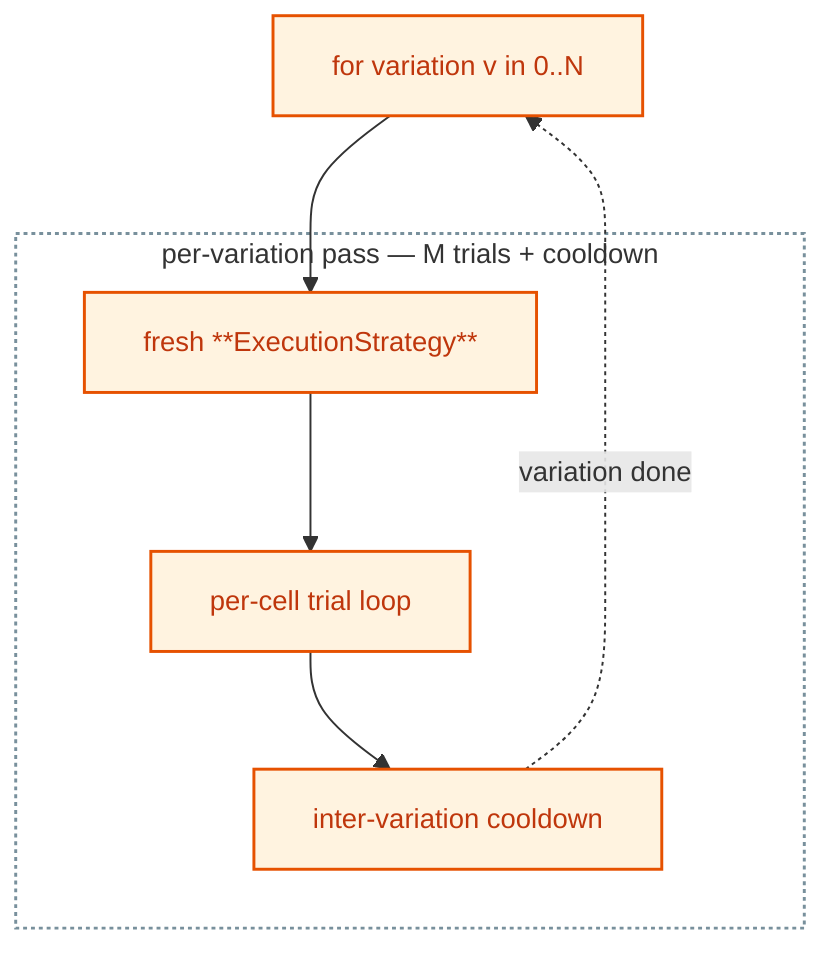

**REPEATED** is the default. It interleaves so transient effects (warm caches,
thermal drift) hit every variation similarly — better for cross-variation
comparison. **INDEPENDENT** runs one variation to completion before moving on;
required when each variation needs its own `ExecutionStrategy` to observe a full
cell's worth of results before deciding to stop (the adaptive trial-convergence
case).

#### Adaptive — `ask` / `tell` loop

When `plan.is_adaptive_search` is true, `execute_adaptive_search` runs a tighter
loop driven by a `SearchPlanner`:

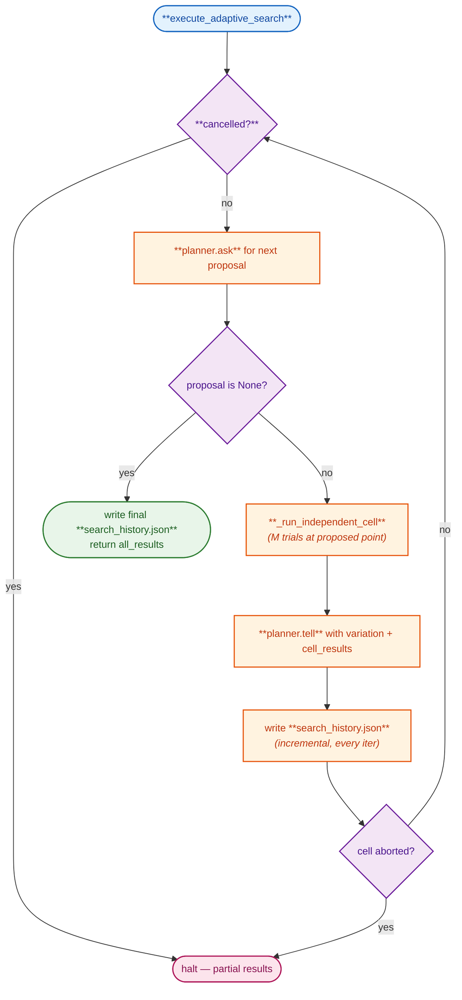

| Step | What actually happens |
| :--- | :--- |
| **`planner.ask()`** | returns the next `(BenchmarkConfig, SweepVariation)` — or `None` to terminate. State: a Gaussian process (`BayesianSearchPlanner`), a bisection bracket (`MonotonicSLASearchPlanner`), an isotonic-fit history (`SmoothIsotonicSLAPlanner`), or an Optuna study (`OptunaSearchPlanner`). |
| **`_run_independent_cell`** | runs M trials at the proposed point — the same per-cell loop INDEPENDENT mode uses. |
| **`planner.tell(...)`** | feeds the M-trial aggregate back so the planner can update its model and propose a better next point. |
| **`planner.is_converged()`** | checked inside `ask()`. When max-iter / plateau / improvement-patience fires, `ask()` returns `None`. |
| **`search_history.json`** | rewritten after every iteration. A crashed run still has a usable trail. |

### Stage 6 — Inside one cell

A "cell" is one `(variation, trial)` slot. Every cell runs a small state machine
driven by an `ExecutionStrategy`:

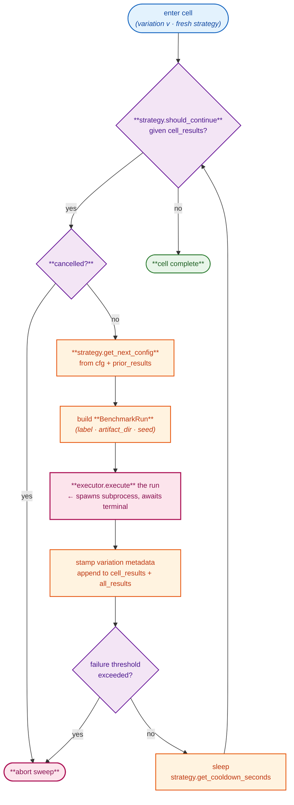

Three collaborators inside the cell — two ABCs and one Pydantic model:

| Type | Implementations | Job |
| :--- | :--- | :--- |
| **`ExecutionStrategy`** (ABC) | `FixedTrialsStrategy`, `AdaptiveStrategy` | Decide whether to run another trial in this cell. |
| **`RunExecutor`** (ABC) | `LocalSubprocessExecutor` (only one shipping) | Turn one `BenchmarkRun` into one `RunResult` by spawning a fresh subprocess of `aiperf.orchestrator.subprocess_runner`. |
| **`BenchmarkRun`** (Pydantic model) | — | The smallest unit of work — essentially `(cfg, variation, trial, artifact_dir)`, plus identity fields (`benchmark_id`, `sweep_id`, `label`, `cli_command`, `random_seed`) that the orchestrator uses for the artifact tree and sweep grouping. |

`FixedTrialsStrategy` runs exactly `M` trials. `AdaptiveStrategy` runs until a
`ConvergenceConfig` says enough — capped by `multi_run.num_runs` so it can't run
forever.

### Stage 7 — Aggregate

After the orchestrator returns `list[RunResult]`, the CLI runner groups by
`RunResult.variation_values`, builds a `per_combination_stats` dict, and hands
it to **`SweepAnalyzer.compute(per_combination_stats, sweep_parameters, sla_filters=…)`**,
which computes summary stats per group, identifies the Pareto frontier, and
returns the aggregate dict the JSON / CSV exporters write.

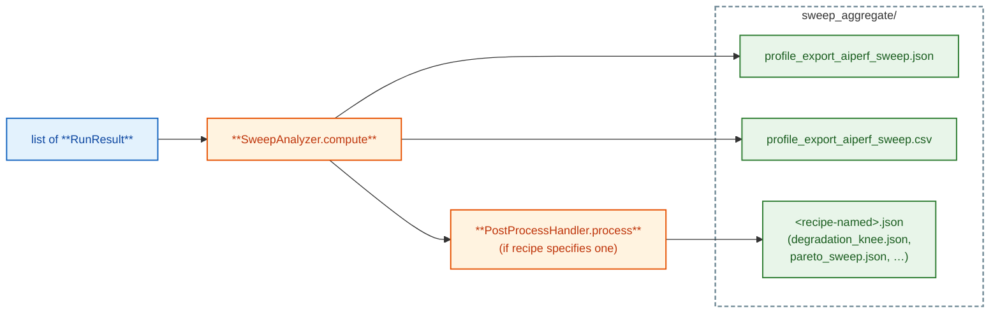

The aggregate JSON has three result blocks plus a `metadata` block:

- **`metadata`** — `num_combinations`, swept parameter list, and (when set)
  `sla_constraints`. Downstream consumers key off this block.
- **`per_combination_metrics`** — one entry per unique `variation_values`, with
  swept parameters and a metric block (mean / p99 / etc.) for every metric.
- **`best_configurations`** — fixed post-hoc picks for highest throughput and
  lowest latency from the aggregate summary. These are not the adaptive search's
  configured objectives.
- **`pareto_optimal`** — fixed post-hoc throughput/latency frontier computed via
  `_dominates`. Adaptive configured objectives are reported in
  `search_history.json["best_trials"]`.

> **Orthogonality note.** `best_configurations` and `pareto_optimal` here are
> emitted by `SweepAnalyzer`, computed across the whole `RunResult` set, and
> live under `sweep_aggregate/profile_export_aiperf_sweep.json`. They are
> distinct from `search_history.json["best_trials"]`, which is what the BO
> planner converged on (see [Search History API](../api/search-history.md)).
> For a single-objective adaptive run with no failed iterations the two
> usually agree on the winner; they can disagree when iterations failed,
> when feasibility differs (search-history is feasibility-first lex over
> `sla_filters`, the analyzer ranks the full set), or when the analyzer's
> Pareto computation includes objectives the planner wasn't optimizing.

If the active sweep came from a search recipe with a `PostProcessSpec`, that
handler runs after the analyzer and emits its own JSON file (e.g.
`degradation_knee.json` for `concurrency-ramp`, `pareto_sweep.json` for
`pareto-sweep`).

### How search recipes plug in

A **search recipe** is a named preset that bundles "search space + objective +
termination + SLA filters + optional post-process" into one CLI selector
(`--search-recipe <name>`). It runs **before stage 3** and emits the typed sweep
config the rest of the pipeline expects.

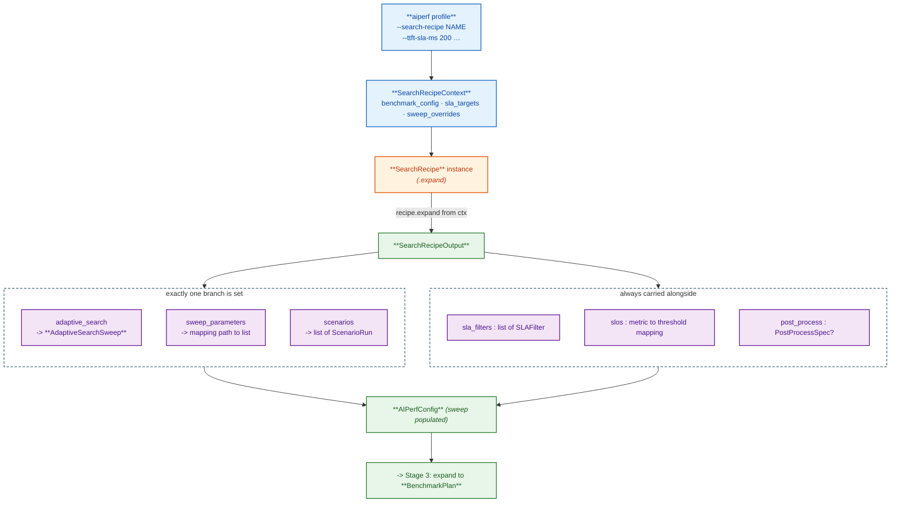

**`SearchRecipeContext`** is the recipe's read-only view of user intent — built
`BenchmarkConfig`, declared SLA targets (`--ttft-sla-ms`, etc.), and any
sweep-knob overrides (`--concurrency-min`, `--isl-osl-pairs`, etc.).

**`SearchRecipeOutput`** carries exactly one of `adaptive_search`,
`sweep_parameters`, or `scenarios` (validated mutually exclusive), plus optional
`sla_filters`, per-request `slos`, and a `post_process` spec.

#### The eight built-in recipes

| Recipe                       | Branch                                                | What it builds                                                |
| :--------------------------- | :---------------------------------------------------- | :------------------------------------------------------------ |
| `max-throughput-ttft-sla`    | `adaptive_search`                                     | BO over concurrency, objective = throughput, SLA = TTFT       |
| `max-throughput-itl-sla`     | `adaptive_search`                                     | BO over concurrency, objective = throughput, SLA = ITL        |
| `max-concurrency-under-sla`  | `adaptive_search` (`smooth_isotonic` default) or grid | 1D feasibility — max concurrency where every SLA filter passes |
| `max-goodput-under-slo`      | `adaptive_search`                                     | BO maximizing goodput at >= attainment-fraction SLO compliance |
| `concurrency-ramp`           | `sweep_parameters` + `degradation_knee_detect`         | log-spaced concurrency grid, finds p99 degradation knee       |
| `prefill-ttft-curve`         | `sweep_parameters` + `ttft_curve_fit`                  | ISL grid at concurrency=1, linear / quadratic fit             |
| `decode-itl-curve`           | `sweep_parameters` + `itl_surface_fit`                 | 2D (concurrency × OSL) grid, surface fit                      |
| `pareto-sweep`               | `scenarios` + `pareto_sweep_export`                   | paired ISL/OSL × concurrency Pareto frontier                  |

After expansion, downstream stages don't know a recipe ever existed — they just
see a normal `AIPerfConfig.sweep` with optional `sla_filters` attached.

### End-to-end — putting it all together

One diagram from key-press to artifact:

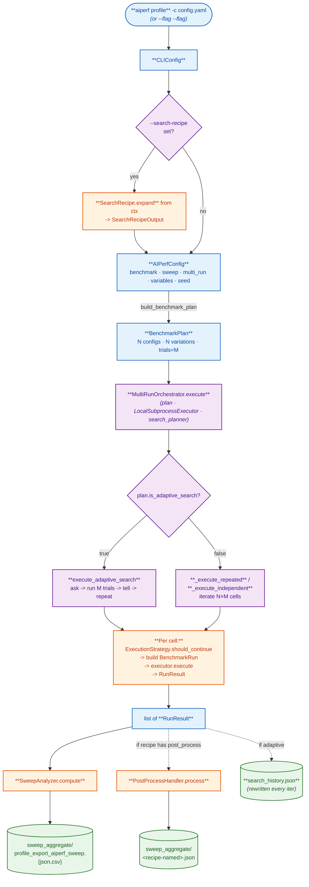

### Names worth remembering

If you remember nothing else from this doc, remember these eleven names — every
other class in the sweep code is glue or helper.

| Name                     | What it is                                                           | Where in the flow         |
| :----------------------- | :------------------------------------------------------------------- | :------------------------ |
| **`AIPerfConfig`**       | Typed envelope. Everything user-supplied lands here.                 | Stage 2 out -> 3 in       |
| **`BenchmarkConfig`**    | Benchmark body — models, endpoint, datasets, phases.                 | Field of `AIPerfConfig`   |
| **`SweepConfig`**        | Discriminated union — `GridSweep`, `ZipSweep`, `ScenarioSweep`, `AdaptiveSearchSweep`, `SobolSweep`, `LatinHypercubeSweep`. | Field of `AIPerfConfig` |
| **`SearchRecipe`**       | Pluggable preset that emits a `SearchRecipeOutput`.                  | Pre-stage 3               |
| **`BenchmarkPlan`**      | Expanded plan — `configs[]`, `variations[]`, trials, sweep.          | Stage 3 out -> 4 in       |
| **`MultiRunOrchestrator`** | Drives the cell loop; dispatches grid vs adaptive.                 | Stage 4                   |
| **`ExecutionStrategy`**  | Per-cell "should I keep going?" — `FixedTrialsStrategy` / `AdaptiveStrategy`. | Stages 5–6        |
| **`BenchmarkRun`**       | One `(cfg, variation, trial)` plus identity (`benchmark_id`, `sweep_id`, `label`, `cli_command`, `random_seed`). Smallest unit of work. | Stage 6 in                |
| **`RunExecutor`**        | ABC. Only impl: `LocalSubprocessExecutor`.                           | Stage 6                   |
| **`RunResult`**          | One `BenchmarkRun`'s output (metrics + variation metadata).          | Stage 6 out -> 7 in       |
| **`SweepAnalyzer`**      | Pure compute: `list[RunResult]` -> grouped / best / Pareto JSON.     | Stage 7                   |

For adaptive runs, three more:

| Name                     | What it is                                                                 |
| :----------------------- | :------------------------------------------------------------------------- |
| **`SearchPlanner`**      | ABC. `BayesianSearchPlanner`, `MonotonicSLASearchPlanner`, `SmoothIsotonicSLAPlanner`, `OptunaSearchPlanner`. |
| **`SearchIteration`**    | Per-iteration record — proposal + measured objective + feasibility.        |
| **`PostProcessHandler`** | Recipe artifact emitter — `degradation_knee_detect`, `ttft_curve_fit`, `itl_surface_fit`, `sla_breach_knee`, `pareto_sweep_export`. |

---

## Part 3 — Class & module map

End-to-end view of how a YAML config or CLI invocation becomes an `AIPerfConfig` envelope, expands into a `BenchmarkPlan`, and is executed by `MultiRunOrchestrator` against a backend `RunExecutor`. Multiple zoom levels — pick whichever matches what you're trying to understand.

The same `BenchmarkPlan` / `MultiRunOrchestrator` / `RunExecutor` machinery handles single-run, grid sweep, zip sweep, scenario sweep, and adaptive search. Dispatch differs only inside `MultiRunOrchestrator.execute`.

### 30,000 ft — what happens, period

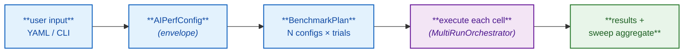

### 10,000 ft — local end-to-end (with cluster path *coming soon*)

```mermaid
%%{init: {'flowchart': {'nodeSpacing': 50, 'rankSpacing': 60, 'htmlLabels': true}, 'themeVariables': {'fontSize': '14px'}}}%%
flowchart TD
    user["**user**"]

    subgraph INPUTS["inputs"]
        cli["**aiperf profile** -c config.yaml"]
        kube["**aiperf kube sweep** --config sweep.yaml<br/><i>coming soon</i>"]
    end

    subgraph CORE["plan / orchestration"]
        plan["**BenchmarkPlan**"]
        orch["**MultiRunOrchestrator**"]
    end

    subgraph EXEC["executors"]
        local["**LocalSubprocessExecutor**"]
        k8s["**K8sChildJobExecutor**<br/><i>(in sweep-controller pod)</i><br/><i>coming soon</i>"]
    end

    subgraph RUNTIME["runtime"]
        sysctrl["**SystemController** + services"]
        child["child **AIPerfJob** CRs<br/><i>(one per cell, deterministic names)</i><br/><i>coming soon</i>"]
    end

    subgraph RESULTS["results"]
        out["**RunResult** -> **SweepAnalyzer** -><br/>profile_export_aiperf_sweep.{json,csv}"]
    end

    user --> cli --> plan
    user -.->|"coming soon"| kube -.-> plan

    plan --> orch
    orch --> local
    orch -.->|"coming soon"| k8s
    local --> sysctrl
    k8s -.-> child
    child -.->|"HTTP pull<br/>profile_export_aiperf.json"| out
    sysctrl --> out

    classDef data fill:#e3f2fd,stroke:#1565c0,stroke-width:1.5px,color:#0d47a1
    classDef proc fill:#fff3e0,stroke:#e65100,stroke-width:1.5px,color:#bf360c
    classDef decision fill:#f3e5f5,stroke:#6a1b9a,stroke-width:1.5px,color:#4a148c
    classDef art fill:#e8f5e9,stroke:#2e7d32,stroke-width:1.5px,color:#1b5e20
    classDef coming fill:#fafafa,stroke:#9e9e9e,stroke-width:1.5px,stroke-dasharray:5 3,color:#616161

    class user,cli data
    class plan data
    class orch,local decision
    class sysctrl proc
    class out art
    class kube,k8s,child coming

    style INPUTS fill:transparent,stroke:#78909c,stroke-width:2px,stroke-dasharray:5 3
    style CORE fill:transparent,stroke:#78909c,stroke-width:2px,stroke-dasharray:5 3
    style EXEC fill:transparent,stroke:#78909c,stroke-width:2px,stroke-dasharray:5 3
    style RUNTIME fill:transparent,stroke:#78909c,stroke-width:2px,stroke-dasharray:5 3
    style RESULTS fill:transparent,stroke:#78909c,stroke-width:2px,stroke-dasharray:5 3
```

### Sub-flow — config layer (YAML/CLI -> BenchmarkPlan)

```mermaid
%%{init: {'flowchart': {'nodeSpacing': 50, 'rankSpacing': 60, 'htmlLabels': true}, 'themeVariables': {'fontSize': '14px'}}}%%
flowchart TD
    subgraph INPUTS["inputs"]
        yaml["**YAML file**"]
        cli["**CLI flags** <i>(cyclopts)</i>"]
    end

    subgraph PARSE["parse"]
        loader["**load_config_from_string**<br/><i>(reject flat shape, env-var sub)</i>"]
        cli_cfg["**CLIConfig**<br/><i>flat CLI DTO</i>"]
        conv["**CLI -> envelope converter** (config/flags/converter.py)<br/>• _assemble_optional<br/>• _apply_recipe_sweep_parameters<br/>• _promote_magic_lists_to_sweep_block<br/>• _wrap_under_envelope<br/><i>(envelope keys: schema_version, sweep, multi_run,<br/>variables, random_seed, benchmark)</i>"]
    end

    subgraph VALIDATE["validate"]
        envelope["**AIPerfConfig** envelope<br/>schema_version / benchmark / sweep /<br/>multi_run / variables / random_seed"]
    end

    subgraph BUILD["expand / render"]
        expand["**expand_sweep** (config/sweep/expand.py)<br/>grid: cartesian over sweep.parameters<br/>zip: lockstep over sweep.parameters<br/>scenarios: deep-merge each run.benchmark<br/>sobol / latin_hypercube: QMC sampling<br/><i>(adaptive runs short-circuit and use<br/>a 1-element seed variation)</i>"]
        jinja["**per-variation Jinja render**<br/><i>(variables overlay)</i>"]
        bp["**BenchmarkPlan**<br/>N configs, N variations,<br/>N variation_seeds, trials,<br/>multi_run, sweep, failure_policy"]
    end

    yaml --> loader
    cli --> cli_cfg
    cli_cfg --> conv
    loader --> envelope
    conv --> envelope

    envelope --> jinja
    envelope --> expand
    expand --> jinja
    jinja --> bp

    classDef data fill:#e3f2fd,stroke:#1565c0,stroke-width:1.5px,color:#0d47a1
    classDef proc fill:#fff3e0,stroke:#e65100,stroke-width:1.5px,color:#bf360c
    classDef art fill:#e8f5e9,stroke:#2e7d32,stroke-width:1.5px,color:#1b5e20

    class yaml,cli,cli_cfg data
    class loader,conv,expand,jinja proc
    class envelope,bp art

    style INPUTS fill:transparent,stroke:#78909c,stroke-width:2px,stroke-dasharray:5 3
    style PARSE fill:transparent,stroke:#78909c,stroke-width:2px,stroke-dasharray:5 3
    style VALIDATE fill:transparent,stroke:#78909c,stroke-width:2px,stroke-dasharray:5 3
    style BUILD fill:transparent,stroke:#78909c,stroke-width:2px,stroke-dasharray:5 3
```

### Sub-flow — orchestrator iteration

`cli_runner.run_benchmark` peels off single-run plans (`plan.is_single_run`) before the orchestrator is constructed; only multi-run plans reach `MultiRunOrchestrator.execute`. Inside `execute()`, dispatch is two-way: adaptive-search vs. grid/scenarios. Grid/scenarios further branch on `_plan_iteration_order(plan)` which reads `plan.sweep.iteration_order` (REPEATED default, or INDEPENDENT).

```mermaid
%%{init: {'flowchart': {'nodeSpacing': 50, 'rankSpacing': 60, 'htmlLabels': true}, 'themeVariables': {'fontSize': '14px'}}}%%
flowchart TD
    cli["**cli_runner.run_benchmark**"] --> single{"plan.is_single_run?"}
    single -->|yes| sgl["**_run_single_benchmark**<br/><i>(LocalSubprocessExecutor.execute)</i>"]
    single -->|no| orch["**MultiRunOrchestrator.execute**<br/><i>(plan · executor ·<br/>cancel_check · search_planner)</i>"]

    subgraph DECIDE["dispatch (inside execute)"]
        ad{"plan.is_adaptive_search?"}
        order{"**_plan_iteration_order**<br/><i>(reads sweep.iteration_order)</i>"}
    end

    orch --> ad
    ad -->|yes| bo["**execute_adaptive_search**<br/>plan · executor · planner<br/>BO outer loop: ask -> execute trials -> tell"]
    ad -->|no| order

    subgraph MODES["modes (variations × trials cells)"]
        rep["**_execute_repeated**<br/>trials OUTER × variations INNER<br/>&lt;base&gt;/profile_runs/trial_NNNN/<br/>&lt;dir_name&gt;/<br/><i>(one run per cell)</i>"]
        ind["**_execute_independent**<br/>variations OUTER × trials INNER<br/>&lt;base&gt;/&lt;dir_name&gt;/<br/>profile_runs/trial_NNNN/<br/><i>(or run_NNNN if no sweep)</i>"]
    end

    order -->|REPEATED| rep
    order -->|INDEPENDENT| ind

    subgraph CELL["per cell"]
        cell["build **BenchmarkRun**<br/>benchmark_id · cfg · variation · trial ·<br/>artifact_dir · label · random_seed · resolved<br/>-> executor runs the cell -> **RunResult**"]
    end

    bo --> cell
    rep --> cell
    ind --> cell
    sgl --> cell

    classDef data fill:#e3f2fd,stroke:#1565c0,stroke-width:1.5px,color:#0d47a1
    classDef proc fill:#fff3e0,stroke:#e65100,stroke-width:1.5px,color:#bf360c
    classDef decision fill:#f3e5f5,stroke:#6a1b9a,stroke-width:1.5px,color:#4a148c

    class cli data
    class sgl,bo,rep,ind,cell proc
    class orch decision
    class single,ad,order decision

    style DECIDE fill:transparent,stroke:#78909c,stroke-width:2px,stroke-dasharray:5 3
    style MODES fill:transparent,stroke:#78909c,stroke-width:2px,stroke-dasharray:5 3
    style CELL fill:transparent,stroke:#78909c,stroke-width:2px,stroke-dasharray:5 3
```

(The artifact-tree layout table is documented above in [Part 1 — Artifact directory layout reference](#artifact-directory-layout-reference).)

### Sub-flow — RunExecutor backends

`RunExecutor` is a 2-method ABC: `execute(run) -> RunResult` and `derive_id(plan, var_idx, trial) -> str`. The local executor derives a stable id from the plan/variation/trial tuple for artifact naming; the cluster executor (**coming soon — finalized on the K8s integration branch, not yet on `main`**) derives a deterministic K8s-name-safe id from `(plan, var_idx, trial)` so child `AIPerfJob` creation is idempotent.

```mermaid
%%{init: {'flowchart': {'nodeSpacing': 50, 'rankSpacing': 60, 'htmlLabels': true}, 'themeVariables': {'fontSize': '14px'}}}%%
flowchart TD
    run["**BenchmarkRun**"] --> abc["**RunExecutor** (ABC)<br/>execute -> RunResult<br/>derive_id -> str (from plan, var_idx, trial)"]

    subgraph LOCAL_BACKEND["local backend (today)"]
        loc["**LocalSubprocessExecutor**"]
        sub["aiperf.orchestrator.subprocess_runner<br/><i>(SystemController + services)</i><br/>argv: [python -u -m … config_file]"]
        jr["artifacts on disk:<br/>profile_export_&lt;prefix&gt;.json{,.zst}"]
        rrl["**RunResult**<br/>label · success ·<br/>summary_metrics · error ·<br/>artifacts_path · variation_label ·<br/>variation_values · trial_index"]
    end

    subgraph K8S_BACKEND["cluster backend &mdash; <i>coming soon</i>"]
        k8s["**K8sChildJobExecutor**<br/><i>(runs inside sweep-controller pod)</i>"]
        cr["create **AIPerfJob** CR<br/><i>(deterministic name:<br/>&lt;sweep&gt;-v{idx:04d}-t{trial:02d})</i>"]
        watch["kubernetes_asyncio:<br/>watch child to terminal phase"]
        pull["HTTP pull from operator<br/>/api/v1/results/&lt;ns&gt;/&lt;child&gt;/<br/>profile_export_aiperf.json"]
        rrk["**RunResult**<br/><i>(same shape as local)</i>"]
    end

    abc --> loc
    abc -.->|"coming soon"| k8s

    loc -->|spawn subprocess| sub
    sub --> jr
    jr --> rrl

    k8s --> cr
    cr --> watch
    watch --> pull
    pull --> rrk

    classDef data fill:#e3f2fd,stroke:#1565c0,stroke-width:1.5px,color:#0d47a1
    classDef decision fill:#f3e5f5,stroke:#6a1b9a,stroke-width:1.5px,color:#4a148c
    classDef proc fill:#fff3e0,stroke:#e65100,stroke-width:1.5px,color:#bf360c
    classDef art fill:#e8f5e9,stroke:#2e7d32,stroke-width:1.5px,color:#1b5e20
    classDef coming fill:#fafafa,stroke:#9e9e9e,stroke-width:1.5px,stroke-dasharray:5 3,color:#616161

    class run data
    class abc,loc decision
    class sub,jr proc
    class rrl art
    class k8s,cr,watch,pull,rrk coming

    style LOCAL_BACKEND fill:transparent,stroke:#78909c,stroke-width:2px,stroke-dasharray:5 3
    style K8S_BACKEND fill:transparent,stroke:#9e9e9e,stroke-width:2px,stroke-dasharray:5 3
```

The `RunResult` shape returned by both backends is identical — the cluster path fetches the same `profile_export_aiperf.json` schema over HTTP that the local path reads off disk. Downstream `SweepAnalyzer.compute()`, `aggregate_and_export()`, and the `search_history.json` writer don't know which backend produced the inputs.

### Class / module map

```mermaid
%%{init: {'themeVariables': {'fontSize': '14px'}}}%%
classDiagram
    class AIPerfConfig {
        schema_version: "2.0"
        benchmark: BenchmarkConfig
        sweep: SweepConfig (optional)
        multi_run: MultiRunConfig
        variables: str-to-Any mapping
        random_seed: int (optional)
        plot: PlotEnvelopeConfig (optional)
        no_sweep_table: bool
    }
    class BenchmarkConfig {
        models, endpoint, datasets, phases
        artifacts, slos, tokenizer
        gpu_telemetry, server_metrics
        runtime, logging, metrics, accuracy
    }
    class SweepConfig {
        <<discriminated union>>
        type: grid | zip | scenarios | adaptive_search | sobol | latin_hypercube
    }
    class GridSweep {
        type: "grid"
        parameters: str-to-list mapping
        iteration_order: REPEATED | INDEPENDENT
        same_seed: bool
        cooldown_seconds, sla_filters,
        post_process
    }
    class ZipSweep {
        type: "zip"
        parameters: str-to-list mapping
        (all lists must be equal length)
        iteration_order, same_seed,
        cooldown_seconds, sla_filters,
        post_process
    }
    class ScenarioSweep {
        type: "scenarios"
        runs: list of dict
        iteration_order, same_seed,
        cooldown_seconds, sla_filters,
        post_process
    }
    class AdaptiveSearchSweep {
        type: "adaptive_search"
        planner: SearchPlannerType
        search_space: list of SearchSpaceDimension
        objectives: list of Objective
        outcome_constraints: list of OutcomeConstraint
        max_iterations, n_initial_points
        plateau_window, plateau_threshold
        improvement_patience, random_seed
        recipe_name, optuna_sampler
        monotonic_stability_trials
        constraint_mode
        cooldown_seconds, sla_filters,
        post_process
    }
    class SweepVariation {
        index: int
        label: str
        values: str-to-Any mapping
    }
    class MultiRunConfig {
        num_runs: int
        cooldown_seconds: float
        confidence_level: float
        set_consistent_seed: bool
        vary_seed_per_trial: bool
        disable_warmup_after_first: bool
        convergence: ConvergenceConfig (optional)
    }
    class ConvergenceConfig {
        metric, stat, mode,
        threshold, min_runs
    }

    class BenchmarkPlan {
        sweep_id: str
        configs: list of BenchmarkConfig
        variations: list of SweepVariation
        variation_seeds: list of optional int
        trials: int
        cooldown_seconds, confidence_level
        set_consistent_seed
        disable_warmup_after_first
        random_seed, variables
        export_level, export_jsonl_file
        multi_run: MultiRunConfig
        sweep: SweepConfig (optional)
        failure_policy: FailurePolicy (optional)
        use_adaptive (prop)
        is_single_run / is_sweep /
        is_adaptive_search (props)
    }
    class BenchmarkRun {
        benchmark_id: str
        sweep_id: optional str
        cfg: BenchmarkConfig
        variation: optional SweepVariation
        trial: int
        artifact_dir: Path
        label: str
        random_seed: optional int
        variables: str-to-Any mapping
        resolved: ResolvedConfig
    }
    class RunResult {
        label: str
        success: bool
        summary_metrics: str-to-JsonMetricResult mapping
        error: optional str
        artifacts_path: optional Path
        variation_label: str
        variation_values: str-to-Any mapping
        trial_index: int
    }

    class MultiRunOrchestrator {
        base_dir: Path
        execute: plan, executor,
        cancel_check, search_planner
        execute_adaptive_search: plan,
        executor, planner, cancel_check
    }
    class RunExecutor {
        <<abstract>>
        execute -> RunResult
        derive_id -> str
    }
    class LocalSubprocessExecutor
    class K8sChildJobExecutor {
        <<coming soon>>
        runs in sweep-controller pod
        creates child AIPerfJob CR per call
    }
    class SweepAnalyzer {
        compute: per_combination_stats,
        sweep_parameters, optional sla_filters
    }

    AIPerfConfig --> BenchmarkConfig : benchmark
    AIPerfConfig --> SweepConfig : sweep
    AIPerfConfig --> MultiRunConfig : multi_run
    MultiRunConfig --> ConvergenceConfig : convergence
    SweepConfig <|-- GridSweep
    SweepConfig <|-- ZipSweep
    SweepConfig <|-- ScenarioSweep
    SweepConfig <|-- AdaptiveSearchSweep
    SweepConfig <|-- SobolSweep
    SweepConfig <|-- LatinHypercubeSweep

    BenchmarkPlan --> BenchmarkConfig : configs
    BenchmarkPlan --> SweepVariation : variations
    BenchmarkPlan --> MultiRunConfig : multi_run
    BenchmarkPlan --> SweepConfig : sweep
    BenchmarkRun --> BenchmarkConfig : cfg
    BenchmarkRun --> SweepVariation : variation

    MultiRunOrchestrator ..> BenchmarkPlan : reads
    MultiRunOrchestrator ..> BenchmarkRun : builds
    MultiRunOrchestrator ..> RunExecutor : delegates
    RunExecutor <|-- LocalSubprocessExecutor
    RunExecutor <|.. K8sChildJobExecutor : coming soon
    RunExecutor ..> RunResult : returns

    SweepAnalyzer ..> RunResult : aggregates
```

### Sequence — a sweep run end to end

```mermaid
%%{init: {'sequence': {'mirrorActors': false}, 'themeVariables': {'fontSize': '14px'}}}%%
sequenceDiagram
    autonumber
    participant U as User
    participant CLI as aiperf profile
    participant Conv as CLI->envelope converter
    participant Cfg as AIPerfConfig
    participant Plan as build_benchmark_plan
    participant Orch as MultiRunOrchestrator
    participant Exec as RunExecutor
    participant Sub as SystemController + services
    participant Agg as SweepAnalyzer

    U->>CLI: launch with config.yaml
    CLI->>Conv: parsed CLIConfig
    Conv->>Cfg: envelope-shaped dict<br/>(benchmark/sweep/...)
    Cfg->>Plan: validated AIPerfConfig
    Plan->>Plan: expand_sweep + per-variation Jinja
    Plan-->>CLI: BenchmarkPlan with N configs and N variations
    CLI->>Orch: execute the plan with executor (optional search_planner)

    loop for each variation and trial
        Orch->>Orch: build BenchmarkRun from cfg, variation, trial
        Orch->>Exec: run the cell
        Exec->>Sub: launch subprocess
        Sub->>Sub: SystemController boots services on ZMQ bus<br/>CreditIssuer -> TimingManager -> Worker -> LLM
        Sub-->>Exec: artifacts on disk + summary
        Exec-->>Orch: RunResult
    end

    Orch-->>CLI: list of RunResult
    CLI->>Agg: aggregate_sweep_and_export
    Agg-->>U: sweep_aggregate/profile_export_aiperf_sweep.{json,csv}
```

### Where to look in the code

| Concept | File |
|---|---|
| `AIPerfConfig` envelope, `BenchmarkConfig` body | `src/aiperf/config/config.py` |
| `BenchmarkPlan`, `BenchmarkRun`, `ResolvedConfig` | `src/aiperf/config/resolution/plan.py` |
| `MultiRunConfig`, `ConvergenceConfig` | `src/aiperf/config/sweep/multi_run.py` |
| `SweepConfig` union / `GridSweep` / `ZipSweep` / `ScenarioSweep` / `AdaptiveSearchSweep` / `Objective` / `OutcomeConstraint` / `SweepVariation` | `src/aiperf/config/sweep/config.py` |
| `SobolSweep` / `LatinHypercubeSweep` / QMC sampling helpers | `src/aiperf/config/sweep/sampling.py`, `src/aiperf/config/sweep/expand_qmc.py` |
| `expand_sweep` (definition) | `src/aiperf/config/sweep/expand.py` (re-exported from `src/aiperf/config/sweep/__init__.py`) |
| `SearchSpaceDimension`, `SLAFilter` | `src/aiperf/config/sweep/adaptive.py` |
| `PostProcessSpec`, `SearchRecipe`, `SearchRecipeContext`, `SearchRecipeOutput` | `src/aiperf/search_recipes/_base.py` (`PostProcessSpec` defined in `src/aiperf/search_recipes/_post_process.py`, re-exported from `_base.py`) |
| `PostProcessHandler` Protocol + built-ins | `src/aiperf/search_recipes/post_process.py` |
| `build_benchmark_plan` (load -> plan) | `src/aiperf/config/loader/plan.py` |
| `MultiRunOrchestrator` | `src/aiperf/orchestrator/orchestrator.py` |
| `RunExecutor` ABC + `RunResult` | `src/aiperf/orchestrator/executor.py`, `src/aiperf/orchestrator/models.py` |
| `LocalSubprocessExecutor` | `src/aiperf/orchestrator/local_executor.py` |
| Subprocess runner entry (`python -m`) | `src/aiperf/orchestrator/subprocess_runner.py` |
| `SearchPlanner` ABC + `SearchIteration` | `src/aiperf/orchestrator/search_planner/base.py` |
| `BayesianSearchPlanner` / `MonotonicSLASearchPlanner` / `SmoothIsotonicSLAPlanner` / `OptunaSearchPlanner` | `src/aiperf/orchestrator/search_planner/{bayesian,monotonic,smooth_isotonic,optuna_planner}.py` |
| `parse_sla_filter`, `parse_search_space` | `src/aiperf/orchestrator/search_planner/parsing.py` |
| `SweepAnalyzer` + exporters | `src/aiperf/orchestrator/aggregation/sweep.py` |
| `aggregate_sweep_and_export` (file writer) | `src/aiperf/cli_runner/_sweep_aggregate.py` (re-exported from `cli_runner/_aggregate.py`) |
| `write_search_history` | `src/aiperf/exporters/search_history.py` |
| `run_benchmark` (single vs multi dispatch) + `_reject_in_process_sweep_under_operator` | `src/aiperf/cli_runner.py` |
| Plugin registry + categories | `src/aiperf/plugin/{plugins.py,categories.yaml,types.py,schema/}` |

### ABC hierarchy — orchestrator-side

The orchestrator layer's extension points are abstract base classes; implementations are registered as plugins or instantiated directly by category-aware factories.

```mermaid
%%{init: {'flowchart': {'nodeSpacing': 50, 'rankSpacing': 60, 'htmlLabels': true}, 'themeVariables': {'fontSize': '14px'}}}%%
flowchart TB
    subgraph EXEC["execute a BenchmarkRun"]
        re["**RunExecutor** (ABC)<br/>execute -> RunResult"]
        loc["**LocalSubprocessExecutor**"]
        re --> loc
    end

    subgraph STRATEGY["per-cell control"]
        es["**ExecutionStrategy** (ABC)<br/>validate_config / should_continue /<br/>get_next_config / get_cooldown_seconds"]
        ft["**FixedTrialsStrategy**"]
        cv["**AdaptiveStrategy**"]
        es --> ft
        es --> cv
    end

    subgraph CONV["convergence"]
        cc["**ConvergenceCriterion** (ABC)<br/>from_plan / is_converged"]
        ci["**CIWidthConvergence**"]
        cvc["**CVConvergence**"]
        dc["**DistributionConvergence**"]
        cc --> ci
        cc --> cvc
        cc --> dc
    end

    subgraph SEARCH["adaptive search"]
        sp["**SearchPlanner** (ABC)<br/>ask / tell / is_converged<br/><i>(+ history, convergence_reason)</i>"]
        bo["**BayesianSearchPlanner**<br/><i>(curated Optuna+BoTorch preset)</i>"]
        mn["**MonotonicSLASearchPlanner**"]
        si["**SmoothIsotonicSLAPlanner**"]
        op["**OptunaSearchPlanner**"]
        sp --> bo
        sp --> mn
        sp --> si
        sp --> op
    end

    subgraph AGG["aggregation"]
        as["**AggregationStrategy** (ABC)<br/>aggregate / get_aggregation_type"]
        da["**DetailedAggregation**"]
        ca["**ConfidenceAggregation**"]
        sa["**SweepAnalyzer**<br/><i>(post-hoc analyzer,<br/>not an AggregationStrategy)</i>"]
        as --> da
        as --> ca
    end

    subgraph DATASET2["dataset"]
        bds["**BaseDatasetSampler** (ABC)<br/>sample"]
        bds --> rng["**RandomSampler** /<br/>**SequentialSampler** /<br/>**ShuffleSampler**"]
    end

    classDef decision fill:#f3e5f5,stroke:#6a1b9a,stroke-width:1.5px,color:#4a148c
    classDef proc fill:#fff3e0,stroke:#e65100,stroke-width:1.5px,color:#bf360c

    class re,es,cc,sp,as,bds decision
    class loc,ft,cv,ci,cvc,dc,bo,mn,si,op,da,ca,sa,rng proc

    style EXEC fill:transparent,stroke:#78909c,stroke-width:2px,stroke-dasharray:5 3
    style STRATEGY fill:transparent,stroke:#78909c,stroke-width:2px,stroke-dasharray:5 3
    style CONV fill:transparent,stroke:#78909c,stroke-width:2px,stroke-dasharray:5 3
    style SEARCH fill:transparent,stroke:#78909c,stroke-width:2px,stroke-dasharray:5 3
    style AGG fill:transparent,stroke:#78909c,stroke-width:2px,stroke-dasharray:5 3
    style DATASET2 fill:transparent,stroke:#78909c,stroke-width:2px,stroke-dasharray:5 3
```

### Sweep execution flow — class module map in motion

How the types from the class diagram actually flow through a sweep run. Read it as: each box is an instance of a class from the class diagram; arrows show what produces what; cardinality annotations make the fan-out explicit (1 plan -> N variations × M trials -> N×M results -> 1 aggregate).

```mermaid
%%{init: {'flowchart': {'nodeSpacing': 50, 'rankSpacing': 60, 'htmlLabels': true}, 'themeVariables': {'fontSize': '14px'}}}%%
flowchart TB
    subgraph CFG["envelope (1)"]
        a["**AIPerfConfig**<br/>schema_version / benchmark / sweep /<br/>multi_run / variables / random_seed"]
        bc["**BenchmarkConfig**<br/><i>(envelope.benchmark, body type)</i>"]
        sw["**SweepConfig** (Annotated union)<br/>GridSweep | ZipSweep | ScenarioSweep |<br/>AdaptiveSearchSweep | SobolSweep |<br/>LatinHypercubeSweep"]
        mr["**MultiRunConfig**<br/>num_runs (-> plan.trials)<br/>cooldown_seconds, confidence_level,<br/>set_consistent_seed,<br/>disable_warmup_after_first,<br/>convergence: optional ConvergenceConfig"]
        a --> bc
        a --> sw
        a --> mr
    end

    subgraph EXP["expand -> plan (1 -> N)"]
        es["**expand_sweep** over envelope dict<br/>-> list of (dict, SweepVariation) pairs<br/><i>(grid: cartesian; zip: lockstep;<br/>scenarios: deep-merge;<br/>sobol / latin_hypercube: QMC samples;<br/>adaptive: plan-builder short-circuits<br/>to a 1-element seed variation)</i>"]
        cfgs["**BenchmarkConfig** × N<br/><i>(one per variation,<br/>built post per-variation Jinja render)</i>"]
        vars["**SweepVariation** × N<br/>index, label, values"]
        bp["**BenchmarkPlan**<br/>N configs, N variations,<br/>N variation_seeds, trials=M,<br/>multi_run, sweep,<br/>failure_policy, …"]
        es --> cfgs
        es --> vars
        cfgs --> bp
        vars --> bp
        mr -.num_runs.-> bp
        sw -.iteration_order/.-> bp
    end

    subgraph ITER["orchestrator iterates (N × M)"]
        orch["**MultiRunOrchestrator.execute**<br/>plan · executor · cancel_check · search_planner<br/>dispatch: is_adaptive_search -><br/>execute_adaptive_search; else<br/>**_plan_iteration_order** -><br/>_execute_repeated / _execute_independent"]
        loop{"per variation v, trial t"}
        run["**BenchmarkRun**<br/>benchmark_id, cfg from configs at index v,<br/>variation from variations at index v, trial=t,<br/>artifact_dir, label, random_seed,<br/>resolved"]
        orch --> loop
        loop --> run
    end

    subgraph EXEC["executor (N × M)"]
        re["**RunExecutor.execute** the run<br/><i>(LocalSubprocessExecutor)</i>"]
        rr["**RunResult**<br/>success, summary_metrics,<br/>artifact paths"]
        re --> rr
    end

    subgraph AGG["aggregate (N×M -> 1)"]
        results["list of **RunResult** (N × M)"]
        sa["**SweepAnalyzer.compute**<br/>group by variation_values"]
        out["sweep_aggregate/<br/>profile_export_aiperf_sweep.{json,csv}<br/>+ best_configurations + pareto_optimal"]
        results --> sa --> out
    end

    bp --> orch
    run --> re
    rr --> results

    classDef data fill:#e3f2fd,stroke:#1565c0,stroke-width:1.5px,color:#0d47a1
    classDef proc fill:#fff3e0,stroke:#e65100,stroke-width:1.5px,color:#bf360c
    classDef decision fill:#f3e5f5,stroke:#6a1b9a,stroke-width:1.5px,color:#4a148c
    classDef art fill:#e8f5e9,stroke:#2e7d32,stroke-width:1.5px,color:#1b5e20

    class a,bc,sw,mr data
    class es,cfgs,vars proc
    class bp,run data
    class orch,loop,re decision
    class rr,results,sa,out art

    style CFG fill:transparent,stroke:#78909c,stroke-width:2px,stroke-dasharray:5 3
    style EXP fill:transparent,stroke:#78909c,stroke-width:2px,stroke-dasharray:5 3
    style ITER fill:transparent,stroke:#78909c,stroke-width:2px,stroke-dasharray:5 3
    style EXEC fill:transparent,stroke:#78909c,stroke-width:2px,stroke-dasharray:5 3
    style AGG fill:transparent,stroke:#78909c,stroke-width:2px,stroke-dasharray:5 3
```

```mermaid
%%{init: {'sequence': {'mirrorActors': false}, 'themeVariables': {'fontSize': '14px'}}}%%
sequenceDiagram
    autonumber
    participant Cfg as AIPerfConfig
    participant Loader as build_benchmark_plan
    participant Sweep as expand_sweep
    participant Plan as BenchmarkPlan
    participant Orch as MultiRunOrchestrator
    participant Run as BenchmarkRun
    participant Exec as RunExecutor
    participant Res as RunResult
    participant Ana as SweepAnalyzer

    Cfg->>Loader: validated envelope<br/>(benchmark, sweep, multi_run, …)
    Loader->>Sweep: envelope dict (with `sweep` block)
    Sweep-->>Loader: N pairs of (BenchmarkConfig_v, SweepVariation_v)
    Loader->>Plan: BenchmarkPlan with<br/>N configs, N variations,<br/>N variation_seeds, trials=M,<br/>multi_run, sweep, failure_policy, …
    Loader-->>Orch: plan
    Orch->>Orch: dispatch:<br/>plan.is_adaptive_search -> execute_adaptive_search<br/>else **_plan_iteration_order** -><br/>REPEATED (_execute_repeated) /<br/>INDEPENDENT (_execute_independent)

    loop for each variation v in 0..N, trial t in 0..M
        Orch->>Run: BenchmarkRun with cfg from configs at index v,<br/>variation from variations at index v, trial=t,<br/>artifact_dir=…
        Orch->>Exec: run the cell
        Exec-->>Res: RunResult with success,<br/>summary_metrics, paths
        Res-->>Orch: append to results
    end

    Orch-->>Ana: list of RunResult (N × M)
    Ana->>Ana: group by variation.values<br/>compute best_configurations,<br/>pareto_optimal, per_combination_metrics
    Ana-->>Cfg: profile_export_aiperf_sweep.{json,csv}
```

The two views together: the **flowchart** shows cardinality and which class produces which (the data shape of a sweep); the **sequence** shows the temporal call pattern between the same classes. Both use only the types from the class diagram — no module-internal helpers.

### Adaptive search — class types

The adaptive search path layers atop the same `BenchmarkPlan` / `MultiRunOrchestrator` / `RunExecutor` core. Adaptive config is **not** a separate field — it's the `AdaptiveSearchSweep` variant of the `SweepConfig` discriminated union (`type: adaptive_search`). Two plugin categories cooperate: a `search_planner` (drives the outer loop) and an optional `search_recipe` (curates the search space / objective / post-process from a higher-level recipe template). The optional terminal `post_process` is a single `PostProcessSpec` resolved via `search_recipe_post_process` plugins.

```mermaid
%%{init: {'themeVariables': {'fontSize': '14px'}}}%%
classDiagram
    class AdaptiveSearchSweep {
        type: "adaptive_search"
        planner: SearchPlannerType
        search_space: list of SearchSpaceDimension
        objectives: list of Objective
        outcome_constraints: list of OutcomeConstraint
        max_iterations: int
        n_initial_points: int
        plateau_window / plateau_threshold
        improvement_patience
        random_seed
        recipe_name
        optuna_sampler / optuna_acquisition / optuna_terminator
        objective_pooling
        sla_replicates / sla_precision / sla_warmup_seconds
        monotonic_stability_trials
        constraint_mode: penalty | eic
        cooldown_seconds (from _SweepBase)
        sla_filters: list of SLAFilter
        post_process: optional PostProcessSpec
    }
    class Objective {
        metric: str
        stat: avg | p50 | p90 | p95 | p99
        direction: OptimizationDirection
    }
    class OutcomeConstraint {
        metric: str
        op: "<=" | ">=" | "=="
        bound: FiniteFloat
    }
    note for OutcomeConstraint "BO acquisition gate (downweights\ninfeasible candidates). Distinct from\nSLAFilter (post-hoc eligibility filter):\nsymbolic ops + bound, no stat field.\nstat is implicit (mean prediction)."
    class SearchSpaceDimension {
        path: str  (envelope-rooted)
        lo / hi
        kind: "int" | "real"
        prior: "uniform" | "log-uniform"
    }
    class SLAFilter {
        metric_tag: str
        stat: avg | p50 | p90 | p95 | p99
        op: lt | gt | le | ge
        threshold: float
    }
    class PostProcessSpec {
        handler: str  (plugin name)
        params: dict
    }

    class BenchmarkPlan {
        sweep: optional SweepConfig
        is_adaptive_search: bool
        (true iff sweep is an
        AdaptiveSearchSweep instance)
    }

    class SearchPlanner {
        <<abstract>>
        ask -> optional (BenchmarkConfig, SweepVariation)
        tell variation, results
        is_converged -> bool
        history -> list of SearchIteration
        convergence_reason -> optional str  (default None, not abstract)
        boundary_summary -> optional dict  (default None; 1D-SLA only)
    }
    class BayesianSearchPlanner {
        curated Optuna+BoTorch preset
        sampler locked to botorch
        acquisition: qLogNEI / qLogNEHVI
        Hvarfner-DSP kernel on GP fits
        plateau / patience checks
    }
    class MonotonicSLASearchPlanner {
        1D exponential probe + bisection
        boundary_summary -> dict
        (feasible_max / infeasible_min /
        first_breach)
    }
    class OptunaSearchPlanner {
        sampler: gp | tpe | botorch
    }
    class SmoothIsotonicSLAPlanner {
        smooth isotonic regression
        surface fit + SLA-aware
    }
    class SearchIteration {
        iteration_idx: int
        variation_values: str-to-Any mapping
        objective_value: optional float
        objective_values: optional list of float
        results: list of RunResult
        feasible: bool
        non_monotonic_warning: bool
    }

    class SearchRecipe {
        <<protocol>>
        name: ClassVar str
        description: ClassVar str
        expand -> SearchRecipeOutput
    }
    class SearchRecipeContext {
        benchmark_config: BenchmarkConfig
        sla_targets: str-to-float mapping
        sweep_overrides: str-to-Any mapping
    }
    class SearchRecipeOutput {
        adaptive_search: optional AdaptiveSearchSweep
        sweep_parameters: optional dict
        scenarios: optional list of ScenarioRun
        (exactly one of the three)
        sla_filters: list of SLAFilter
        slos: str-to-float mapping
        post_process: optional PostProcessSpec
    }

    class PostProcessHandler {
        <<protocol>>
        name / description: ClassVar str
        process: sweep_aggregate, params -> dict
    }
    class DegradationKneeDetect
    class TTFTCurveFit
    class ItlSurfaceFit
    class SLABreachKnee
    class ParetoSweepExport

    class MultiRunOrchestrator {
        execute: plan, executor,
        cancel_check, search_planner
        execute_adaptive_search: plan,
        executor, planner, cancel_check
    }

    AdaptiveSearchSweep --> Objective : objectives[]
    AdaptiveSearchSweep --> OutcomeConstraint : outcome_constraints[]
    AdaptiveSearchSweep --> SearchSpaceDimension : search_space[]
    AdaptiveSearchSweep --> SLAFilter : sla_filters[]
    AdaptiveSearchSweep --> PostProcessSpec : post_process
    BenchmarkPlan --> AdaptiveSearchSweep : sweep
    SearchPlanner <|-- MonotonicSLASearchPlanner
    SearchPlanner <|-- OptunaSearchPlanner
    OptunaSearchPlanner <|-- BayesianSearchPlanner
    SearchPlanner <|-- SmoothIsotonicSLAPlanner
    SearchPlanner ..> SearchIteration : history
    SearchPlanner ..> AdaptiveSearchSweep : configured by
    SearchRecipe ..> SearchRecipeContext : reads
    SearchRecipe ..> SearchRecipeOutput : returns
    SearchRecipeOutput --> AdaptiveSearchSweep : produces
    SearchRecipeOutput --> PostProcessSpec : post_process
    PostProcessHandler <|.. DegradationKneeDetect
    PostProcessHandler <|.. TTFTCurveFit
    PostProcessHandler <|.. ItlSurfaceFit
    PostProcessHandler <|.. SLABreachKnee
    PostProcessHandler <|.. ParetoSweepExport
    PostProcessSpec ..> PostProcessHandler : resolved via plugin

    MultiRunOrchestrator ..> BenchmarkPlan : reads
    MultiRunOrchestrator ..> SearchPlanner : drives ask/tell
```

Built-in `search_recipe` plugins (`src/aiperf/search_recipes/`):

- `max-throughput-ttft-sla`, `max-throughput-itl-sla`
- `concurrency-ramp`
- `prefill-ttft-curve`, `decode-itl-curve`
- `max-goodput-under-slo`, `max-concurrency-under-sla`
- `pareto-sweep`

Recipes choose one of three output branches: `adaptive_search` (BO-style), `sweep_parameters` (grid-style — e.g. `concurrency-ramp`, `prefill-ttft-curve`, `decode-itl-curve`), or `scenarios` (deep-merge variants — e.g. `pareto-sweep`). The `SearchRecipeOutput` validator enforces exactly-one-of, so downstream code can branch cleanly.

Built-in `search_recipe_post_process` plugins: `degradation_knee_detect`, `ttft_curve_fit`, `itl_surface_fit`, `sla_breach_knee`, `pareto_sweep_export`.

### Adaptive search — execution flow

The BO outer loop is a `propose -> execute -> record` cycle inside `MultiRunOrchestrator.execute_adaptive_search`. `BenchmarkRun` and `RunExecutor` are the same as in the grid path; the difference is that `BenchmarkPlan.configs` starts with one seed config and grows by one per iteration as the planner asks for the next point.

```mermaid
%%{init: {'sequence': {'mirrorActors': false}, 'themeVariables': {'fontSize': '14px'}}}%%
sequenceDiagram
    autonumber
    participant Plan as BenchmarkPlan<br/>(sweep is AdaptiveSearchSweep)
    participant Orch as MultiRunOrchestrator
    participant Pl as SearchPlanner<br/>(Bayesian / Monotonic / Optuna)
    participant Run as BenchmarkRun
    participant Exec as RunExecutor
    participant Res as RunResult
    participant PP as PostProcessHandler
    participant Out as search_history.json /<br/>sweep_aggregate

    Orch->>Pl: planner instantiated upstream<br/>(via _build_search_planner)<br/>and passed into execute

    loop until converged or max_iterations
        Orch->>Pl: ask
        Pl-->>Orch: (BenchmarkConfig_k, SweepVariation_k)<br/>or None (converged -> convergence_reason)
        alt got proposal
            Orch->>Orch: _run_independent_cell<br/>(fresh ExecutionStrategy per cell)
            loop trials inner (until strategy says stop)
                Orch->>Run: BenchmarkRun for cfg_k, variation_k, trial t, …
                Orch->>Exec: run the cell
                Exec-->>Res: RunResult
            end
            Orch->>Pl: tell with variation_k, cell_results
            Pl->>Pl: filter by SLAFilter,<br/>compute objective scalar,<br/>plateau / patience / max-iter check
            Orch-->>Out: write_search_history<br/>(incremental, includes<br/>boundary_summary if planner has it)
        end
    end

    Orch->>PP: process the sweep_aggregate with params<br/>(per PostProcessSpec on sweep)
    PP-->>Out: knees, curve fits, …
    Orch-->>Out: profile_export_aiperf_sweep.{json,csv}
```

### Adaptive search — recipe -> AdaptiveSearchSweep

A user can either author an `AdaptiveSearchSweep` directly under `sweep:` (low level) or pick a `search_recipe` plugin (high level) that builds one from a recipe + the user's existing benchmark config. The adaptive block lives entirely on `sweep`; there is no separate adaptive-search field on `MultiRunConfig`.

```mermaid
%%{init: {'flowchart': {'nodeSpacing': 50, 'rankSpacing': 60, 'htmlLabels': true}, 'themeVariables': {'fontSize': '14px'}}}%%
flowchart TB
    subgraph IN["user inputs"]
        cli["**--search-recipe NAME --param k=v**<br/>or<br/>**sweep: { type: adaptive_search, … }** in YAML<br/>or<br/>--search-space PATH:LO,HI[:KIND]<br/>--search-metric METRIC<br/>--search-stat STAT<br/>--search-direction DIRECTION<br/>--search-sla metric:stat:op:threshold (×N)"]
        uc["**AIPerfConfig.benchmark**<br/><i>(models, endpoint, phases, …)</i>"]
    end

    subgraph RECIPE["recipe layer (optional)"]
        ctx["**SearchRecipeContext**<br/><i>(benchmark_config, sla_targets,<br/>sweep_overrides)</i>"]
        rc["**SearchRecipe** plugin (Protocol)<br/><i>built-ins:</i><br/>max-throughput-ttft-sla<br/>max-throughput-itl-sla<br/>concurrency-ramp<br/>prefill-ttft-curve / decode-itl-curve<br/>max-goodput-under-slo<br/>max-concurrency-under-sla<br/>pareto-sweep"]
        out["**SearchRecipeOutput**<br/><i>(exactly one of:<br/>adaptive_search | sweep_parameters | scenarios)</i><br/>+ sla_filters, slos, post_process"]
    end

    subgraph CFG["adaptive sweep variant"]
        asc["**AdaptiveSearchSweep**<br/><i>(SweepConfig variant,<br/>type=adaptive_search)</i><br/>search_space, objectives,<br/>max_iterations, sla_filters,<br/>post_process, planner, …"]
    end

    subgraph DRIVE["runtime drivers"]
        plan["**AIPerfConfig.sweep**<br/>= AdaptiveSearchSweep"]
        plan2["**BenchmarkPlan.sweep**<br/><i>(is_adaptive_search is true)</i>"]
        sp["**SearchPlanner** plugin<br/><i>(BayesianSearchPlanner |<br/>MonotonicSLASearchPlanner |<br/>SmoothIsotonicSLAPlanner |<br/>OptunaSearchPlanner)</i>"]
        pph["**search_recipe_post_process** plugin<br/><i>(degradation_knee_detect, ttft_curve_fit,<br/>itl_surface_fit, sla_breach_knee,<br/>pareto_sweep_export)</i>"]
    end

    cli --> rc
    uc --> ctx --> rc --> out --> asc
    cli -.direct path.-> asc

    asc --> plan
    plan --> plan2
    plan2 --> sp
    plan2 --> pph

    classDef data fill:#e3f2fd,stroke:#1565c0,stroke-width:1.5px,color:#0d47a1
    classDef proc fill:#fff3e0,stroke:#e65100,stroke-width:1.5px,color:#bf360c
    classDef decision fill:#f3e5f5,stroke:#6a1b9a,stroke-width:1.5px,color:#4a148c
    classDef art fill:#e8f5e9,stroke:#2e7d32,stroke-width:1.5px,color:#1b5e20

    class cli,uc data
    class ctx,rc proc
    class out,asc art
    class plan,plan2,sp,pph decision

    style IN fill:transparent,stroke:#78909c,stroke-width:2px,stroke-dasharray:5 3
    style RECIPE fill:transparent,stroke:#78909c,stroke-width:2px,stroke-dasharray:5 3
    style CFG fill:transparent,stroke:#78909c,stroke-width:2px,stroke-dasharray:5 3
    style DRIVE fill:transparent,stroke:#78909c,stroke-width:2px,stroke-dasharray:5 3
```

### SearchPlanner — protocols, planners, and extension points

How AIPerf's Bayesian-Optimization outer loop is wired together: the protocols, the runtime sequence, and the config-to-execution flow.

The planner and the orchestrator talk through narrow protocols. `MultiRunOrchestrator` doesn't know about Bayesian Optimization — it only knows `SearchPlanner` and `RunExecutor`. The Optuna+BoTorch dependency is hidden inside `OptunaSearchPlanner` and its `BayesianSearchPlanner` curated-preset subclass; `MonotonicSLASearchPlanner` and `SmoothIsotonicSLAPlanner` are 1D-feasibility-search planners that plug in at the same `SearchPlanner` ABC. Future planners (random-search baseline, MORBO, etc.) plug in identically.

#### Registered planners

Planner modules below are relative to `aiperf.orchestrator.search_planner.` (e.g. `bayesian.py` -> `aiperf.orchestrator.search_planner.bayesian`).

| Plugin name | Class | Module | Purpose |
|---|---|---|---|
| `bayesian` | `BayesianSearchPlanner` | `bayesian.py` | Curated Optuna preset (subclass of `OptunaSearchPlanner`); uses BoTorch qLogNEI/qLogNEHVI when available and falls back to TPE with a warning when the optional BoTorch stack is unavailable |
| `monotonic_sla` | `MonotonicSLASearchPlanner` | `monotonic.py` | 1D exponential probe + bisection mirroring perf_analyzer's `--binary-search`. Margin-magnitude-blind. |
| `smooth_isotonic` | `SmoothIsotonicSLAPlanner` | `smooth_isotonic.py` (+ helpers `_smooth_isotonic_fit.py`, `_replicate_budget.py`, `_cliff_detect.py`, `_margin_normalize.py`) | 1D PAVA + PCHIP smooth-isotonic fit; opt-in replicates and bootstrap CI; cliff-curve guard. Default for `max-concurrency-under-sla`. |
| `optuna` | `OptunaSearchPlanner` | `optuna_planner.py` | Expert-mode Optuna BO (TPE / GP / BoTorch samplers exposed via `--optuna-sampler`); Optuna ships by default, BoTorch requires the optional `botorch` extra. |

All four are registered in `src/aiperf/plugin/plugins.yaml` under the `search_planner:` category and resolved via `plugins.get_class(PluginType.SEARCH_PLANNER, name)`.

#### SearchPlanner class diagram

```mermaid
%%{init: {'themeVariables': {'fontSize': '14px'}}}%%
classDiagram
    %% --- Config layer (aiperf.config) -----------------------------------
    class AdaptiveSearchSweep {
        <<Pydantic; discriminator variant of AIPerfConfig.sweep>>
        +type: "adaptive_search"
        +planner: SearchPlannerType
        +search_space: list of SearchSpaceDimension
        +objectives: list of Objective
        +outcome_constraints: list of OutcomeConstraint
        +max_iterations: int (2..200)
        +n_initial_points: int (>=1, default 5)
        +plateau_window: int (>=2, default 8)
        +plateau_threshold: float (>0, default 0.01)
        +improvement_patience: int (>=2, default 10)
        +random_seed: optional int
        +optuna_sampler: "gp" | "tpe" | "botorch"
        +optuna_acquisition: optional "logei" | "qlogei" | "qnei" | "qlognei" | "qehvi" | "qnehvi" | "qlognehvi"
        +optuna_terminator: "regret" | "emmr" | "none"
        +objective_pooling: "mean" | "pooled"
    }
    class Objective {
        <<Pydantic; aliased as AdaptiveObjective>>
        +metric: str
        +stat: "avg" | "p50" | "p90" | "p95" | "p99"
        +direction: OptimizationDirection
        +threshold: optional FiniteFloat
    }
    class SearchSpaceDimension {
        <<Pydantic>>
        +path: str
        +lo: float
        +hi: float
        +kind: "int" | "real"
        +prior: "uniform" | "log-uniform"
    }
    class MultiRunConfig {
        <<Pydantic; trial mechanics within one variation>>
        +num_runs: int (1..10)
        +cooldown_seconds: float
        +confidence_level: float
        +convergence: optional ConvergenceConfig
    }
    class BenchmarkPlan {
        <<Pydantic>>
        +configs: list of BenchmarkConfig
        +variations: list of SweepVariation
        +trials: int
        +sweep: optional SweepConfig
        +is_sweep: bool
        +is_adaptive_search: bool
    }

    %% --- Planner layer (aiperf.orchestrator.search_planner) -------------
    class SearchPlanner {
        <<abstract>>
        +ask -> optional tuple of (BenchmarkConfig, SweepVariation)
        +tell variation, results
        +is_converged -> bool
        +history -> list of SearchIteration
        +convergence_reason -> optional str
    }
    class BayesianSearchPlanner {
        <<curated Optuna preset>>
        -inherits OptunaSearchPlanner
        -tries BoTorch sampler first
        -falls back to TPE when BoTorch is unavailable
        -auto-selects qlognei/qlognehvi by objective count
    }
    class MonotonicSLASearchPlanner {
        <<1D feasibility>>
        -_lo: float
        -_hi: float
        -_phase: "bracket" | "bisect"
        +boundary_summary -> dict
    }
    class SmoothIsotonicSLAPlanner {
        <<1D feasibility, denoised>>
        -_phase: "bracket" | "fit" | "replicate" | "done"
        -_candidate_x: optional float
        -boundary_type: optional "smooth" | "cliff"
        -binding_constraint: optional str
        -boundary_ci_low/high: optional float
        +boundary_summary -> dict
    }
    class SearchIteration {
        <<dataclass>>
        +iteration_idx: int
        +variation_values: dict
        +objective_value: optional float
        +results: list of RunResult
    }

    %% --- Orchestration layer --------------------------------------------
    class MultiRunOrchestrator {
        +base_dir: Path
        +execute: plan, executor, search_planner, cancel_check
        +execute_adaptive_search: plan, executor, planner, cancel_check
        -_run_independent_cell: plan, executor, ...
    }
    class RunExecutor {
        <<abstract>>
        +execute the BenchmarkRun -> RunResult
        +derive_id from plan, var_idx, trial -> str
    }
    class LocalSubprocessExecutor

    %% --- Inheritance & composition --------------------------------------
    SearchPlanner <|-- BayesianSearchPlanner
    SearchPlanner <|-- MonotonicSLASearchPlanner
    SearchPlanner <|-- SmoothIsotonicSLAPlanner
    RunExecutor <|-- LocalSubprocessExecutor

    AdaptiveSearchSweep "1" *-- "1..*" SearchSpaceDimension : search_space
    AdaptiveSearchSweep "1" *-- "1..*" Objective : objectives
    BenchmarkPlan "1" o-- "0..1" SweepConfig : sweep

    BayesianSearchPlanner ..> AdaptiveSearchSweep : reads config
    BayesianSearchPlanner "1" *-- "*" SearchIteration : history

    MultiRunOrchestrator ..> SearchPlanner : drives via ask/tell
    MultiRunOrchestrator ..> RunExecutor : delegates execute
    MultiRunOrchestrator ..> BenchmarkPlan : reads sweep / is_adaptive_search
```

The CLI grammar lives in `aiperf.orchestrator.search_planner.parsing.parse_search_space(values)`, which converts `--search-space "path:lo,hi[:kind]"` strings into `SearchSpaceDimension` instances. The v1->v2 converter (`build_multi_run` in `aiperf.config.flags._converter_optionals`) packages everything into a typed `AdaptiveSearchSweep` carried on `AIPerfConfig.sweep`.

#### Runtime sequence — one BO iteration

`MultiRunOrchestrator.execute_adaptive_search` is a thin loop. Every iteration: ask the planner for a `(BenchmarkConfig, SweepVariation)`; run all configured trials at that point via the same `_run_independent_cell` grid sweeps use; tell the planner what happened; write `search_history.json` incrementally. When `ask()` returns `None`, surface the planner's `convergence_reason()` and exit.

```mermaid
%%{init: {'sequence': {'mirrorActors': false}, 'themeVariables': {'fontSize': '14px'}}}%%
sequenceDiagram
    participant Runner as cli_runner._run_multi_benchmark
    participant Orch as MultiRunOrchestrator<br/>.execute_adaptive_search
    participant Planner as BayesianSearchPlanner
    participant Optuna as Optuna study<br/>(BoTorch sampler)
    participant Cell as _run_independent_cell
    participant Exec as LocalSubprocessExecutor
    participant Hist as write_search_history

    Runner->>Orch: execute with plan, executor, search_planner
    Orch->>Orch: dispatch on plan.is_adaptive_search

    loop until ask returns None
        Orch->>Planner: ask
        Planner->>Optuna: study.ask -> trial with suggested params
        Planner->>Planner: deep-copy base_config<br/>+ _set_nested_value
        Planner-->>Orch: (BenchmarkConfig, SweepVariation)<br/>or None on convergence

        Note over Orch: if proposal is None,<br/>read planner.convergence_reason,<br/>log & write history, exit

        Orch->>Cell: _run_independent_cell with plan, executor, cfg, variation, ...
        loop trials per BO point
            Cell->>Exec: execute the BenchmarkRun
            Exec-->>Cell: RunResult with summary_metrics, ...
        end
        Cell-->>Orch: list of RunResult (length = plan.trials)

        Orch->>Planner: tell with variation, results
        Planner->>Planner: _extract_objective_vector from results<br/>-> list[float] or None
        alt no usable objective
            Planner->>Optuna: study.tell trial, fallback objective vector
        else usable objective
            Planner->>Optuna: study.tell trial, aggregate objective vector<br/>(mean by default, pooled percentile when configured)<br/>+ user_attrs constraints entry for SLA filters
        end
        Planner->>Planner: update _best<br/>+ _iters_since_improvement<br/>+ append SearchIteration

        Orch->>Hist: write_search_history with base_dir, history, cfg
        Note over Hist: iterations list, best_trials list, convergence_reason
    end

    Orch-->>Runner: list of RunResult
```

A few things this view makes explicit:

- **Aggregate observations to the GP.** The planner currently reports one Optuna trial per search point. With `objective_pooling=mean` it tells Optuna the mean of finite per-trial objective values; with pooled percentile mode it tells Optuna the pooled percentile objective computed from the raw record samples. Per-trial `RunResult` objects remain on `SearchIteration.results` in memory for search-history derivation, but separate per-trial Optuna observations are not recorded in v1.
- **Failed-iteration handling.** When zero trials produce a usable objective, the planner still calls `study.tell(trial, fallback_objective)` so Optuna's ask/tell pairing stays consistent. The fallback is a strictly worse-than-prior sentinel used only inside the study; `search_history.json` persists `objective_values: null` for that iteration.
- **Three convergence signals.** `is_converged()` checks max_iterations, then improvement-over-best patience, then coefficient-of-variation plateau. The first to fire wins; the reason is recorded in `search_history.json`.

#### Config flow — CLI / YAML -> execution

The CLI feeds a `CLIConfig` through `src/aiperf/config/flags/converter.py`, which packages the search-space + objective + filters into a typed `AdaptiveSearchSweep` carried on `AIPerfConfig.sweep`. From there the plan builder produces a `BenchmarkPlan`, and `MultiRunOrchestrator.execute` dispatches on `plan.is_adaptive_search` to the BO loop.

```mermaid
%%{init: {'flowchart': {'nodeSpacing': 50, 'rankSpacing': 60, 'htmlLabels': true}, 'themeVariables': {'fontSize': '14px'}}}%%
flowchart TB
    subgraph CLI_LAYER["CLI input layer"]
        CLI_FLAGS["**aiperf profile** --search-space ...<br/>--search-metric ... --search-direction ...<br/>--search-max-iterations N"]
        LG["**CLIConfig**<br/><i>(search_space, search_metric,<br/>search_stat, search_direction,<br/>search_max_iterations, ...)</i>"]
    end

    subgraph TYPED["typed envelope layer"]
        BMR["**build_multi_run**<br/><i>(_converter_optionals.py)</i>"]
        AS["**AdaptiveSearchSweep**<br/>+ SearchSpaceDimension[]"]
        SW["**AIPerfConfig.sweep**<br/><i>(discriminated union)</i>"]
    end

    subgraph PLAN["Plan build"]
        BBP["**build_benchmark_plan**"]
        BP["**BenchmarkPlan**<br/>.sweep<br/>.is_adaptive_search"]
    end

    subgraph EXEC["Execution"]
        DISPATCH["**MultiRunOrchestrator.execute**<br/>dispatch on is_adaptive_search"]
        BSP["**BayesianSearchPlanner**<br/><i>(Optuna+BoTorch curated preset)</i>"]
        EAS["**execute_adaptive_search**<br/><i>(ask/tell loop)</i>"]
        LSE["**LocalSubprocessExecutor**"]
    end

    subgraph OUT["Outputs"]
        HIST["**search_history.json**<br/>{config, iterations, best_trials,<br/>boundary_summary, recipe,<br/>convergence_reason}"]
        AGG["**sweep_aggregate/**<br/>profile_export_aiperf_sweep.{json,csv}"]
        ITER["**search_iter_NNNN/**<br/>profile_runs/run_NNNN/<br/><i>(per-trial artifacts)</i>"]
    end

    CLI_FLAGS --> LG
    LG -->|build_multi_run<br/>parses, validates,<br/>builds typed config| BMR
    BMR --> AS
    AS --> SW
    SW --> BBP
    BBP --> BP

    BP --> DISPATCH
    DISPATCH -->|is_adaptive_search=true| EAS
    DISPATCH -.instantiate.-> BSP
    EAS <-->|ask/tell| BSP
    EAS --> LSE

    EAS -->|every iter| HIST
    EAS -->|all results| AGG
    EAS -->|per cell| ITER

    classDef data fill:#e3f2fd,stroke:#1565c0,stroke-width:1.5px,color:#0d47a1
    classDef proc fill:#fff3e0,stroke:#e65100,stroke-width:1.5px,color:#bf360c
    classDef decision fill:#f3e5f5,stroke:#6a1b9a,stroke-width:1.5px,color:#4a148c
    classDef art fill:#e8f5e9,stroke:#2e7d32,stroke-width:1.5px,color:#1b5e20

    class CLI_FLAGS,LG data
    class AS,SW,BP data
    class BMR,BBP,EAS proc
    class DISPATCH,BSP,LSE decision
    class HIST,AGG,ITER art

    style V1 fill:transparent,stroke:#78909c,stroke-width:2px,stroke-dasharray:5 3
    style V2 fill:transparent,stroke:#78909c,stroke-width:2px,stroke-dasharray:5 3
    style PLAN fill:transparent,stroke:#78909c,stroke-width:2px,stroke-dasharray:5 3
    style EXEC fill:transparent,stroke:#78909c,stroke-width:2px,stroke-dasharray:5 3
    style OUT fill:transparent,stroke:#78909c,stroke-width:2px,stroke-dasharray:5 3
```

#### Notes on extension points

- **Adding a new planner backend** (random-search baseline, etc.): subclass `SearchPlanner`, implement the four abstract methods (`ask`/`tell`/`is_converged`/`history`); optionally override `convergence_reason` (default returns `None`) and `boundary_summary` (1D feasibility planners only). No orchestrator changes required — `MonotonicSLASearchPlanner`, `SmoothIsotonicSLAPlanner`, and `OptunaSearchPlanner` are existing examples reusing the same ABC. Wiring is already generic: `AdaptiveSearchSweep.planner` is a `SearchPlannerType` (`ExtensibleStrEnum` in `src/aiperf/plugin/enums.pyi`), and `cli_runner._run_multi_benchmark` instantiates the planner via `plugins.get_class(PluginType.SEARCH_PLANNER, sweep.planner)`. To register a new backend, add an entry under `search_planner:` in `src/aiperf/plugin/plugins.yaml` and a matching enum value — no dispatch code changes.
- **Adding a new executor backend**: subclass `RunExecutor`. `LocalSubprocessExecutor` iterates one (variation, trial) at a time via `execute(BenchmarkRun)` — the seam is adaptive-shaped by construction.
- **Replacing the BO backend.** The `OptunaSearchPlanner` boundary (and its `BayesianSearchPlanner` curated-preset subclass) is the only Optuna-aware code in the project. BoTorch-specific acquisitions live behind the optional `botorch` extra in `pyproject.toml`. The `qlognei` / `qlognehvi` acquisitions, posterior-regret stopping (`--optuna-terminator regret`/`emmr`), pooled-percentile aggregation (`--search-percentile-pooling pooled`), and the Hvarfner-DSP Matern-5/2 kernel ([arXiv:2402.02229](https://arxiv.org/abs/2402.02229)) are all plumbed through `_optuna_helpers.py`. The remaining principled upgrade path is wiring per-iteration heteroscedastic noise estimates from the pooled-percentile JSONL helper into a `HeteroskedasticSingleTaskGP`-based custom `candidates_func`. Evidence-gated: ship only if observed within-trial variance varies meaningfully across the search space on real workloads.

#### `smooth_isotonic` as novel-in-composition

The `SmoothIsotonicSLAPlanner` algorithm (PAVA monotonic regression as denoiser -> PCHIP cubic Hermite interpolant -> root-find for SLA-threshold crossing, plus a PAVA-residual changepoint detector for the cliff-guard exit) does not appear in published BO literature in this exact composition. The components are textbook (PAVA: pool-adjacent-violators; PCHIP: shape-preserving piecewise-cubic Hermite interpolation; bracketed root-find: classical numerical analysis), but their composition for SLA-saturation in noisy GPU-serving benchmarking is original. Adjacent prior art:

- **Letham et al. 2017** ([arXiv:1706.07094](https://arxiv.org/abs/1706.07094)) -- the noise-modeling anchor; per-trial-observations in BO with feasibility-product constraints.
- **DistServe** (Zhong et al. OSDI '24, [arXiv:2401.09670](https://arxiv.org/abs/2401.09670)) -- "DistServe simply enumerates the placements via binary search and finds the maximum rate that meets the SLO attainment target with simulation trials." `MonotonicSLASearchPlanner` reproduces DistServe's algorithm; `SmoothIsotonicSLAPlanner` is a strict improvement (denoised + continuous-space root-find).
- **BOute** (Jiang et al. 2026, [arXiv:2602.10729](https://arxiv.org/abs/2602.10729)) -- closest contemporary work using BO for LLM serving; constrained `qNEHVI` on BoTorch with `ModelListGP`. Different problem (serving-system optimization rather than benchmark-side adaptive sweep), same machinery family.

`smooth_isotonic` is defensibly novel in the systems-benchmarking literature even though every individual piece is classical statistics; worth a section in a future technical report.
