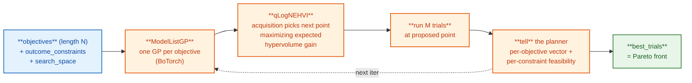
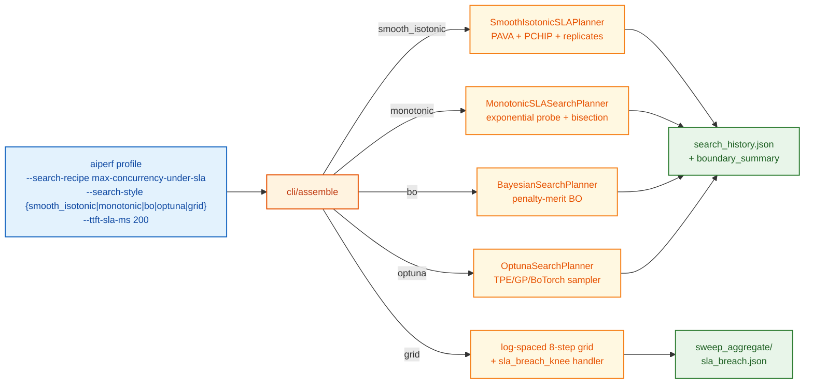

<!--
# SPDX-FileCopyrightText: Copyright (c) 2026 NVIDIA CORPORATION & AFFILIATES. All rights reserved.
# SPDX-License-Identifier: Apache-2.0
-->
# Bayesian-Optimization Outer Loop

> **New users start here:** [Search Recipes](search-recipes.md) bundle the BO knobs below into named presets such as `--search-recipe max-throughput-ttft-sla --ttft-sla-ms 200`. The 1D-saturation case (max-passing-concurrency under an SLA) is covered in [1D SLA saturation](#1d-sla-saturation-max-concurrency-under-sla-and-max-goodput-under-slo) below. Use the explicit `--search-*` flags documented on this page when no recipe matches your workflow.

> **Kubernetes execution — *coming soon*.** Every `--search-*` flag
> documented below is designed to work unchanged under cluster execution
> via the `AIPerfSweep` CRD + `aiperf kube sweep` CLI. The cluster-side
> path is finalized on the upcoming K8s integration branch but not yet
> on `main`. When it ships, BO will run inside an in-cluster
> `sweep-controller` pod that creates one child `AIPerfJob` CR per
> iteration; `search_history.json` and `sweep_aggregate/` artifacts are
> served via the operator's results API instead of being written to the
> local artifacts directory. Until then, run BO with `aiperf profile`
> locally.

`aiperf profile --search-space ... --search-metric ... --search-direction ... --search-max-iterations ...` runs an adaptive outer loop instead of a grid sweep. Each iteration the planner asks Optuna for the next point in the search space, runs `--num-profile-runs` benchmarks at it, scores the configured objective, and feeds the result back to the optimizer.

## Two ways to run BO

AIPerf ships an Optuna-backed adaptive-search engine, exposed under two `--search-planner` names:

- **`--search-planner=bayesian`** (recommended default) — a curated preset that uses the BoTorch sampler when available, auto-selects `qLogNoisyExpectedImprovement` for single-objective and `qLogNoisyExpectedHypervolumeImprovement` for multi-objective, and applies the Hvarfner-DSP Matern-5/2 kernel (Hvarfner et al. ICML 2024, [arXiv:2402.02229](https://arxiv.org/abs/2402.02229)) to every GP fit. If the optional BoTorch stack is unavailable, it logs a warning and falls back to Optuna's core TPE sampler.
- **`--search-planner=optuna`** (expert mode) — same engine, but exposes `--optuna-sampler {tpe,gp,botorch}` and `--optuna-acquisition {logei,qlogei,qnei,qlognei,qehvi,qnehvi,qlognehvi}` for users who specifically want TPE / GP-EI / a non-default acquisition. Defaults to the BoTorch path when available and falls back to TPE only when that default was implicit; explicit `botorch` requests require the optional BoTorch stack and fail clearly when it is unavailable.

Optuna is installed by default. The BoTorch sampler is optional:

```bash
uv pip install -e '.[botorch]'
```

The BoTorch extra pulls in `optuna-integration`, `botorch>=0.10`, `gpytorch`, and `torch`.

## When to use it

Use BO when:
- The search space is too large to grid-enumerate (e.g. concurrency 1–1000 with no obvious step).
- You want the best point (single-objective) or the Pareto front (multi-objective), not full characterization of every variation.
- A single scalar objective captures what you care about (throughput, p99 latency, etc.), OR you want the trade-off curve between two-or-more metrics — see [Multi-objective Pareto BO](#multi-objective-pareto-bo) below.

Use a grid sweep when:
- You want to compare specific points the team has agreed on.
- You need a complete characterization of every variation (BO converges on the best region and may stop early).

BO runs in-process via `aiperf profile --search-*`. The orchestrator owns the planner state and drives one benchmark per iteration.

## Quick start

```bash
aiperf profile \
    --model my-model \
    --url http://infer.example.com \
    --search-space "concurrency:1,1000:int" \
    --search-metric output_token_throughput \
    --search-direction maximize \
    --search-max-iterations 30 \
    --search-random-seed 42 \
    --num-profile-runs 3
```

This runs 30 search iterations × 3 trials each = 90 benchmarks. `--search-planner=bayesian` is the implicit default. Output:
- `<artifact_dir>/search_iter_NNNN/profile_runs/run_NNNN/` — per-trial artifacts.
- `<artifact_dir>/search_history.json` — BO trajectory, written incrementally.
- `<artifact_dir>/aggregate/sweep_aggregate/profile_export_aiperf_sweep.{json,csv}` — same per-combination aggregate the grid path produces. (For sweep-only runs without `--num-profile-runs`, this lands at `<artifact_dir>/sweep_aggregate/` instead; multi-run wrapping nests it under `aggregate/`.)

## Single-objective BO

### Flag reference

| Flag | Required | Description |
|---|---|---|
| `--search-space PATH:LO,HI[:KIND]` | yes | Repeatable. Dotted-path into `BenchmarkConfig`. `KIND` is `int` or `real`, default `real`. |
| `--search-metric METRIC` | yes | Metric tag to optimize (e.g. `output_token_throughput`). The bare tag — NOT a flattened `_avg`/`_p99` aggregator-suffixed key. |
| `--search-stat STAT` | no | Statistic on the metric: `avg` / `p50` / `p90` / `p95` / `p99`. Default `avg`. See [Objective semantics](#objective-semantics) for the mean-vs-pooled trade-off when STAT is a percentile. |
| `--search-direction DIR` | yes | `maximize` (throughput, goodput) or `minimize` (latency, TTFT). |
| `--search-max-iterations N` | yes | Maximum search iterations. 2–200. |
| `--search-initial-points N` | no | Random Sobol points before GP fitting. Default 5. Must be < `--search-max-iterations`. |
| `--search-random-seed N` | no | Reproducibility seed for the Optuna study. When unset, sampling is non-deterministic. |
| `--search-percentile-pooling MODE` | no | `mean` (default) or `pooled`. When `--search-stat` is a percentile, switches the BO objective from mean-of-per-trial-percentiles to the percentile of the pooled per-request samples across all trials. `pooled` requires `--export-level records`. See [Objective semantics](#objective-semantics). |
| `--search-planner NAME` | no | `bayesian` (default; curated Optuna preset with BoTorch-if-available fallback to TPE) / `optuna` (expert mode) / `monotonic_sla` / `smooth_isotonic`. |
| `--optuna-sampler SAMPLER` | no | Only consulted with `--search-planner=optuna`. `botorch` (implicit default) / `gp` / `tpe`. The implicit BoTorch default falls back to TPE when the optional stack is unavailable; explicit `botorch` raises. |
| `--optuna-acquisition ACQ` | no | BoTorch acquisition override. Only consulted with `--search-planner=optuna --optuna-sampler=botorch`. Single-objective: `qnei` (Letham 2019) or `qlognei` (Ament 2023) for noisy-EI; `logei`/`qlogei` are the explicit defaults. Multi-objective: `qehvi`, `qnehvi`, or `qlognehvi` (Daulton 2021). The cross-field validator on `AdaptiveSearchSweep` requires the choice to match `len(objectives)`: single-objective acquisitions reject `len(objectives) > 1`, multi-objective acquisitions reject `len(objectives) == 1`. The `bayesian` preset auto-selects `qlognei` (single-obj) or `qlognehvi` (multi-obj) based on `len(objectives)`. See [Multi-objective Pareto BO](#multi-objective-pareto-bo). |
| `--optuna-terminator MODE` | no | Posterior-regret stopping: `regret` (Makarova 2022 `RegretBoundEvaluator`) or `emmr` (Ishibashi 2023). Only consulted with `--search-planner=optuna`. Layered on top of three-signal convergence; `convergence_reason` becomes `posterior_regret_bound` or `emmr` when it fires. |

### Search space grammar

`PATH:LO,HI[:KIND]`

- `PATH` is a dotted path resolved by `_set_nested_value` (the same primitive grid sweeps use). For named-list segments like `phases.profiling.concurrency`, the segment matches against the `name` field. Typos error loudly with the available names listed.
- `LO` and `HI` are inclusive bounds parsed as floats. For `:int`, integer rounding happens at the planner boundary so candidates always coerce to integers before the run.
- `:int` produces an integer-valued dimension, `:real` a real-valued dimension. Categorical dimensions are not supported by the current `SearchSpaceDimension` model.

Multi-dim:

```bash
--search-space "concurrency:1,500:int" \
--search-space "phases.profiling.request_rate:0.1,100.0:real"
```

### Objective semantics

`--search-metric` must match a key in `RunResult.summary_metrics` produced by the run — that is, the bare metric tag (`output_token_throughput`, `time_to_first_token`), not the flattened `_avg`/`_p99` aggregator-suffixed form.

**Aggregation across `--num-profile-runs`.** Per iteration, the planner records a single Optuna trial whose scalar objective is the arithmetic mean of finite per-trial values across the N successful benchmark trials (or the pooled-percentile point estimate when `--search-percentile-pooling=pooled` and `--search-stat` is a percentile). The GP therefore sees one observation per search point, not N, and fits a single homoscedastic noise term over the whole study. The within-point spread is not currently exposed to the GP; heteroscedastic-noise modelling via `HeteroskedasticSingleTaskGP` is listed as a deferred upgrade under [What this implementation isn't](#what-this-implementation-isnt).

The same scalar is what `search_history.json` records as the first entry of the per-iteration `objective_values` list (length-1 for single-objective).

**Failed trials.** Skipped when extracting the objective. An iteration with zero successful trials is reported to Optuna via a per-direction failure sentinel passed to `study.tell()` (large value when minimizing, small when maximizing), and the loop continues. A warning is logged.

**Mean of percentiles vs pooled percentiles.** When `--search-stat` is a percentile (`p50`/`p99`/...), the BO objective defaults to the *expected per-trial percentile* (mean across trials). Pass `--search-percentile-pooling pooled` to switch to the percentile of the **pooled** per-request samples across all `--num-profile-runs` trials -- the planner walks each trial's `profile_export.jsonl` and computes `numpy.percentile` over the pooled bag. The two differ for skewed distributions: pooled-p99 over `N×requests` exposes more tail mass than `mean(per-trial p99)`. For BO finding the best config the choice rarely changes the optimum's location; for SLO claims it does, and pooled is the statistic that satisfies the claim. `pooled` requires `--export-level records` (or `raw`) so the per-request JSONL is on disk; missing JSONL falls back to mean-of-percentiles with a one-time warning. Cite Nakayama 2014, *Confidence Intervals for Quantiles Using Sectioning* ([PDF](https://web.njit.edu/~marvin/papers/a19-nakayama.pdf)) for the canonical bias/variance analysis of pooled-vs-sectioned quantile estimation; the WSC tutorial Pasupathy & Yeh 2022, *Input Uncertainty Quantification for Quantiles* ([PDF](https://web.ics.purdue.edu/~pasupath/PAPERS/2022passinyeh.pdf)) is the recommended starting point for engineers wiring up sectioning-based confidence intervals on top of the point estimate.

### Constraint handling

SLA filters (`--search-sla`, `--ttft-sla-ms`, etc.) and `outcome_constraints` are wired into Optuna via the native `constraints_func` interface. Each trial's signed-violation vector (`v_i = observed_i - threshold_i`, sign-aligned so `v_i <= 0` means feasible) is written to `trial.user_attrs["constraints"]` and the BoTorch sampler consumes it through `constraints_func`. Per Letham et al. 2019 ([arXiv:1706.07094](https://arxiv.org/abs/1706.07094)), this lets the acquisition function downweight infeasible regions without requiring a hand-rolled penalty merit, and lets the GP learn the feasibility surface as a separate output.

### Convergence detection

The loop terminates when any of:

1. `--search-max-iterations` iterations have been run.
2. **Improvement-over-best patience** (`improvement_patience`, default 10): no successful iteration has improved the running best for that many consecutive iterations. "We've stopped finding better points" is a stronger termination signal than "values stopped fluctuating."
3. **Coefficient-of-variation plateau** (`plateau_window`, `plateau_threshold`): on the last `plateau_window` (default 8) successful iterations, the sample CV (`stddev/|mean|`, Bessel's correction) falls below `plateau_threshold` (default 0.01 = 1% relative spread). Refused when `|mean|` is essentially zero — CV has no scale in that regime.

Whichever signal fires first wins; the reason is logged and recorded under `convergence_reason` in `search_history.json` so post-run audit can tell which terminated. `"max_iterations"`, `"improvement_patience"`, `"plateau_cv"`, or — when `--optuna-terminator` is set under `--search-planner=optuna` — `"posterior_regret_bound"` (Makarova 2022) / `"emmr"` (Ishibashi 2023).

Plateau detection is **scale-free** — works for throughput (~1000) and latency (~50) without tuning. Convergence can fire as early as iteration `plateau_window` if the first random-Sobol points happen to land in a flat region; this is correct behavior, not a bug.

### Mutual exclusion

`--search-*` is mutually exclusive with:
- Magic-list flags that produce sweeps (`--concurrency 10,20,30`).
- Explicit `sweep:` blocks in YAML.
- `--convergence-metric` (adaptive trial-level early stop). Reason: the trial-level convergence semantics are orthogonal to outer-loop convergence; their composition is undefined. Rejected at config-validate time in `_converter_optionals._reject_search_plus_convergence`.

### Output schema

`search_history.json`:

```json
{
  "config": {
    "planner": "bayesian",
    "objectives": [
      {"metric": "output_token_throughput", "stat": "avg", "direction": "MAXIMIZE", "threshold": null}
    ],
    "outcome_constraints": [],
    "max_iterations": 30,
    "n_initial_points": 5,
    "random_seed": 42,
    "improvement_patience": 10,
    "plateau_window": 8,
    "plateau_threshold": 0.01,
    "search_space": [{"path": "phases.profiling.concurrency", "lo": 1, "hi": 1000, "kind": "int"}],
    "sla_filters": []
  },
  "iterations": [
    {"iteration_idx": 0, "variation_values": {"phases.profiling.concurrency": 503}, "objective_values": [1247.3], "feasible": true, "non_monotonic_warning": null},
    {"iteration_idx": 1, "variation_values": {"phases.profiling.concurrency": 178}, "objective_values": [942.1], "feasible": true, "non_monotonic_warning": null},
    "..."
  ],
  "best_trials": [
    {
      "iteration_idx": 23,
      "objective_values": [1822.5],
      "variation_values": {"phases.profiling.concurrency": 814},
      "feasible": true,
      "feasible_count": 24,
      "pareto_rank": 0
    }
  ],
  "recipe": null,
  "convergence_reason": "improvement_patience"
}
```

Single-objective is the length-1 special case of the multi-objective shape: `best_trials` always contains the global argmax/argmin. For `len(objectives) > 1`, `best_trials` is the Pareto front (one entry per non-dominated trial). Schema reference: [Search History API](../api/search-history.md).

`convergence_reason` is one of `"max_iterations"`, `"improvement_patience"`, `"plateau_cv"`, `"posterior_regret_bound"`, `"emmr"`, or `null` (still running / written mid-loop). The monotonic-planner path (see [1D SLA saturation](#1d-sla-saturation-max-concurrency-under-sla-and-max-goodput-under-slo)) adds `"monotonic_precision_reached"`, `"monotonic_no_failure_in_range"`, and `"monotonic_no_pass_in_range"`. The `smooth_isotonic` planner additionally emits `"smooth_isotonic_no_pass_in_range"` and `"smooth_isotonic_no_failure_in_range"`.

The file is rewritten after every iteration, so a crashed run still leaves the partial trajectory on disk.

#### `boundary_summary` (1D SLA-saturation)

When the search has exactly one search-space dimension, `search_history.json` carries a `boundary_summary` block reporting the literal feasibility boundary — the highest swept value that passed (`feasible_max`) and, when at least one SLA filter is configured, the lowest that failed (`infeasible_min`, with the breaching filter recorded under `first_breach`). For runs with no SLA filters, every iteration is feasible by definition, so `infeasible_min` is `null` and `feasible_max` reports the highest swept value seen. For multi-dim searches the entire block is `null`. See [1D SLA saturation — `boundary_summary` block](#search_historyjson--boundary_summary-block) for the full schema and examples.

The `monotonic_sla` planner (registered alongside `bayesian` under the `search_planner` plugin category) writes the same `boundary_summary` shape directly from its bisection state, so consumers don't branch on planner choice.

## Multi-objective Pareto BO

When `len(objectives) > 1`, BO maximizes the **dominated hypervolume** of the Pareto front rather than a scalar. Use it when you want the trade-off between two-or-more metrics (e.g. throughput vs. p99 TTFT) instead of a single best point. AIPerf supports multi-objective Bayesian optimization via Optuna+BoTorch's `qLogNoisyExpectedHypervolumeImprovement` acquisition (`qlognehvi`; Daulton et al. 2021, [arXiv:2105.08195](https://arxiv.org/abs/2105.08195)).

The single-objective path is the length-1 special case of the same machinery; this section documents the additional knobs that come into play when `len(objectives) > 1`.

### When to use it

- You need the **trade-off shape** between two-or-more metrics (e.g. throughput vs. p99 TTFT). Single-objective BO collapses the trade-off into a scalar before the search starts; multi-objective BO reports the curve and lets you pick a point afterward.
- You don't know how to weight the objectives in advance. With single-objective + scalarization (`0.7*throughput - 0.3*ttft`) you have to commit to weights up front; with multi-objective you defer the choice.
- The BoTorch sampler is acceptable. Multi-objective Pareto BO is supported under `--search-planner=bayesian` (the curated preset auto-selects `qlognehvi` when `len(objectives) > 1`) or under the explicit-flag form `--search-planner=optuna --optuna-sampler=botorch --optuna-acquisition=qlognehvi`. The 1D-saturation planners `monotonic_sla` and `smooth_isotonic` are single-objective by design.

### When not to use it

- You can articulate a defensible scalar objective (`0.7*throughput - 0.3*ttft`, or a goodput metric that already encodes the SLA). Single-objective BO is faster, has tighter convergence guarantees, and produces a single number.
- You only have one metric you care about — `len(objectives) == 1` is just single-objective BO.
- You want to enforce hard cutoffs ("p99 TTFT must never exceed 250 ms") rather than soft trade-offs. Outcome constraints downweight infeasible candidates inside acquisition; for hard eligibility use `sla_filters` instead. See [Three knobs that look similar](#three-knobs-that-look-similar).

### How it works



A `ModelListGP` fits one independent GP per objective, so the planner doesn't assume the objectives are correlated — the GP for throughput and the GP for TTFT each get their own kernel hyperparameters. qLogNEHVI scores candidate points by expected hypervolume gain over the current dominated region, with a log-space numerically-stable formulation (Ament et al.'s 2023 log-space formulation, [arXiv:2310.20708](https://arxiv.org/abs/2310.20708)).

### Three knobs that look similar

`Objective.threshold`, `OutcomeConstraint`, and `sla_filters` are all "thresholds on metrics" but they do different things. Get them right. **This table is the canonical reference for the three-knob distinction; other docs link here.**

| Knob | Where it lives | What it does | When to use |
|---|---|---|---|
| `Objective.threshold` | inside `objectives[i]` | **Pareto reference point** for hypervolume. Trials worse than `threshold` on this objective contribute zero hypervolume. Auto-derived from worst Sobol initial point when `null`. | When you have a defensible "anything past this is unusable" bound and want hypervolume to ignore it. Multi-objective only — ignored for length-1 `objectives`. |
| `OutcomeConstraint` | top-level `outcome_constraints` list | **Acquisition mask** on a metric the optimizer is **not** optimizing. BoTorch downweights candidates predicted to violate the constraint. Doesn't reject the trial post-hoc. | When you want the optimizer to *avoid* a region (e.g. any failed requests) without making it a Pareto axis. |
| `sla_filters` | top-level `sla_filters` list | **Post-hoc benchmark eligibility filter.** Trials that violate any SLA filter are marked infeasible and demoted in the lexicographic best-selection — but they still flow into the GP. Use with one search dimension to define a feasibility boundary. | When the question is "what's the highest concurrency I can sustain at p99 TTFT < 250ms?" — the SLA is a hard cutoff, not a trade-off. See [1D SLA saturation](#1d-sla-saturation-max-concurrency-under-sla-and-max-goodput-under-slo). |

You can combine all three. A typical multi-objective recipe might use `objectives: [throughput, ttft]` with `Objective.threshold` on each, plus `OutcomeConstraint` on `error_request_count` to keep BO out of failure regions, with no `sla_filters` because the trade-off itself is the point.

```yaml
sweep:
  type: adaptive_search
  planner: bayesian   # curated preset: auto-selects qlognehvi for len(objectives) > 1.
                      # Equivalent expert form:
                      # planner: optuna
                      # optuna_sampler: botorch
                      # optuna_acquisition: qlognehvi
  search_space:
    - {path: concurrency, lo: 1, hi: 1000, kind: int}
  objectives:
    - {metric: output_token_throughput, stat: avg, direction: maximize}
    - {metric: time_to_first_token, stat: p99, direction: minimize, threshold: 250.0}
  outcome_constraints:
    - {metric: error_request_count, op: "<=", bound: 0}
  max_iterations: 40
  n_initial_points: 10
```

### Schema

`AdaptiveSearchSweep.objectives` is a list of `Objective` entries, each with `metric`, `stat`, `direction`, and an optional `threshold` (Pareto reference point used to bound hypervolume). `outcome_constraints` is a parallel list of `OutcomeConstraint` feasibility gates on metrics the optimizer is **not** optimizing — distinct from `Objective.threshold` (reference point) and from `sla_filters` (post-hoc benchmark eligibility).

```yaml
sweep:
  type: adaptive_search
  planner: bayesian   # or: planner: optuna, with sampler/acquisition pinned
  search_space:
    - {path: concurrency, lo: 1, hi: 1000, kind: int}
  objectives:
    - {metric: output_token_throughput, stat: avg, direction: maximize}
    - {metric: time_to_first_token, stat: p99, direction: minimize, threshold: 250.0}
  outcome_constraints:
    - {metric: request_error_rate, op: "<=", bound: 0.01}
  max_iterations: 30
```

### CLI

The CLI shorthand `--search-metric` / `--search-direction` produces a length-1 `objectives` list. Multi-objective requires either an explicit `objectives:` block in YAML (preferred, since the CLI shape doesn't repeat well for N>1) or a multi-objective search recipe.

```bash
# Curated preset (recommended): auto-selects qlognehvi for multi-objective.
aiperf profile \
    --model my-model \
    --url http://infer.example.com \
    --config sweep.yaml \
    --search-planner bayesian \
    --search-max-iterations 40 \
    --search-random-seed 42 \
    --num-profile-runs 3

# Equivalent expert form: pin every choice explicitly.
aiperf profile \
    --model my-model \
    --url http://infer.example.com \
    --config sweep.yaml \
    --search-planner optuna \
    --optuna-sampler botorch \
    --optuna-acquisition qlognehvi \
    --search-max-iterations 40 \
    --search-random-seed 42 \
    --num-profile-runs 3
```

Multi-objective is supported under both:

- **`--search-planner=bayesian`** — the curated preset auto-detects `len(objectives) > 1` and selects `qlognehvi`. No further flags required.
- **`--search-planner=optuna --optuna-sampler=botorch --optuna-acquisition=qlognehvi`** — the explicit-flag form for users who want to pin every choice.

The 1D-saturation planners `monotonic_sla` and `smooth_isotonic` are intrinsically single-objective (1D bisection / 1D isotonic regression) and reject `len(objectives) > 1` at config-time.

### Acquisition

Multi-objective uses BoTorch's `qLogNoisyExpectedHypervolumeImprovement` (Daulton et al. 2021, [arXiv:2105.08195](https://arxiv.org/abs/2105.08195)) — the noise-aware, log-space-numerically-stable Pareto BO default. `qehvi` and `qnehvi` are the older non-log variants kept under `--search-planner=optuna` for parity studies.

### Cross-field validator

`AdaptiveSearchSweep` enforces that the acquisition matches the number of objectives:

- Single-objective acquisitions (`logei`, `qlogei`, `qnei`, `qlognei`) reject `len(objectives) > 1` with a config-time error suggesting `qlognehvi`.
- Multi-objective acquisitions (`qehvi`, `qnehvi`, `qlognehvi`) reject `len(objectives) == 1` with a config-time error suggesting `qlognei`.
- 1D-saturation planners (`monotonic_sla`, `smooth_isotonic`) reject `len(objectives) > 1` outright.

### Reference points

`Objective.threshold` is the **Pareto reference point** for hypervolume computation: trials worse than `threshold` on this objective contribute zero hypervolume. When `threshold: null`, the planner auto-derives one from the worst observed value among the Sobol initial points. Set it explicitly when you have a defensible "anything past this is unusable" bound (e.g. p99 TTFT > 250ms is unacceptable for the workload).

The choice matters because hypervolume is computed **relative to the reference point**: trials worse than the reference contribute zero. Two consequences:

- A reference that's too tight (close to the median) flattens hypervolume and slows convergence — every initial point is "outside" the dominated region and the planner has nothing to work with.
- A reference that's too loose (deep in the worst-observed tail) makes hypervolume look healthy even when the front is bad. Convergence detection (improvement-patience on hypervolume) gets noisy.

For most workloads, the auto-derived reference (worst Sobol value) is fine. Override when you have an operational floor: "TTFT past 250 ms is unacceptable for this workload" → `threshold: 250.0` on the TTFT objective.

### Convergence

`improvement_patience` and `plateau_cv` operate on the **hypervolume time series** in multi-objective mode (rather than the scalar objective). Hypervolume is monotone non-decreasing across iterations (a non-dominated point either expands the front or doesn't), so improvement-patience fires when the front has stopped growing for `improvement_patience` consecutive iterations.

Pareto fronts plateau later than scalar objectives — there's more "frontier" to explore. The default `improvement_patience=10` and `plateau_window=8` work, but consider:

- Raising `max_iterations` to 50+ for `len(objectives) >= 2`.
- Raising `n_initial_points` to 10+ so the auto-derived reference points are well-conditioned.
- Loosening `plateau_threshold` to 0.005 (0.5% relative hypervolume CV) if you want the loop to run longer.

The full list of `convergence_reason` values is unchanged from single-objective; see [Search History API — Convergence Reasons](../api/search-history.md#convergence-reasons).

### Output

`search_history.json` carries the same shape as single-objective, with `objective_values` becoming a length-N tuple per iteration and `best_trials` becoming the Pareto front. See [Search History API — Interpreting `best_trials`](../api/search-history.md#interpreting-best_trials) for the full schema.

```json
{
  "config": {
    "objectives": [
      {"metric": "output_token_throughput", "stat": "avg", "direction": "maximize", "threshold": null},
      {"metric": "time_to_first_token", "stat": "p99", "direction": "minimize", "threshold": 250.0}
    ],
    "outcome_constraints": [
      {"metric": "error_request_count", "op": "<=", "bound": 0}
    ]
  },
  "iterations": [
    {"iteration_idx": 7, "variation_values": {"phases.profiling.concurrency": 280}, "objective_values": [9800.1, 215.4]},
    {"iteration_idx": 13, "variation_values": {"phases.profiling.concurrency": 256}, "objective_values": [9512.3, 187.4]},
    {"iteration_idx": 22, "variation_values": {"phases.profiling.concurrency": 224}, "objective_values": [8910.0, 162.7]}
  ],
  "best_trials": [
    {"iteration_idx": 7,  "objective_values": [9800.1, 215.4], "variation_values": {"phases.profiling.concurrency": 280}, "feasible": true, "feasible_count": 18, "pareto_rank": 0},
    {"iteration_idx": 13, "objective_values": [9512.3, 187.4], "variation_values": {"phases.profiling.concurrency": 256}, "feasible": true, "feasible_count": 18, "pareto_rank": 0},
    {"iteration_idx": 22, "objective_values": [8910.0, 162.7], "variation_values": {"phases.profiling.concurrency": 224}, "feasible": true, "feasible_count": 18, "pareto_rank": 0}
  ],
  "convergence_reason": "improvement_patience"
}
```

Each entry of `best_trials` carries `pareto_rank: 0` (all front members are non-dominated by definition). The front is unranked; pick a point afterward by whatever scalar criterion fits your deployment (e.g. "throughput at the highest concurrency where p99 TTFT < 200 ms").

### Limitations

- **Multi-objective requires the BoTorch sampler.** Available under `--search-planner=bayesian` (curated preset auto-selects `qlognehvi`) or under `--search-planner=optuna --optuna-sampler=botorch --optuna-acquisition=qlognehvi`. The 1D SLA-saturation planners (`monotonic_sla`, `smooth_isotonic`) are single-objective by design and reject `len(objectives) > 1` at config-time.
- **`outcome_constraints` are soft, not hard.** They mask BoTorch's acquisition score but don't reject infeasible trials. For hard cutoffs use `sla_filters` instead. The two compose: `outcome_constraints` keeps BO out of the failure region; `sla_filters` makes any trial that lands there infeasible in `best_trials` selection.
- **No high-dimensional Pareto BO.** AIPerf's search spaces are 1D–3D; we use qLogNEHVI on a single `ModelListGP`. The MORBO ([arXiv:2109.10964](https://arxiv.org/abs/2109.10964)) approach for ≥20D Pareto BO is not on the roadmap. See [What this implementation isn't](#what-this-implementation-isnt).
- **`Objective.threshold` is for hypervolume, not for filtering.** A trial worse than the threshold still flows into the GP — it just contributes zero hypervolume. If you want to actively avoid a region, use `outcome_constraints`.

## 1D SLA saturation: `max-concurrency-under-sla` and `max-goodput-under-slo`

The classic LLM-serving capacity question: **what is the highest concurrency at which the SUT still meets its SLA?** AIPerf answers it with an adaptive search that names both the maximum passing concurrency and the first failing concurrency in O(log N) trials. The `max-concurrency-under-sla` search recipe is the canonical entry point; the goodput-formulation alternative is `max-goodput-under-slo`. Both are plugin-registered presets that compose with the BO engine described above and with [Search Recipes](search-recipes.md).

The research basis (industry survey + academic citations) for the adaptive SLA search lived in a companion design-notes document that is not part of the repository.

The plugin registry ships two recipes built on top of the engine:

| Recipe | Algorithm | What it answers | Required flags |
|---|---|---|---|
| `max-concurrency-under-sla` | `smooth_isotonic` (default) / `monotonic` / `bo` / `optuna` / `grid` | "Highest concurrency where every SLA filter passes" | One or more of `--ttft-sla-ms` / `--tpot-sla-ms` / `--e2e-sla-ms` / `--error-rate-sla` / `--search-sla` |
| `max-goodput-under-slo` | BO with goodput as objective | "Concurrency that maximizes goodput at >=X% per-request SLO attainment" (DistServe formulation) | `--ttft-sla-ms`, `--tpot-sla-ms`, `--e2e-sla-ms`; `--slo-attainment-fraction` (default 0.95) |

The generic `--search-sla "metric:stat:op:threshold"` flag (repeatable) attaches arbitrary SLA filters to the explicit `--search-space` path, with no recipe involved. See the [SLA flags table](#sla-flags) below for the format.

### Quick start

```bash
# Default: smooth-isotonic SLA search (PAVA-denoised + PCHIP root-find;
# strictly more accurate than `monotonic` under noise)
aiperf profile --model my-model --url http://infer.example.com --streaming \
  --search-recipe max-concurrency-under-sla --ttft-sla-ms 200

# Monotonic style: 1D exponential probe + bisection (~10 iterations on
# [1, 1000] at 5% precision). Cheaper but margin-magnitude-blind.
aiperf profile --model my-model --url http://infer.example.com --streaming \
  --search-recipe max-concurrency-under-sla --search-style monotonic --ttft-sla-ms 200

# BO style: optimize WITHIN the feasibility region (best when you also want
# to maximize throughput, not only locate the boundary)
aiperf profile --model my-model --url http://infer.example.com --streaming \
  --search-recipe max-concurrency-under-sla --search-style bo --ttft-sla-ms 200

# Grid style: 8 log-spaced points + sla_breach.json artifact for plotting
aiperf profile --model my-model --url http://infer.example.com --streaming \
  --search-recipe max-concurrency-under-sla --search-style grid --ttft-sla-ms 200

# Goodput formulation (DistServe canonical: per-request TTFT/TPOT/E2E SLOs +
# attainment-fraction; objective is the goodput metric itself)
aiperf profile --model my-model --url http://infer.example.com --streaming \
  --search-recipe max-goodput-under-slo \
  --ttft-sla-ms 500 --tpot-sla-ms 15 --e2e-sla-ms 2000 \
  --slo-attainment-fraction 0.95
```

The recipe expands in the CLI assembly pipeline into the same `AdaptiveSearchSweep` (set on `AIPerfConfig.sweep`) machinery a hand-written `--search-space` invocation would produce.

### SLA flags

The four issue-named SLA flags are sugar over the generic `--search-sla` syntax. All five may be combined; recipe-named flags compose first, then `--search-sla` entries in CLI order.

| Flag | Metric tag | Stat | Op | Notes |
|---|---|---|---|---|
| `--ttft-sla-ms` | `time_to_first_token` | `p95` | `lt` | Streaming required |
| `--tpot-sla-ms` (a.k.a. `--itl-sla-ms`) | `inter_token_latency` | `p95` | `lt` | Streaming required; TPOT == ITL in AIPerf metric tags |
| `--e2e-sla-ms` | `request_latency` | `p99` | `lt` | |
| `--error-rate-sla` | `request_error_rate` | `p99` | `lt` | Fraction in `[0, 1]` |
| `--search-sla "TAG:STAT:OP:THRESHOLD"` | any | any of `{avg, p50, p90, p95, p99}` | any of `{lt, le, gt, ge}` | Repeatable; format is strict colon-delimited 4-tuple |

```bash
# Compose: TTFT p95 < 200ms AND error rate p99 < 1%, on the explicit
# --search-space path (no recipe).
aiperf profile --model my-model --streaming \
  --search-space "concurrency:1,1000:int" \
  --search-sla "time_to_first_token:p95:lt:200" \
  --search-sla "request_error_rate:p99:lt:0.01" \
  --search-metric output_token_throughput --search-direction maximize \
  --search-max-iterations 30
```

Malformed `--search-sla` values raise `TypeError` naming the offending flag. Unknown stat or op keys are validated against the `SLAFilter` `Literal` types — typos error loud at parse time.

### Search styles for `max-concurrency-under-sla`

`--search-style` selects which planner the recipe expands to. The defaults match the issue's exact ask.

| Style | Algorithm | Iterations (typical) | Best for |
|---|---|---|---|
| `smooth_isotonic` (default) | PAVA-denoised isotonic regression + PCHIP root-find on per-SLO margin curves | ~13–25 on `[1, 1000]` at 5% precision (more with replicates) | Most-accurate boundary location under noise; reports `boundary_type` (smooth or cliff), `binding_constraint`, optional bootstrap CI |
| `monotonic` | Exponential probe + bisection on `[lo, hi]` | ~10 on `[1, 1000]` at 5% precision | Cheapest path; margin-magnitude-blind so a single noisy probe at the boundary can pull the verdict |
| `bo` | Penalty-BO with `output_token_throughput` as objective | 30 (`--search-max-iterations` overrides; see [Single-objective BO](#single-objective-bo) for the underlying engine) | Optimizing throughput WITHIN the feasibility region, not just naming the boundary |
| `optuna` | Optuna-driven BO/TPE backend over the same penalty objective | ~30 (configurable via `--search-max-iterations`) | Same niche as `bo` but uses the Optuna sampler stack for tuning; pick based on which sampler library you prefer |
| `grid` | 8 log-spaced points + `sla_breach_knee` post-process | 8 fixed | Plotting / visualization with a reproducible artifact |



The monotonic planner mirrors Triton perf_analyzer's `--binary-search`: each point's verdict is provisional until 2 trials agree (configurable via `AdaptiveSearchSweep.monotonic_stability_trials`, default `2`).

#### `smooth_isotonic` (default)

The smooth-isotonic planner is a drop-in replacement for `monotonic` that fixes its core accuracy gap: bisection uses **sign-only** feedback at every probe, so a single noisy probe at the boundary can flip the verdict and corrupt the next root estimate. `smooth_isotonic` instead fits a smooth, monotone curve to all probe margins and root-finds the boundary on the curve.

The algorithm runs in five phases:

1. **Bracket** — exponential probe (`x = x_min, 2·x_min, 4·x_min, …`) until the first SLO breach, identical to `monotonic`. Output: `[x_lo, x_hi]`.
2. **Smooth-isotonic fit** — three internal probes inside `[x_lo, x_hi]`, then for each per-SLO margin series: PAVA (`scipy.optimize.isotonic_regression`) denoises by pooling adjacent violators into a monotone step function, then PCHIP (`scipy.interpolate.PchipInterpolator`) interpolates the **denoised** points to give a smooth, monotone, root-findable curve. Solve `m̂(x*) = 0` per SLO and aggregate via σ-normalized max-of-margins to pick the candidate boundary. PAVA-then-PCHIP composition fixes both PCHIP's noise-fragility (vLLM's deleted `serve_sla.py` pattern) and isotonic regression's piecewise-constant ambiguous-root problem.
3. **Replicates (opt-in)** — when `sla_replicates: N > 0` in YAML (or the auto-budget formula triggers `N ≥ 3`), re-run the candidate `x*` `N` times under Common Random Numbers (same `BenchmarkConfig` + same `random_seed`) to estimate per-replicate margin variance. Bootstrap CI on the binding margin → if CI brackets zero, expand to `x* ± δ` and refit; otherwise terminate. Capped at 20 replicates to bound runaway under noisy degenerate constraints.
4. **Cliff guard** — PAVA-residual changepoint detection. If the most-recent probe's residual `|m_observed - m̂|` exceeds `3·σ_local` AND the bracket gap exceeds `precision · x_hi`, the planner declares `boundary_type: "cliff"` and reports `(boundary_low, boundary_high)` instead of pretending the curve is smooth across a discontinuity. Otherwise `boundary_type: "smooth"`. Catches the prefill-prioritizing-server pattern documented in Sarathi-Serve.
5. **Termination** — bracket precision reached: `(infeasible_min - feasible_max) / infeasible_min < SLA_PRECISION_DEFAULT` (5% by default), OR the Phase-3 bootstrap CI on the binding-constraint margin no longer brackets zero, OR `--search-max-iterations` exhausted. Reasons emitted in `convergence_reason`: `smooth_isotonic_precision_reached`, `smooth_isotonic_cliff_precision_reached`, `smooth_isotonic_no_pass_in_range`, `smooth_isotonic_no_failure_in_range`, `smooth_isotonic_pchip_fallback_bisection`, or `max_iterations`.

Power-user knobs (all optional; the defaults are sized for typical LLM-serving workloads). These are **YAML-only** fields on the `AdaptiveSearchSweep` schema (`src/aiperf/config/sweep/config.py`); they are not exposed as CLI flags and have no `AIPERF_SEARCH_PLANNER_*` env-var binding. Set them under a `sweep:` block in your AIPerf YAML config:

- `sla_replicates: N` — Phase-3 replicate count override. Default `0` (auto). Set to a fixed integer to override the auto budget.
- `sla_precision: tight|normal|coarse` — Per-probe sample budget. Maps to `n_requests_per_probe ∈ {10000, 1000, 300}`. Default `normal` → p99 CI ≈ ±10%.
- `sla_warmup_seconds: N` — Per-probe warmup discard before computing margins. Default `None` → 30s flat floor (`AIPERF_SEARCH_PLANNER_DEFAULT_WARMUP_SECONDS`). First-probe-at-each-x is floored at 60s (`FIRST_PROBE_WARMUP_FLOOR`); replicate probes are floored at 15s (`REPLICATE_WARMUP_FLOOR`).

```yaml
# Example: override smooth-isotonic tuning via YAML
sweep:
  type: adaptive_search
  sla_replicates: 5
  sla_precision: tight
  sla_warmup_seconds: 60
```

The `boundary_summary` block in `search_history.json` carries three new optional fields when `smooth_isotonic` ran: `boundary_type` (`"smooth"` or `"cliff"`), `binding_constraint` (the SLO key with the worst σ-normalized margin at termination), and `boundary_ci` (`{lo, hi}` bootstrap CI on the binding margin) when Phase-3 replicates ran. See [Search History API Reference](../api/search-history.md#boundary_summary).

No new dependencies — the planner uses only `scipy.optimize.isotonic_regression` and `scipy.interpolate.PchipInterpolator`, both already part of the `scipy>=1.13.0` hard dep.

### Output artifacts

#### `search_history.json` — `boundary_summary` block

The BO and monotonic paths write `search_history.json` incrementally per iteration (same file documented in [Output schema](#output-schema)). The 1D-feasibility extension is the `boundary_summary` block:

```json
{
  "config": {
    "objective_metric": "output_token_throughput",
    "objective_direction": "maximize",
    "search_space": [{"path": "phases.profiling.concurrency", "lo": 1, "hi": 1000, "kind": "int"}],
    "sla_filters": [
      {"metric_tag": "time_to_first_token", "stat": "p95", "op": "lt", "threshold": 200.0}
    ]
  },
  "iterations": [
    {"iteration_idx": 0, "variation_values": {"phases.profiling.concurrency": 256}, "feasible": true},
    {"iteration_idx": 1, "variation_values": {"phases.profiling.concurrency": 512}, "feasible": false}
  ],
  "best": {"iteration_idx": 0, "variation_values": {"phases.profiling.concurrency": 256}, "feasible": true},
  "boundary_summary": {
    "swept_dim_path": "phases.profiling.concurrency",
    "feasible_max": {"value": 256, "iteration_idx": 0, "objective_value": 4172.3},
    "infeasible_min": {
      "value": 512, "iteration_idx": 1,
      "first_breach": {
        "metric_tag": "time_to_first_token", "stat": "p95",
        "op": "lt", "threshold": 200.0, "observed": 213.4
      }
    }
  },
  "convergence_reason": "monotonic_precision_reached"
}
```

`boundary_summary` is `null` when the search space has more than one dimension — the field is intentionally narrow and its semantics are only well-defined in 1D. For `monotonic_sla` and `smooth_isotonic`, the planner writes the summary directly from its internal state; for the BO style, the field is derived post-hoc from the iteration history (highest feasible swept value, lowest infeasible). The `smooth_isotonic` planner additionally writes `boundary_type`, `binding_constraint`, and (when Phase-3 replicates ran) `boundary_ci` — see [Search History API Reference](../api/search-history.md#boundary_summary). All shapes share the same base so consumers don't branch on style.

#### `sla_breach.json` — grid style only

The `grid` style emits a dedicated artifact under `sweep_aggregate/sla_breach.json`. Its keys substitute the leaf parameter name (here `concurrency`) for clarity:

```json
{
  "swept_param": "phases.profiling.concurrency",
  "max_passing_concurrency": 256,
  "first_failing_concurrency": 384,
  "first_failing_breach": {
    "metric_tag": "time_to_first_token", "stat": "p95",
    "op": "lt", "threshold": 200.0, "observed": 213.4
  },
  "all_points": [
    {"concurrency": 1,   "feasible": true,  "breaches": []},
    {"concurrency": 256, "feasible": true,  "breaches": []},
    {"concurrency": 384, "feasible": false, "breaches": [{"metric_tag": "time_to_first_token", "...": "..."}]}
  ],
  "monotonicity_check": true,
  "filters": [{"metric_tag": "time_to_first_token", "stat": "p95", "op": "lt", "threshold": 200.0}]
}
```

Edge cases: `max_passing_concurrency: null` when every point fails; `first_failing_concurrency: null` when every point passes. `monotonicity_check: false` when feasibility alternates along the swept axis — informational, never an error (it usually means the SUT is unstable, not that the search broke).

#### Goodput recipe

`max-goodput-under-slo` writes the same `search_history.json` shape, but the BO objective is the [`goodput`](../tutorials/goodput.md) metric tag and the per-request SLO threshold-set (TTFT/TPOT/E2E) is wired into the goodput-metric configuration channel; only the attainment-fraction gate (`good_request_fraction:avg:ge:<attainment>`) appears as an `SLAFilter` row. Per the DistServe formulation ([Zhong et al. OSDI '24](https://www.usenix.org/system/files/osdi24-zhong-yinmin.pdf)), a request counts as "good" only when **all three** thresholds are simultaneously met, and the attainment fraction (default `0.95`) is the minimum acceptable share of good requests.

### Comparison to other tools

| Tool | Saturation-search | SLA-stop semantics | Where AIPerf lands |
|---|---|---|---|
| [Triton perf_analyzer](https://docs.nvidia.com/deeplearning/triton-inference-server/user-guide/docs/perf_analyzer/docs/cli.html) `--binary-search` | 1D bisection over concurrency / request rate, stability-window verdict | None native | `monotonic` style is the direct equivalent + adds explicit SLA filters |
| [k6](https://k6.io/docs/test-types/breakpoint-testing/) `abortOnFail` thresholds | `ramping-arrival-rate` executor | Threshold breach stops the test, breaking-point VU count recorded | Closest UX precedent; AIPerf's `boundary_summary.infeasible_min` plays the same role |
| [Triton Model Analyzer](https://github.com/triton-inference-server/model_analyzer/blob/main/docs/config_search.md) `quick` / `optuna` | Hill-climbing or BO over engine-config space | Constraints applied as post-hoc filter | AIPerf's `bo` style is the equivalent; `monotonic` has no Model-Analyzer counterpart |
| [GenAI-Perf `analyze`](https://github.com/triton-inference-server/perf_analyzer/blob/main/genai-perf/docs/analyze.md) | `--sweep-range` / `--sweep-list` only | Python-API post-hoc filter | AIPerf's `grid` style with `sla_breach.json` exceeds this |
| [vLLM `bench serve`](https://github.com/vllm-project/vllm/pull/9338) `--goodput TTFT:500 TPOT:15 E2E:2000` | Single point per invocation | Reports goodput at that point | `max-goodput-under-slo` is the auto-search equivalent |
| [DistServe](https://arxiv.org/abs/2401.09670) (Zhong et al. OSDI '24) | Binary search + simulation, NOT Bayesian optimization. Quote: *"DistServe simply enumerates the placements via binary search and finds the maximum rate that meets the SLO attainment target with simulation trials."* | Per-request SLO attainment threshold | `MonotonicSLASearchPlanner` reproduces this algorithm; `SmoothIsotonicSLAPlanner` is a strict improvement (denoised + continuous-space PCHIP root-find) |
| [BOute](https://arxiv.org/abs/2602.10729) (Jiang et al. 2026) | Constrained `qNEHVI` on BoTorch + `ModelListGP` for joint (latency, quality); decision variables = routing thresholds + GPU placement | Constraint-GP feasibility product | Closest published precedent for AIPerf's BO planner. Different problem (serving-system optimization vs benchmark-side adaptive sweep), same machinery family |

### Caveats

**Monotonicity assumption.** Bisection assumes feasibility is monotonic along the swept axis (high concurrency fails, low passes). Real systems can violate this under cold-cache conditions or memory pressure. Watch for `monotonicity_check: false` in `sla_breach.json` and the `non_monotonic_warning` flag on the iteration history — when set, treat `boundary_summary.feasible_max` as the largest *observed* passing value, not a proof of optimality.

**"First failing" semantics.** Well-defined for `monotonic` and `grid` paths. For `bo`, the BO trajectory is non-monotonic by design; `boundary_summary.infeasible_min.value` reports the *lowest seen* failing concurrency, which is a lower bound on the true first-failing point — not a tight one.

**Stability under noise.** A single trial's verdict can flip with run-to-run variance. Pass `--num-profile-runs >= 2` so each point's verdict averages over trials; the monotonic planner's stability window kicks in automatically. The cost is linear in the number of trials, but the boundary location is more robust.

**Streaming requirement.** The TTFT and TPOT/ITL filters are streaming-only metrics. The recipe rejects `--no-streaming` at expand time when any SLA references a streaming-only metric. E2E latency and error-rate filters work without streaming.

**Mutual exclusion.** As with all recipes, `--search-recipe` is mutually exclusive with explicit `--search-*` flags and with magic-list sweeps; see [Search Recipes — mutual-exclusion rules](search-recipes.md#mutual-exclusion-rules) for the full matrix.

## Citations

- **Mockus 1978** — historical Expected Improvement; superseded by LogEI/qLogEI for numerical-stability reasons but the conceptual basis of the entire EI family.
- **Ament et al. 2023**, *Unexpected Improvements to Expected Improvement for Bayesian Optimization* ([arXiv:2310.20708](https://arxiv.org/abs/2310.20708)) — the canonical EI variant in current use; `qLogNoisyExpectedImprovement` is what the `bayesian` preset selects for single-objective.
- **Hvarfner et al. ICML 2024**, *Vanilla Bayesian Optimization Performs Great in High Dimensions* ([arXiv:2402.02229](https://arxiv.org/abs/2402.02229)) — the √D-scaled LogNormal lengthscale prior on a Matern-5/2 kernel ("Hvarfner-DSP" kernel). Applied to every BoTorch `SingleTaskGP` fit on the `bayesian` and `--optuna-sampler=botorch` paths.
- **Letham et al. 2019**, *Constrained Bayesian Optimization with Noisy Experiments* ([arXiv:1706.07094](https://arxiv.org/abs/1706.07094)) — the noisy-EI / qNEI line and the signed-violation constraint formulation Optuna's `constraints_func` consumes.
- **Daulton et al. 2021**, *Parallel Bayesian Optimization of Multiple Noisy Objectives with Expected Hypervolume Improvement* ([arXiv:2105.08195](https://arxiv.org/abs/2105.08195)) — qNEHVI / qLogNEHVI for multi-objective Pareto BO.
- **Makarova et al. 2022**, *Automatic Termination for Hyperparameter Optimization* ([proceedings.mlr.press/v188/makarova22a.html](https://proceedings.mlr.press/v188/makarova22a.html)) — `RegretBoundEvaluator`, available via `--optuna-terminator regret`.
- **Ishibashi et al. 2023**, *A Stopping Criterion for Bayesian Optimization by the Sum of Expected Margin Reductions* ([proceedings.mlr.press/v206/ishibashi23a.html](https://proceedings.mlr.press/v206/ishibashi23a.html)) — `EMMREvaluator`, available via `--optuna-terminator emmr`.

## What this implementation isn't

The current planner family is a noisy-objective BO with the conventional knobs plus native Pareto BO. It is not — and we know it is not — the literature-state-of-the-art for every HPO regime. Several upgrades have already landed under explicit flags; the remaining deferrals, for context:

- **High-dimensional Pareto BO** (MORBO, [arXiv:2109.10964](https://arxiv.org/abs/2109.10964)). AIPerf's native multi-objective path uses `qLogNoisyExpectedHypervolumeImprovement` on a `ModelListGP` (Daulton et al. 2021, [arXiv:2105.08195](https://arxiv.org/abs/2105.08195)) — see [Multi-objective Pareto BO](#multi-objective-pareto-bo). MORBO targets the ≥20-dimensional regime; AIPerf's search spaces are 1D–3D, so qNEHVI on a single `ModelListGP` is the right choice and MORBO is not on the roadmap.
- **Heteroscedastic noise priors**. The planner currently feeds a single scalar (mean of per-trial values) per iteration, so the GP fits one homoscedastic noise term over the whole study. Makarova et al. 2021, *Risk-averse Heteroscedastic Bayesian Optimization* ([arXiv:2111.03637](https://arxiv.org/abs/2111.03637)) is the relevant paper; the path forward would be (1) recording N Optuna trials per search point so within-point spread is observable, then (2) wiring a custom `candidates_func` that builds `botorch.models.gp_regression.HeteroskedasticSingleTaskGP` from per-trial sample variances. Evidence-gated: ship only if observed within-trial variance varies meaningfully across the search space on real workloads.

## See also

- [Search Recipes](search-recipes.md) — recipe catalog and authoring guide.
- [Space-filling designs](space-filling.md) — Sobol / LHS designs for the initial-points phase.
- [Adaptive Search Tutorial](../tutorials/adaptive-search.md) — narrative walkthrough of a single-objective run.
- [Search History API](../api/search-history.md) — full `search_history.json` schema, including the multi-objective `best_trials` shape and `boundary_summary` fields.
- [Sweeps troubleshooting](../troubleshooting/sweeps.md) — common issues and fixes.
- [Goodput tutorial](../tutorials/goodput.md) — per-request SLO definitions used by `max-goodput-under-slo`.
