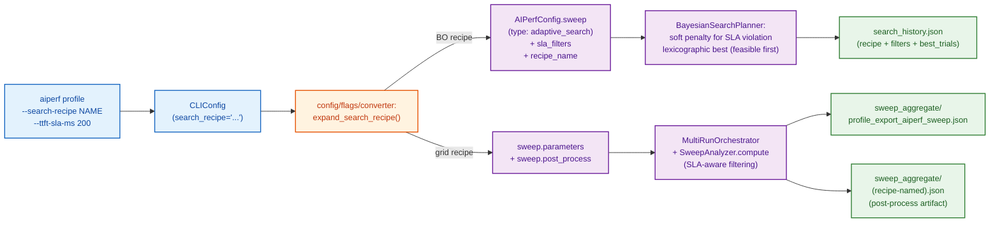
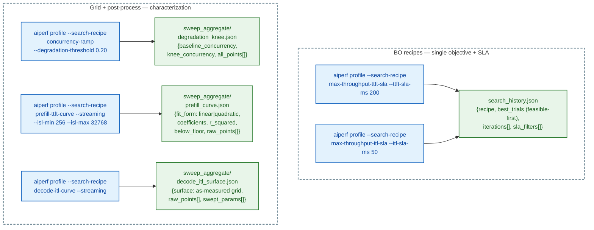
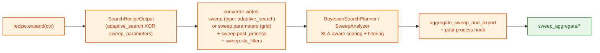

<!--
# SPDX-FileCopyrightText: Copyright (c) 2026 NVIDIA CORPORATION & AFFILIATES. All rights reserved.
# SPDX-License-Identifier: Apache-2.0
-->
# Search Recipes

Search Recipes are named, plugin-registered presets that bundle a search space, an optimization objective (or grid), termination conditions, optional SLA constraints, and an optional post-process step into a single CLI selector. They lift the user-facing surface from "write `--search-space` / `--search-metric` / `--search-direction` / `--search-max-iterations` and pick the right combination" to `--search-recipe <name>`.

> **Kubernetes execution — *coming soon*.** Every recipe in this catalog
> is designed to run unmodified under `aiperf kube sweep` once the K8s
> integration branch lands on `main`. The recipe selector, post-process
> hooks, and output artifacts are execution-mode-independent; the
> cluster path swaps in the in-cluster `sweep-controller` pod + child
> `AIPerfJob` CRs for the local subprocess executor.

```bash
aiperf profile --model my-model --url http://infer.example.com --streaming \
  --request-count 1000 \
  --search-recipe max-throughput-ttft-sla --ttft-sla-ms 200
```

Recipes expand in the CLI assembly pipeline into the same machinery the explicit `--search-*` / sweep flags drive — the runtime path is unchanged. See [Bayesian-Optimization Outer Loop](bayesian-optimization.md) for the underlying engine and `search_history.json` schema.

## When to use a recipe

| You want to | Recipe | Lower-level alternative |
|---|---|---|
| Maximize throughput under a TTFT SLA | `max-throughput-ttft-sla` | `--search-space ... --search-direction maximize` + post-filter |
| Maximize throughput under an ITL SLA | `max-throughput-itl-sla` | `--search-space ... --search-direction maximize` + post-filter |
| Find the **maximum passing concurrency** under one or more SLAs | `max-concurrency-under-sla` | 1D BO + post-filter; see [Bayesian Optimization — 1D SLA saturation](bayesian-optimization.md) |
| Maximize **goodput** under per-request TTFT/TPOT/E2E SLOs (DistServe) | `max-goodput-under-slo` | BO with `--search-metric goodput` + per-request SLO config |
| Find the concurrency knee where p99 latency degrades | `concurrency-ramp` | `--concurrency 1,10,50,100,500,1000` + post-process |
| Characterize TTFT(ISL) for capacity planning | `prefill-ttft-curve` | grid sweep + custom curve fit |
| Characterize ITL(concurrency, OSL) | `decode-itl-curve` | 2D grid sweep + custom surface fit |
| Sweep paired ISL/OSL workload shapes × concurrency for a Pareto frontier | `pareto-sweep` | scenarios sweep + custom Pareto post-process |

Power users can keep the explicit `--search-*` flags; recipes are mutually exclusive with them at the converter (clear error on collision).

## How it feels — a walkthrough

This section shows the user experience end-to-end. Every recipe collapses several BO/grid flags into one named selector, and emits artifacts the user can read directly.

### Before / after

```bash
# Before: write the BO config from scratch
aiperf profile --model X --url Y --streaming \
  --request-count 1000 \
  --search-space "concurrency:1,1000:int" \
  --search-metric output_token_throughput \
  --search-direction maximize \
  --search-max-iterations 30
# Hope you picked the right metric. Hope max-iterations is sensible.
# No SLA constraint — the winner might violate p95 TTFT silently.

# After: name the workflow, supply the SLA
aiperf profile --model X --url Y --streaming \
  --request-count 1000 \
  --search-recipe max-throughput-ttft-sla --ttft-sla-ms 200
```

### Flow at a glance



### Recipes by interaction shape



### Concrete BO interaction (`max-throughput-ttft-sla`)

```text
$ aiperf profile --model deepseek-r1 --url http://localhost:8000 \
    --endpoint-type chat --streaming \
    --search-recipe max-throughput-ttft-sla --ttft-sla-ms 200

[expand] recipe=max-throughput-ttft-sla
         search_space=[phases.profiling.concurrency: 1..1000 int]
         objective=output_token_throughput.avg -> MAXIMIZE
         max_iterations=30, n_initial_points=5
         sla_filters=[time_to_first_token.p95 < 200.0]

[BO  iter 0] concurrency=  47  -> throughput=2143  TTFT.p95= 87  feasible
[BO  iter 1] concurrency= 891  -> throughput=2890  TTFT.p95=412  infeasible (penalty=22.6)
[BO  iter 2] concurrency= 312  -> throughput=3120  TTFT.p95=178  feasible
[BO  iter 3] concurrency= 524  -> throughput=3340  TTFT.p95=215  infeasible (penalty=2.5)
[BO  iter 4] concurrency= 401  -> throughput=3290  TTFT.p95=193  feasible  best so far
...
[BO  iter 12] no improvement for 7 iterations — stopping (improvement_patience)

-> artifacts/<run>/search_history.json
   {"recipe": "max-throughput-ttft-sla",
    "best_trials": [
      {"iteration_idx": 4, "objective_values": [3290],
       "variation_values": {"phases.profiling.concurrency": 401},
       "feasible": true, "feasible_count": 8, "pareto_rank": 0}
    ],
    "config": {"sla_filters": [{"metric_tag": "time_to_first_token",
                                "stat": "p95", "op": "lt", "threshold": 200.0}],
               ...}}
```

The user reads `best_trials[0].variation_values` and gets a concrete answer: **deploy at concurrency=401 to maximize throughput while keeping p95 TTFT under 200 ms.** Without the recipe they'd have written ~5 BO flags by hand and post-hoc filtered for the SLA themselves. (`best_trials` is a list because multi-objective recipes surface the full Pareto front; single-objective recipes emit a length-1 list.)

The above terminal log is illustrative — the actual progress format depends on the dashboard / progress UI mode.

### Concrete grid + curve interaction (`prefill-ttft-curve`)

```text
$ aiperf profile --model deepseek-r1 --url http://localhost:8000 \
    --endpoint-type chat --streaming \
    --search-recipe prefill-ttft-curve --isl-min 256 --isl-max 32768

[expand] sweep_parameters={
   datasets.main.prompts.isl: [256, 512, 1024, 2048, 4096, 8192, 16384, 32768],
   phases.profiling.concurrency: [1]
 }
[expand] post_process: ttft_curve_fit -> prefill_curve.json

[run  1/8] ISL=  256 conc=1 -> TTFT.avg=  18.2 ms
[run  2/8] ISL=  512 conc=1 -> TTFT.avg=  31.7 ms
...
[run  8/8] ISL=32768 conc=1 -> TTFT.avg=2104.0 ms

[post-process] ttft_curve_fit -> linear fit r²=0.998
-> artifacts/<run>/sweep_aggregate/prefill_curve.json
   {"fit_form": "linear",
    "coefficients": [0.0641, 1.83],
    "r_squared": 0.998,
    "below_floor": false,
    "raw_points": [{"isl": 256, "ttft_ms": 18.2}, ..., {"isl": 32768, "ttft_ms": 2104.0}]}
```

The user gets a usable equation: **`TTFT(ms) = 0.0641 × ISL + 1.83`** — feed it into a capacity planner directly. Quadratic fallback fires automatically if linear `r² < 0.85`; `below_floor` flags low-confidence fits.

### Failure paths fail loud

```text
$ aiperf profile --search-recipe max-throughput-ttft-sla
ValueError: recipe 'max-throughput-ttft-sla' requires --ttft-sla-ms
           (TTFT SLA threshold in milliseconds); pass it on the CLI alongside
           --search-recipe.

$ aiperf profile --search-recipe max-throughput-ttft-sla --ttft-sla-ms 200 \
    --search-space "concurrency:1,500:int"
TypeError: --search-recipe 'max-throughput-ttft-sla' is mutually exclusive
           with explicit --search-* flags ['search_space']. Either drop the
           explicit flags and let the recipe expand them, or drop --search-recipe
           and configure --search-* by hand.

$ aiperf profile --search-recipe prefill-ttft-curve --no-streaming \
    --isl-min 256 --isl-max 32768
ValueError: recipe 'prefill-ttft-curve' requires --streaming (TTFT is a
            streaming-only metric); enable streaming on the endpoint or pick
            a different recipe.
```

### What stays invisible



That whole pipeline — Protocol dispatch, mutual-exclusion checking, model_dump round-trips, soft-penalty math, lexicographic best, post-process plugin lookup — is invisible to the user. They typed two flags. They got an answer.

## Catalog

| Recipe | Algorithm | What it answers | Inputs | Output |
|---|---|---|---|---|
| `max-throughput-ttft-sla` | BO | "Highest tokens/s where p95 TTFT < X ms" | `--ttft-sla-ms` | `best_trials` in `search_history.json`, feasibility-first |
| `max-throughput-itl-sla` | BO | "Highest tokens/s where p95 ITL < X ms" | `--itl-sla-ms` (alias `--tpot-sla-ms`) | `best_trials` in `search_history.json`, feasibility-first |
| `max-concurrency-under-sla` | Smooth-isotonic / Monotonic / BO / Optuna / Grid | "Highest concurrency where every SLA filter passes" | One or more SLA flags; `--search-style {smooth_isotonic\|monotonic\|bo\|optuna\|grid}` (default smooth_isotonic) | `boundary_summary` in `search_history.json`; `sla_breach.json` for grid |
| `max-goodput-under-slo` | BO (objective = goodput) | "Concurrency that maximizes goodput at >=X% per-request SLO attainment" | `--ttft-sla-ms`, `--tpot-sla-ms`, `--e2e-sla-ms`, `--slo-attainment-fraction` | `best_trials` in `search_history.json` plus standard aggregate summaries |
| `concurrency-ramp` | Grid + post-process | "Where does p99 latency degrade by >N%?" | `--degradation-threshold` | `sweep_aggregate/degradation_knee.json` |
| `prefill-ttft-curve` | Grid + post-process | "TTFT(ISL) curve" | `--isl-min`, `--isl-max` | `sweep_aggregate/prefill_curve.json` |
| `decode-itl-curve` | Grid + post-process | "ITL(concurrency, OSL) as-measured grid" | optional bounds | `sweep_aggregate/decode_itl_surface.json` |
| `pareto-sweep` | Scenarios + post-process | "Pareto frontier across paired ISL/OSL workloads × concurrency" | `--isl-osl-pairs`, optional `--concurrency 1,2,4,8` | `sweep_aggregate/pareto_sweep.json` with `pareto_optimal` flag per cell (axes: `time_to_first_token`/`p95` vs `output_token_throughput`/`avg`) |

All recipes whose metric is streaming-only (TTFT, ITL) require `--streaming`; the recipe rejects non-streaming endpoints at expand time with a message naming the recipe and the missing flag. `max-concurrency-under-sla` checks streaming only when a streaming-only SLA filter (`--ttft-sla-ms` / `--tpot-sla-ms` / `--itl-sla-ms`) is configured; `--e2e-sla-ms`-only and `--error-rate-sla`-only runs do not require streaming.

## Per-recipe usage

### `max-throughput-ttft-sla`

Bayesian-optimized over `phases.profiling.concurrency` in [1, 1000]. Lifts the SLA `p95(time_to_first_token) < ttft-sla-ms` into a soft penalty in the GP score and a strict feasibility filter on `best_trials`. See [Bayesian-Optimization Outer Loop](bayesian-optimization.md#1d-sla-saturation-max-concurrency-under-sla-and-max-goodput-under-slo) for the scoring details.

```bash
aiperf profile --model my-model --url http://infer.example.com --streaming \
  --request-count 1000 \
  --search-recipe max-throughput-ttft-sla --ttft-sla-ms 200
```

### `max-throughput-itl-sla`

Identical shape to the TTFT twin, but on `p95(inter_token_latency) < itl-sla-ms`. Accepts `--itl-sla-ms` or its alias `--tpot-sla-ms` (passing both raises a conflict error).

```bash
aiperf profile --model my-model --url http://infer.example.com --streaming \
  --search-recipe max-throughput-itl-sla --itl-sla-ms 50
```

### `max-concurrency-under-sla`

Find the largest concurrency at which every configured SLA filter passes. Composes any combination of `--ttft-sla-ms` / `--tpot-sla-ms` / `--e2e-sla-ms` / `--error-rate-sla` / `--search-sla`. Five search styles (`--search-style {smooth_isotonic|monotonic|bo|optuna|grid}`, default `smooth_isotonic`):

- `smooth_isotonic` — PAVA-denoised isotonic regression + PCHIP root-find on per-SLO margin curves; opt-in Phase-3 replicates with bootstrap CI; cliff-curve guard. Strictly more accurate than `monotonic` under noise. ~13–25 iterations on `[1, 1000]` at 5% precision (more with replicates).
- `monotonic` — exponential probe + bisection; ~10 iterations on `[1, 1000]` at 5% precision; the direct equivalent of perf_analyzer's `--binary-search`. Margin-magnitude-blind.
- `bo` — penalty-BO maximizing `output_token_throughput` within the feasibility region.
- `optuna` — same penalty-BO formulation as `bo`, routed through the `OptunaSearchPlanner` (TPE / GP / BoTorch samplers, selected via `--optuna-sampler`). Optuna ships by default; BoTorch requires the optional `botorch` extra.
- `grid` — 8 log-spaced points + `sla_breach_knee` post-process emitting `sweep_aggregate/sla_breach.json`.

```bash
aiperf profile --model my-model --url http://infer.example.com --streaming \
  --search-recipe max-concurrency-under-sla --ttft-sla-ms 200
```

The full reference — including artifact schemas, comparison-to-other-tools, and caveats — is at [Bayesian Optimization — 1D SLA saturation](bayesian-optimization.md).

### `max-goodput-under-slo`

The DistServe canonical formulation ([Zhong et al. OSDI '24](https://www.usenix.org/system/files/osdi24-zhong-yinmin.pdf)). BO over concurrency with the [`goodput`](../tutorials/goodput.md) metric tag as the maximization objective. A request counts as "good" only when **all three** per-request thresholds (TTFT, TPOT, E2E) are simultaneously satisfied; the `--slo-attainment-fraction` (default `0.95`) sets the minimum acceptable share. Streaming required.

```bash
aiperf profile --model my-model --url http://infer.example.com --streaming \
  --search-recipe max-goodput-under-slo \
  --ttft-sla-ms 500 --tpot-sla-ms 15 --e2e-sla-ms 2000 \
  --slo-attainment-fraction 0.95
```

### `concurrency-ramp`

8-step log-spaced grid over concurrency in [1, 1000]; post-process detects the first concurrency where `p99(request_latency)` exceeds `baseline * (1 + --degradation-threshold)`. Streaming is **not** required (`request_latency` is end-to-end).

```bash
aiperf profile --model my-model --url http://infer.example.com \
  --search-recipe concurrency-ramp --degradation-threshold 0.20
```

Output: `sweep_aggregate/degradation_knee.json` with `baseline_concurrency`, `knee_concurrency` (or `null` if no knee found), threshold, and the full point series.

### `prefill-ttft-curve`

8-step log-spaced grid over ISL in [`--isl-min`, `--isl-max`] (defaults 256, 32768) at concurrency=1; post-process fits `TTFT = a*ISL + b` and falls back to a quadratic fit when r² < 0.85.

```bash
aiperf profile --model my-model --url http://infer.example.com --streaming \
  --search-recipe prefill-ttft-curve --isl-min 256 --isl-max 32768
```

Output: `sweep_aggregate/prefill_curve.json` with `fit_form` (`linear` | `quadratic`), `coefficients`, `r_squared`, `r_squared_floor`, and the raw `(isl, ttft_ms)` points.

### `decode-itl-curve`

Two-axis grid: 6 log-spaced concurrency points in [1, 200] x 4 log-spaced OSL points in [64, 1024]. Post-process emits an axis-aligned grid surface; cells where no triple was measured stay `null` (the handler refuses to invent values for missing cells).

```bash
aiperf profile --model my-model --url http://infer.example.com --streaming \
  --search-recipe decode-itl-curve
```

Output: `sweep_aggregate/decode_itl_surface.json` with `surface.concurrency_axis`, `surface.osl_axis`, `surface.itl_grid` (2D, indexed `[concurrency_idx][osl_idx]`), and the raw `(concurrency, osl, itl_ms)` triples.

### `pareto-sweep`

Sweeps paired ISL/OSL workload shapes from `--isl-osl-pairs` against a list of concurrency values, pre-flattened to a `ScenarioSweep` so the pairs stay paired (vs the Cartesian product a grid would emit). Each cell runs as its own benchmark; the `pareto_sweep_export` post-process walks the per-combination metrics and marks each cell `pareto_optimal: true` iff no other cell has both lower `time_to_first_token.p95` and higher `output_token_throughput.avg`. Streaming required (the recipe's y-axis is `output_token_throughput`, a streaming-only metric). `--concurrency` defaults to `[1, 4, 16, 64, 256]` when omitted; this recipe consumes the magic-list flag directly.

```bash
aiperf profile --model meta-llama/Llama-3.1-8B-Instruct --url http://vllm.internal:8000 \
  --endpoint-type chat --streaming \
  --search-recipe pareto-sweep \
  --isl-osl-pairs 128/128,512/256,2048/512 \
  --concurrency 1,4,16,64,256
```

The above expands to `3 pairs × 5 concurrency values = 15` benchmark runs and writes `sweep_aggregate/pareto_sweep.json` with one cell per run plus a per-cell `pareto_optimal` flag.

#### Scenario

You want a single chart for a capacity-planning doc that shows, for the same model and deployment, how throughput trades off against latency under several distinct workload shapes — short chat turns (`128/128`), RAG-style prompts (`512/256`), long-doc summarization (`2048/512`) — across a range of concurrency. A grid sweep is the wrong tool: it would Cartesian-product `isl × osl × concurrency`, and most of those cells (`isl=128, osl=512`, `isl=2048, osl=128`) aren't workload shapes you care about. You want the ISL and OSL to stay paired, with concurrency swept inside each pair. `pareto-sweep` is built for exactly this.

#### How it works

The recipe pre-flattens the `(pairs × concurrency)` grid into a `ScenarioSweep` — one scenario per cell, with internal label `shape_<isl>_<osl>_c<conc>` and swept values `{isl, osl, concurrency}`. The orchestrator then runs each scenario as a separate benchmark, producing the same per-run artifact tree a `--sweep` invocation would. The on-disk directory name is derived from the swept values (not the internal label). After all runs complete and `SweepAnalyzer.compute()` finishes, the `pareto_sweep_export` post-process handler walks the per-combination metrics and writes the frontier JSON. Failures in the post-process step are logged into `sweep_aggregate/post_process_errors.json` but do not fail the sweep — the per-run profile exports are already on disk.

#### `--isl-osl-pairs` syntax

Syntax: `<isl>/<osl>,<isl>/<osl>,...`. Each side is a positive integer. Whitespace around commas and slashes is tolerated. Pairs must be unique. Valid:

```text
--isl-osl-pairs 128/128,512/256,2048/512
--isl-osl-pairs " 128 / 128 , 256/256 "
--isl-osl-pairs 128/64,512/256,2048/512
```

Invalid inputs raise a `ValueError` from `parse_isl_osl_pairs` at expand time, naming the bad token:

```text
--isl-osl-pairs 128
ValueError: --isl-osl-pairs: '128' expected '<isl>/<osl>' (one slash)

--isl-osl-pairs 0/128
ValueError: --isl-osl-pairs: '0/128' both sides must be a positive int

--isl-osl-pairs 128/128,128/128
ValueError: --isl-osl-pairs: duplicate pair '128/128'
```

A single-cell sweep is also rejected — a one-point "Pareto frontier" is meaningless:

```text
--isl-osl-pairs 128/128 --concurrency 64
ValueError: recipe 'pareto-sweep': a Pareto sweep with a single point is meaningless. Pass at least 2 pairs OR at least 2 concurrency values.
```

The recipe also rejects non-streaming endpoints at expand time:

```text
ValueError: recipe 'pareto-sweep' requires --streaming
            (output_token_throughput is a streaming-only metric);
            enable streaming on the endpoint or pick a different recipe.
```

`--isl-osl-pairs` is recipe-only and is silently ignored unless `--search-recipe pareto-sweep` is set. The full flag entry lives in [CLI Options](../cli-options.md).

#### Artifacts

Standard sweep artifacts are written under `<artifact_dir>/`:

- `sweep_aggregate/profile_export_aiperf_sweep.{json,csv}` — the cross-cell summary table the grid path always emits.
- `isl_<isl>__osl_<osl>__concurrency_<conc>/profile_export_aiperf.json` — full per-run metrics for each `(isl, osl, concurrency)` cell (default single-trial layout; `SweepVariation.dir_name` joins the swept values with `__`). With `--num-profile-runs N` (N > 1) and the default `REPEATED` iteration order, per-trial outputs live under `<artifact_dir>/profile_runs/trial_NNNN/isl_<isl>__osl_<osl>__concurrency_<conc>/profile_export_aiperf.json`.
- `sweep_aggregate/pareto_sweep.json` — the recipe-specific frontier file, fixed axes `x_metric=time_to_first_token/p95` (lower-is-better) vs `y_metric=output_token_throughput/avg` (higher-is-better):

```json
{
  "x_metric": "time_to_first_token",
  "x_stat": "p95",
  "y_metric": "output_token_throughput",
  "y_stat": "avg",
  "cells": [
    {"isl": 128,  "osl": 128, "concurrency":   1, "x":   10.0, "y":   50.0, "pareto_optimal": true},
    {"isl": 128,  "osl": 128, "concurrency":   4, "x":   12.0, "y":  200.0, "pareto_optimal": true},
    {"isl": 128,  "osl": 128, "concurrency":  16, "x":   18.5, "y":  720.0, "pareto_optimal": true},
    {"isl": 512,  "osl": 256, "concurrency":   1, "x":   30.2, "y":   45.0, "pareto_optimal": false},
    {"isl": 2048, "osl": 512, "concurrency": 256, "x": 4801.0, "y":  990.0, "pareto_optimal": true}
  ]
}
```

A cell is marked `pareto_optimal: true` iff no other cell weakly dominates it — i.e. no other cell has `x <= cell.x` AND `y >= cell.y` with strict inequality on at least one axis. The frontier is computed across all cells in the file — over every shape and every concurrency together — so the optimal set typically includes the lowest-latency cell of the smallest shape AND the highest-throughput cell of the largest shape, with intermediate cells filling in between. If you need per-shape frontiers (one Pareto curve per `(isl, osl)`) rather than a single global one, group `cells` on `(isl, osl)` client-side and do the dominance check yourself — see the plotting snippet below.

#### Plotting the frontier

`aiperf plot` does **not** currently render `pareto_sweep.json` directly, and `pareto-sweep` does not opt in to `--auto-plot` (only the curve recipes — `concurrency-ramp`, `prefill-ttft-curve`, `decode-itl-curve` — set `auto_plot_default = True`). Plot it yourself with `matplotlib`:

```python
import matplotlib.pyplot as plt
import orjson

with open("artifacts/<run>/sweep_aggregate/pareto_sweep.json", "rb") as fp:
    frontier = orjson.loads(fp.read())

# Group cells by (isl, osl) so each shape gets its own series
by_shape: dict[tuple[int, int], list[dict]] = {}
for cell in frontier["cells"]:
    by_shape.setdefault((cell["isl"], cell["osl"]), []).append(cell)

fig, ax = plt.subplots(figsize=(8, 6))
for (isl, osl), cells in sorted(by_shape.items()):
    cells.sort(key=lambda c: c["concurrency"])
    xs = [c["x"] for c in cells]
    ys = [c["y"] for c in cells]
    ax.plot(xs, ys, "-o", label=f"ISL={isl}, OSL={osl}")
    # Highlight pareto-optimal cells
    opt = [c for c in cells if c["pareto_optimal"]]
    ax.scatter([c["x"] for c in opt], [c["y"] for c in opt],
               s=120, facecolors="none", edgecolors="red", linewidths=2,
               label=None, zorder=5)

ax.set_xlabel(f"{frontier['x_metric']} ({frontier['x_stat']}, ms)")
ax.set_ylabel(f"{frontier['y_metric']} ({frontier['y_stat']}, tok/s)")
ax.set_title("Throughput vs latency Pareto frontier")
ax.legend()
ax.grid(True, alpha=0.3)
fig.tight_layout()
fig.savefig("pareto_sweep.png", dpi=150)
```

Each line traces one workload shape across concurrency; circles ringed in red are globally Pareto-optimal across all shapes.

#### When NOT to use this

- If you want a **single optimal concurrency** rather than a frontier, use [`adaptive-search`](../tutorials/adaptive-search.md) (BO over concurrency for one objective).
- If you want **adaptive multi-objective BO** (the optimizer steers toward the front instead of enumerating a grid) rather than a discrete grid frontier, see [Multi-Objective Pareto BO](bayesian-optimization.md#multi-objective-pareto-bo) and the [Adaptive Search tutorial's "Going multi-objective" section](../tutorials/adaptive-search.md#going-multi-objective).
- If you want a **TTFT(ISL) curve** at a single concurrency, use the [`prefill-ttft-curve`](#prefill-ttft-curve) recipe.
- If you want the **throughput-maximizing concurrency under an SLA**, use [`max-throughput-ttft-sla`](#max-throughput-ttft-sla) or [`max-throughput-itl-sla`](#max-throughput-itl-sla).
- If your shapes are paired but you want full control over the per-scenario YAML (different `request_count`, `duration`, `phases`, or different `dataset` types per shape), write a `ScenarioSweep` directly — see [`docs/tutorials/sweeps.md` -> Paired ISL/OSL via Scenarios](../tutorials/sweeps.md#paired-islosl-via-scenarios). `pareto-sweep` is the one-liner for the common case where every cell shares the same per-run config and you only want to vary `(isl, osl, concurrency)`.

#### Limits and common follow-ups

- **Coarse concurrency list.** If `--concurrency 1,4,16,64,256` lands a 256× jump on either side of the knee, the frontier you plot will visibly miss the actual knee. Re-run with a denser list around where the curve bends — e.g. `--concurrency 16,32,48,64,96,128,192,256`.
- **Asymmetric pairs.** ISL/OSL don't have to match (`128/64`, `512/256`, `2048/512` all parse fine). Mirror the production traffic shape, not symmetric powers of two.
- **Single-shape sweep.** Pass exactly one pair plus a list of concurrency values to characterize one workload shape across concurrency — it works fine, just the post-process JSON degenerates to a single curve.
- **Statistic axes are fixed.** The recipe wires `time_to_first_token.p95` and `output_token_throughput.avg` into the post-process spec; there is no CLI flag to swap them. If you need a different pair, copy the recipe under a new name and adjust the `PostProcessSpec` `params` (see [Writing your own recipe](#writing-your-own-recipe)).
- **Streaming-only.** `output_token_throughput` requires `--streaming`. There is no non-streaming variant of this recipe; chat-completions and similar endpoints must be in streaming mode.
- **Pareto-optimality is global, not per-shape.** The `pareto_optimal` flag in the JSON is computed across every cell, not within each `(isl, osl)` group. Group cells client-side (as the plotting snippet above shows) if you want per-shape frontiers.

## Mutual-exclusion rules

- `--search-recipe` is rejected alongside any **defining** `--search-*` flag (`--search-space`, `--search-metric`, `--search-direction`, `--search-stat`, `--search-planner`, `--search-percentile-pooling`, `--optuna-sampler`, `--optuna-acquisition`, `--optuna-terminator`, `--bo-constraint-mode`). Drop one or the other.
- **Tunable** `--search-*` flags (`--search-max-iterations`, `--search-initial-points`, `--search-random-seed`) are accepted on BO recipes and override the recipe's defaults; they are rejected on grid recipes (which have no BO loop to tune).
- Grid recipes are rejected alongside magic-list flags (`--concurrency 10,20,30`, etc.). The recipe owns the swept variables. **Exception:** `pareto-sweep` consumes `--concurrency` directly (declared in `consumed_magic_lists`), so passing a `--concurrency` list alongside `--search-recipe pareto-sweep` is allowed and forms one axis of the sweep.
- BO recipes are rejected alongside `--convergence-metric` (trial-level adaptive early-stop). The two operate at different levels.

Errors name both the recipe and the conflicting flag list.

## Writing your own recipe

A recipe is a stateless class implementing the `SearchRecipe` Protocol in `aiperf.search_recipes._base`:

```python
# my_pkg/recipes.py
from typing import ClassVar
from aiperf.common.enums import OptimizationDirection
from aiperf.config.sweep import AdaptiveObjective, AdaptiveSearchSweep
from aiperf.config.sweep.adaptive import SearchSpaceDimension
from aiperf.search_recipes._base import (
    PostProcessSpec,
    SearchRecipe,
    SearchRecipeContext,
    SearchRecipeOutput,
    SLAFilter,
)


class MyThroughputRecipe(SearchRecipe):
    """One-line summary; expand the docstring for users.

    Example:
        aiperf profile --search-recipe my-throughput --ttft-sla-ms 100
    """

    name: ClassVar[str] = "my-throughput"
    description: ClassVar[str] = "Maximize throughput under a tight TTFT SLA."

    def expand(self, ctx: SearchRecipeContext) -> SearchRecipeOutput:
        threshold = ctx.sla_targets.get("ttft_sla_ms")
        if threshold is None:
            raise ValueError(
                f"recipe {self.name!r} requires --ttft-sla-ms; pass it on the CLI."
            )
        return SearchRecipeOutput(
            adaptive_search=AdaptiveSearchSweep(
                search_space=[
                    SearchSpaceDimension(
                        path="phases.profiling.concurrency",
                        lo=1, hi=500, kind="int",
                    ),
                ],
                objectives=[
                    AdaptiveObjective(
                        metric="output_token_throughput",
                        stat="avg",
                        direction=OptimizationDirection.MAXIMIZE,
                    ),
                ],
                max_iterations=20,
                n_initial_points=5,
            ),
            sla_filters=[
                SLAFilter(
                    metric_tag="time_to_first_token",
                    stat="p95",
                    op="lt",
                    threshold=float(threshold),
                ),
            ],
        )
```

Then register the recipe in your `plugins.yaml`:

```yaml
search_recipe:
  my-throughput:
    class: my_pkg.recipes:MyThroughputRecipe
    description: |
      Maximize output_token_throughput under a tight TTFT SLA.
    metadata:
      sweep_path: phases.profiling.concurrency
```

The plugin loader picks it up at startup; `aiperf plugins --validate` exercises the registry. See [Plugin System](../plugins/plugin-system.md) for the broader registry shape.

### Returning a grid recipe instead of BO

Set `sweep_parameters` (a `path -> list-of-values` map) instead of `adaptive_search`; the converter writes the dict into `sweep.parameters` so `expand_sweep` materializes one variation per cartesian-product cell. Optionally attach a `PostProcessSpec` to emit a derived artifact under `sweep_aggregate/`:

```python
return SearchRecipeOutput(
    sweep_parameters={
        "phases.profiling.concurrency": [1, 10, 100],
        "datasets.main.prompts.osl": [64, 256, 1024],
    },
    post_process=PostProcessSpec(
        handler="itl_surface_fit",
        params={
            "metric_tag": "inter_token_latency",
            "stat": "avg",
            "concurrency_param": "phases.profiling.concurrency",
            "osl_param": "datasets.main.prompts.osl",
        },
        output_filename="my_surface.json",
    ),
)
```

### Writing a post-process handler

Handlers implement `PostProcessHandler` in `aiperf.search_recipes.post_process` and register under the `search_recipe_post_process` plugin category. They run after `SweepAnalyzer.compute()` and emit a JSON artifact under `sweep_aggregate/<output_filename>`:

```python
from typing import Any, ClassVar


class MyKneeFinder:
    name: ClassVar[str] = "my_knee_finder"
    description: ClassVar[str] = "Locate the knee in a swept-parameter curve."

    def process(
        self, sweep_aggregate: dict[str, Any], params: dict[str, Any]
    ) -> dict[str, Any]:
        # Walk sweep_aggregate["per_combination_metrics"] and return a dict;
        # aggregate_sweep_and_export serializes it to JSON.
        ...
```

```yaml
search_recipe_post_process:
  my_knee_finder:
    class: my_pkg.handlers:MyKneeFinder
    description: Locate the knee in a swept-parameter curve.
```

Failures in a handler are logged and recorded in `sweep_aggregate/post_process_errors.json` but do not fail the sweep — standard artifacts are already written.

## See also

- [Bayesian Optimization — 1D SLA saturation](bayesian-optimization.md) — `max-concurrency-under-sla` and `max-goodput-under-slo` deep dive: SLA flag table, search styles, output-artifact schemas, comparison to perf_analyzer / k6 / Triton Model Analyzer.
- [Bayesian-Optimization Outer Loop](bayesian-optimization.md) — engine details, search-space grammar, SLA scoring, `search_history.json`.
- [Adaptive Search Tutorial](../tutorials/adaptive-search.md) — narrative walkthrough.
- [Plugin System](../plugins/plugin-system.md) — registry shape, validation, override priorities.
