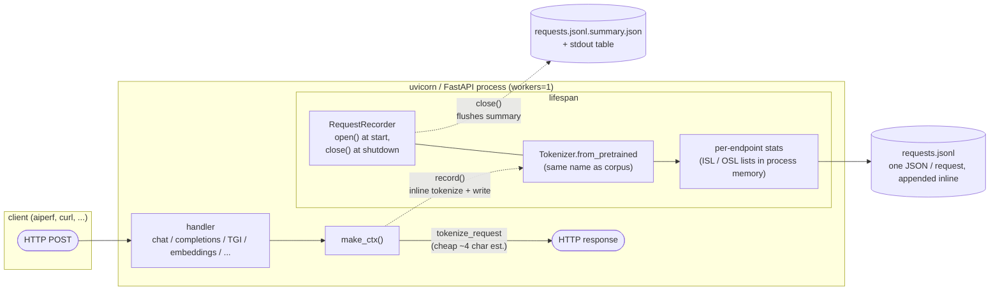

<!--
SPDX-FileCopyrightText: Copyright (c) 2025 NVIDIA CORPORATION & AFFILIATES. All rights reserved.
SPDX-License-Identifier: Apache-2.0
-->

# AIPerf Mock Server

A mock server for integration testing and performance benchmarking of LLM applications. Provides OpenAI-compatible APIs, multi-backend Prometheus metrics simulation, configurable latency, and deterministic responses.

## Features

- [**OpenAI API Compatibility**](#openai-compatible-endpoints): Chat completions, text completions, embeddings, model listing, and image generation
- [**Multi-Backend Ranking**](#ranking-endpoints): NVIDIA NIM, HuggingFace TEI, and Cohere reranking
- [**HuggingFace TGI Support**](#huggingface-tgi-endpoints): `/generate` and `/generate_stream` endpoints
- [**Prometheus Metrics**](#prometheus-metrics): vLLM, SGLang, TensorRT-LLM, and NVIDIA Dynamo backends
- [**GPU Telemetry**](#gpu-telemetry): Simulated DCGM metrics for multiple GPU types
- [**Configurable Latency**](#latency-options): TTFT, ITL, and per-endpoint latency models
- [**Reasoning Models**](#reasoning-models): GPT-OSS/Qwen-style reasoning with `reasoning_content`
- [**Error Injection**](#error-injection): Reproducible fault testing with configurable error rates
- [**Deterministic Responses**](#token-generation): Hash-based generation for identical outputs
- [**Fast Mode**](#quick-start): Zero-latency mode (`--fast`) for integration testing
- [**Corpus**](#corpus): Pre-tokenized corpus loaded from aiperf's shakespeare.txt for deterministic output
- [**Request Recording**](#request-recording): Per-request ISL + requested OSL capture with JSONL output and a shutdown summary

### Supported Endpoints

**Inference APIs**

| Endpoint | Description |
|----------|-------------|
| [`/v1/chat/completions`](#chat-completions) | OpenAI chat completions (streaming supported) |
| [`/v1/completions`](#text-completions) | OpenAI text completions (streaming supported) |
| [`/v1/embeddings`](#embeddings) | OpenAI embeddings (768-dim) |
| `/v1/images/generations` | OpenAI-compatible image generation |
| `/v1/image/infer` | Image inference / retrieval-style response |
| `/rag/api/prompt` | RAG prompt endpoint |
| `/v1/models` | OpenAI-compatible model listing |
| [`/v1/ranking`](#nvidia-nim-ranking) | NVIDIA NIM ranking |
| [`/rerank`](#huggingface-tei-rerank) | HuggingFace TEI reranking |
| [`/v2/rerank`](#cohere-rerank) | Cohere reranking |
| [`/generate`](#generate-non-streaming) | HuggingFace TGI generation |
| [`/generate_stream`](#generate-stream) | HuggingFace TGI streaming |
| [`/v1/custom-multimodal`](#custom-multimodal-endpoint) | Custom multimodal format |

**Prometheus Metrics**

| Endpoint | Description |
|----------|-------------|
| [`/metrics`](#prometheus-metrics) | Mock server metrics |
| [`/vllm/metrics`](#prometheus-metrics) | vLLM-compatible |
| [`/sglang/metrics`](#prometheus-metrics) | SGLang-compatible |
| [`/trtllm/metrics`](#prometheus-metrics) | TensorRT-LLM-compatible |
| [`/dynamo_frontend/metrics`](#prometheus-metrics) | Dynamo frontend |
| [`/dynamo_component/prefill/metrics`](#prometheus-metrics) | Dynamo prefill worker |
| [`/dynamo_component/decode/metrics`](#prometheus-metrics) | Dynamo decode worker |

**GPU Telemetry**

| Endpoint | Description |
|----------|-------------|
| [`/dcgm1/metrics`](#gpu-telemetry) | DCGM GPU metrics (instance 1) |
| [`/dcgm2/metrics`](#gpu-telemetry) | DCGM GPU metrics (instance 2) |

**Health & Info**

| Endpoint | Description |
|----------|-------------|
| [`/health`](#health--info) | Health check with config |
| [`/`](#health--info) | Server info and version |

## Installation

```bash
# From project root
make install-mock-server

# Or standalone
cd tests/aiperf_mock_server
uv pip install -e ".[dev]"
```

## Quick Start

```bash
# Start with defaults
aiperf-mock-server

# Or run as module
python -m aiperf_mock_server

# Fast mode for integration testing (zero latency)
aiperf-mock-server --fast

# Custom configuration
aiperf-mock-server --port 8080 --ttft 50 --itl 10

# Verbose logging
aiperf-mock-server -v
```

## Configuration

Configuration via CLI arguments or environment variables (`MOCK_SERVER_` prefix).

### Server Options

| Option | Short | Default | Description |
|--------|-------|---------|-------------|
| `--port` | `-p` | `8000` | Server port |
| `--host` | | `127.0.0.1` | Bind address |
| `--workers` | `-w` | `1` | Uvicorn worker count |
| `--fast` | `-f` | `false` | Zero latency mode |
| `--log-level` | | `INFO` | Logging level (DEBUG/INFO/WARNING/ERROR/CRITICAL) |
| `--verbose` | `-v` | `false` | Debug logging (overrides log-level) |
| `--access-logs` | | `false` | HTTP access logs |
| `--models-ready-delay-seconds` | | `0.0` | Delay before `/v1/models` reports loaded models |
| `--disable-models-endpoint` | | `false` | Return 404 from `/v1/models` to exercise fallback readiness probes |
| `--inference-ready-delay-seconds` | | `0.0` | Delay before inference endpoints stop returning HTTP 503 |
| `--api-key` | | `None` | API key required for inference endpoints; auth is disabled when unset |
| `--auth-header-name` | | `Authorization` | Header name checked when `--api-key` is set |

### Latency Options

| Option | Short | Default | Description |
|--------|-------|---------|-------------|
| `--ttft` | `-t` | `20.0` | Time to first token (ms) |
| `--itl` | | `5.0` | Inter-token latency (ms) |
| `--embedding-base-latency` | | `10.0` | Embedding base latency (ms) |
| `--embedding-per-input-latency` | | `2.0` | Per-input latency (ms) |
| `--ranking-base-latency` | | `10.0` | Ranking base latency (ms) |
| `--ranking-per-passage-latency` | | `1.0` | Per-passage latency (ms) |

### Error Injection

| Option | Default | Description |
|--------|---------|-------------|
| `--error-rate` | `0.0` | Error injection rate (0-100%) |
| `--random-seed` | `None` | Seed for reproducible errors |

### GPU Telemetry

| Option | Default | Description |
|--------|---------|-------------|
| `--dcgm-gpu-name` | `h200` | GPU model (`rtx6000`, `a100`, `h100`, `h100-sxm`, `h200`, `b200`, `gb200`) |
| `--dcgm-num-gpus` | `2` | Number of GPUs (1-8) |
| `--dcgm-auto-load` | `true` | Auto-scale DCGM load based on token throughput |
| `--dcgm-min-throughput` | `100` | Minimum baseline tokens/sec (auto-scales above) |
| `--dcgm-window-sec` | `1.0` | Throughput sliding window (0.1-60 seconds) |
| `--dcgm-hostname` | `localhost` | Hostname in metrics |
| `--dcgm-seed` | `None` | Seed for deterministic metrics |

### Tokenizer Options

| Option | Default | Description |
|--------|---------|-------------|
| `--tokenizer` | `builtin` | Tokenizer for corpus (and for the recorder, when enabled). `builtin` = bundled tiktoken `o200k_base` (zero network access); pass any HuggingFace name or path to use an HF tokenizer. |
| `--tokenizer-revision` | `main` | Tokenizer revision (branch, tag, or commit) |
| `--tokenizer-trust-remote-code` | `false` | Trust remote code for custom tokenizers |
| `--no-tokenizer` | `false` | Skip tokenizer, use character-based chunking (faster startup) |

### Request Recording Options

| Option | Default | Description |
|--------|---------|-------------|
| `--record-requests` | `None` | Path to a JSONL file for per-request ISL + requested OSL capture. Presence of this flag enables recording mode, forces `--workers=1`, and requires a real tokenizer (incompatible with `--no-tokenizer`). |

**Auto-Scaling GPU Metrics**

DCGM metrics automatically scale based on observed token throughput. The system tracks peak throughput and uses that as 100% load:

```text
Token Flow:
┌─────────────────┐
│  LLM Endpoint   │  (chat/completions)
└────────┬────────┘
         │
         ▼
┌─────────────────────┐
│  Token Generation   │  → record_streamed_token() / record_token_metrics()
└────────┬────────────┘
         │                ┌─────────────────────────────────────┐
         │                │ _token_events (1-sec sliding window)│
         │                │ throughput = tokens / window        │
         │                │ max_observed = max(max, throughput) │
         │                │ load = throughput / max_observed    │
         │                └────────┬────────────────────────────┘
         │                         │
         │                         ▼
         │                ┌──────────────────┐
         │                │  DCGMFaker(s)    │  → set_load(load)
         │                │  .generate()     │  → GPU metrics reflect load
         │                └──────────────────┘
         │
         ▼
┌─────────────────┐
│    Response     │
└─────────────────┘
```

**Behavior:**
- Tracks peak observed throughput automatically
- Current throughput / peak = GPU load percentage
- `--dcgm-min-throughput` sets a floor (prevents div-by-tiny-number during warmup)
- No manual tuning needed - adapts to your workload

### Environment Variables

```bash
export MOCK_SERVER_PORT=8080
export MOCK_SERVER_FAST=true
aiperf-mock-server
```

### Optional Inference Authentication

```bash
MOCK_SERVER_API_KEY=<your-mock-api-key> aiperf-mock-server

curl -X POST http://localhost:8000/v1/chat/completions \
  -H "Authorization: Bearer <your-mock-api-key>" \
  -H "Content-Type: application/json" \
  -d '{"model":"mock-model","messages":[{"role":"user","content":"Hello"}]}'
```

Use `--auth-header-name X-API-Key` or `MOCK_SERVER_AUTH_HEADER_NAME=X-API-Key` to check a custom header instead of `Authorization`.

## API Endpoints

### OpenAI-Compatible Endpoints

#### Chat Completions

**`POST /v1/chat/completions`**

```bash
curl -X POST http://localhost:8000/v1/chat/completions \
  -H "Content-Type: application/json" \
  -d '{
    "model": "gpt-4",
    "messages": [{"role": "user", "content": "Hello"}],
    "stream": false
  }'
```

**Parameters:**
- `model` (required): Model identifier
- `messages` (required): Array of `{role, content}` objects
- `max_completion_tokens` or `max_tokens`: Maximum output tokens
- `stream`: Enable streaming (default: false)
- `stream_options`: `{"include_usage": true}` for usage in stream
- `reasoning_effort`: `"low"` | `"medium"` | `"high"` (for reasoning models)
- `min_tokens`: Minimum tokens to generate
- `ignore_eos`: Generate exactly `max_tokens`

#### Text Completions

**`POST /v1/completions`**

```bash
curl -X POST http://localhost:8000/v1/completions \
  -H "Content-Type: application/json" \
  -d '{"model": "gpt-4", "prompt": "Hello world", "max_tokens": 50}'
```

**Parameters:**
- `model` (required): Model identifier
- `prompt` (required): String or array of strings
- `max_tokens`, `stream`, `stream_options`, `min_tokens`, `ignore_eos`: Same as chat

#### Embeddings

**`POST /v1/embeddings`**

Returns deterministic 768-dimensional embeddings based on input hash.

```bash
curl -X POST http://localhost:8000/v1/embeddings \
  -H "Content-Type: application/json" \
  -d '{"model": "text-embedding", "input": ["text1", "text2"]}'
```

**Parameters:**
- `model` (required): Model identifier
- `input` (required): String or array of strings

### Ranking Endpoints

Three ranking endpoint formats are supported:

#### NVIDIA NIM Ranking

**`POST /v1/ranking`**

```bash
curl -X POST http://localhost:8000/v1/ranking \
  -H "Content-Type: application/json" \
  -d '{
    "model": "reranker",
    "query": {"text": "query"},
    "passages": [{"text": "passage1"}, {"text": "passage2"}]
  }'
```

#### HuggingFace TEI Rerank

**`POST /rerank`**

```bash
curl -X POST http://localhost:8000/rerank \
  -H "Content-Type: application/json" \
  -d '{"query": "query", "texts": ["text1", "text2"]}'
```

#### Cohere Rerank

**`POST /v2/rerank`**

```bash
curl -X POST http://localhost:8000/v2/rerank \
  -H "Content-Type: application/json" \
  -d '{"query": "query", "documents": ["doc1", "doc2"]}'
```

### HuggingFace TGI Endpoints

#### Generate (Non-Streaming)

**`POST /generate`**

```bash
curl -X POST http://localhost:8000/generate \
  -H "Content-Type: application/json" \
  -d '{"inputs": "Hello world", "parameters": {"max_new_tokens": 50}}'
```

#### Generate Stream

**`POST /generate_stream`**

```bash
curl -N -X POST http://localhost:8000/generate_stream \
  -H "Content-Type: application/json" \
  -d '{"inputs": "Hello world", "parameters": {"max_new_tokens": 50}}'
```

### Custom Multimodal Endpoint

**`POST /v1/custom-multimodal`**

Example custom format for testing non-standard APIs:

```bash
curl -X POST http://localhost:8000/v1/custom-multimodal \
  -H "Content-Type: application/json" \
  -d '{
    "modality_bundle": {
      "text_fragments": ["text1"],
      "visual_assets": {"images": [], "videos": []},
      "audio_streams": []
    },
    "inference_params": {"model_id": "multimodal-model"}
  }'
```

### Health & Info

| Endpoint | Description |
|----------|-------------|
| `GET /health` | Health check with config |
| `GET /` | Server info and version |

### GPU Telemetry

**`GET /dcgm1/metrics`** and **`GET /dcgm2/metrics`**

DCGM metrics in Prometheus format:
- GPU utilization, power, temperature
- Memory usage (used/free/total)
- Clock frequencies, energy consumption
- Violations and XID errors

### Prometheus Metrics

Multiple endpoints simulate different LLM backends:

| Endpoint | Backend |
|----------|---------|
| `GET /metrics` | Mock server metrics |
| `GET /vllm/metrics` | vLLM-compatible |
| `GET /sglang/metrics` | SGLang-compatible |
| `GET /trtllm/metrics` | TensorRT-LLM-compatible |
| `GET /dynamo_frontend/metrics` | NVIDIA Dynamo frontend |
| `GET /dynamo_component/prefill/metrics` | Dynamo prefill worker |
| `GET /dynamo_component/decode/metrics` | Dynamo decode worker |

**Example metrics:**
- Request latency histograms
- Token counts (prompt/completion)
- In-flight request gauges
- TTFT and ITL distributions

## Behavior Details

### Latency Models

**LLM Endpoints** (`/v1/chat/completions`, `/v1/completions`, `/v1/custom-multimodal`):
- Streaming: TTFT delay before first token, ITL between subsequent tokens
- Non-streaming: TTFT + (ITL × token_count)

**Embeddings**: `base_latency + (per_input_latency × num_inputs)`

**Rankings**: `base_latency + (per_passage_latency × num_passages)`

**TGI Endpoints**: Uses TTFT/ITL model like LLM endpoints

**Fast Mode** (`--fast`): Sets all latencies to zero.

### Token Generation

- Character-based tokenizer (~4 chars/token)
- Output tokens generated by cycling through input tokens
- Deterministic: identical inputs produce identical outputs

| Scenario | Behavior | Finish Reason |
|----------|----------|---------------|
| No `max_tokens` | 0.8-1.2× prompt length (min 16) | `stop` |
| `max_tokens` set | Up to limit, respects `min_tokens` | `length` or `stop` |
| `ignore_eos=true` | Exactly `max_tokens` | `length` |

### Reasoning Models

Models with `gpt-oss` or `qwen` in the name support reasoning:
- Generates `reasoning_content` before main output
- Tokens count toward `max_tokens` budget
- Effort: `low`=100, `medium`=250 (default), `high`=500 tokens

### Error Injection

When `--error-rate` is set, requests randomly fail with HTTP 500. Use `--random-seed` for reproducible error sequences.

## Saturation modeling (design B)

By default, the mock server uses an **open-loop latency model**: every request sleeps for `ttft + itl * num_tokens` (with optional concurrency penalties layered on). This produces a smooth latency curve but no real saturation knee — throughput scales linearly with concurrency.

For testing adaptive search and Pareto-front planners, enable the **batched step scheduler**:

```bash
aiperf-mock-server \
  --scheduler-enabled \
  --scheduler-step-ms 5 \
  --scheduler-max-batch-size 256 \
  --scheduler-max-prefill-chunks-per-step 8 \
  --scheduler-prefill-chunk-tokens 512
```

### What it models

- A virtual decode loop ticking every `step_ms`. Per tick, up to `max_batch_size` decoders advance one token; surplus decoders wait one or more ticks.
- A separate prefill chunk pool. A prompt of `P` tokens splits into `ceil(P / prefill_chunk_tokens)` chunks; each chunk consumes one of the `max_prefill_chunks_per_step` per-tick slots.

### Knee math

- **Decode-token rate ceiling:** `max_batch_size / step_ms` tokens/sec. With defaults: `256 / 0.005 = 51,200 tok/s`.
- **Concurrency knee:** `~max_batch_size`. Past that, every additional decoder linearly stretches all decoders' ITL.
- **Prefill cliff:** TTFT spikes when `max_prefill_chunks_per_step` is the binding constraint. Tune low to test prefill-bound regimes.

### Knob recipes

| Goal | Settings |
|---|---|
| Knee at concurrency=32, fast iteration | `--scheduler-max-batch-size 32 --scheduler-step-ms 5` |
| Prefill-bound regime (TTFT cliffs first) | `--scheduler-max-prefill-chunks-per-step 1 --scheduler-prefill-chunk-tokens 256` |
| Sharp Pareto front (TTFT vs throughput) | combine prefill-bound + small `max-batch-size` |

### Composition with other knobs

The structural scheduler-driven latency is **additive** with the per-request penalty knobs (`ttft_per_isl_token_ms`, `ttft_concurrency_quad_ms`, `itl_per_osl_token_ms`, `itl_concurrency_lin_ms`). Those penalties layer on top of scheduler waits when both are set; in default scheduler config the penalties are 0 and only the scheduler decides timing.

### Goodput collapse past the knee

By default, the scheduler simply queues excess decoders past `max_batch_size` and aggregate throughput plateaus. Real continuous-batching servers exhibit *goodput collapse* under heavy oversubscription: preemption thrash, swap, and admission churn drop the *useful* tok/s once the queue grows too large. Enable this with `--scheduler-goodput-collapse-enabled`:

```bash
aiperf-mock-server \
  --scheduler-enabled \
  --scheduler-max-batch-size 64 \
  --scheduler-goodput-collapse-enabled \
  --scheduler-goodput-collapse-threshold 1.5 \
  --scheduler-goodput-collapse-slope 0.5 \
  --scheduler-goodput-collapse-floor 0.3
```

Effective per-step admit budget shrinks linearly past the threshold:

- `ratio = decode_queue_len / max_batch_size`
- `overload = max(0, ratio - threshold)`
- `shrink = min(1 - floor, overload * slope)`
- `effective_batch = max(1, max_batch_size * (1 - shrink))`

With the defaults above, at 3× oversubscription the effective batch is `64 * (1 - min(0.7, 0.75)) = 64 * 0.3 ≈ 19`, so `tok/s` measured by the client *drops* past the knee instead of plateauing — exactly what knee-finding sweep recipes need to learn the right side of the cliff.

### Latency jitter

Open-loop and scheduler modes both support lognormal-distributed jitter, sampled fresh per token for ITL and once per request for TTFT:

```bash
aiperf-mock-server --ttft-jitter-cv 0.2 --itl-jitter-cv 0.15
```

`--ttft-jitter-cv 0.2` adds ~20% TTFT noise (lognormal mean stays at 1.0). In open-loop mode jitter is symmetric (samples can be faster or slower than nominal); in scheduler mode it is positive-only (`max(0, factor − 1) × base`) since the scheduler enforces a structural floor. Combine with `--random-seed N` for reproducible noise traces across re-runs. This is the single most useful knob for testing whether sweep recipes converge under realistic per-request variance.

### Client disconnects

When a streaming client (HTTP/SSE consumer) disconnects mid-response, the mock server now:

- Removes the request's pending waiters from the scheduler's decode and prefill queues so they don't artificially inflate queue depth (and thus goodput-collapse / oversubscription accounting).
- Increments the `dynamo_frontend_disconnected_clients{model="…"}` Prometheus counter so search recipes can verify their cancellation behavior.
- Wakes any orphaned waiters cleanly so the scheduler tick loop has no leaked references.

No CLI knob — this is always-on. Streaming success paths set a `_finished` flag before the final `[DONE]` sentinel so a consumer that breaks immediately after `[DONE]` does not get spuriously counted as a disconnect.

### Limitations

- Single-process only: `--workers > 1` runs each worker with an independent scheduler (no cross-worker batching).
- No KV-block accounting, no preemption, no swap. For those, see design C (deferred).

## Request Recording

Used to verify that an aiperf run actually generates the requested ISL / OSL distribution on the wire. When `--record-requests PATH` is set, the server tokenizes every incoming request inline with the configured `--tokenizer` and appends one JSONL record per request. Chat requests are counted from the framework-shaped prompt: `prompt_token_ids` if supplied, otherwise `tokenizer.apply_chat_template(..., tokenize=True, add_generation_prompt=True)` when the tokenizer supports it. Completion requests follow vLLM / trtllm-serve shape: `prompt` may be text, a list of text prompts, a token-id list, or a list of token-id lists; token-id prompts are counted directly and recorded as `prompt_token_ids`. Tokenizers without chat templates (including `builtin`) use a role-preserving fallback and record that mode explicitly. On shutdown it writes a per-endpoint distribution summary to `<PATH>.summary.json` (and prints the same summary to stdout).



**Properties:**

- The recorder lives in the FastAPI lifespan; tokenization and the JSONL append both run on the event loop in `make_ctx`. Real HF `tokenizer.encode()` is fast (sub-ms for typical prompts), and `--workers=1` means there is exactly one producer — no locking, no queue, no subprocess.
- The recorder reuses the configured `--tokenizer` rather than introducing a separate one, so ISL counts match whatever vocab the corpus is using. For chat models with HuggingFace chat templates, this mirrors trtllm-serve's prompt-token path instead of counting only user-message text.
- `--record-requests` rejects `--no-tokenizer` at config validation time, since recording with no tokenizer is incoherent.
- `--record-requests` forces `--workers=1` because per-request stats are kept in process memory and need a single producer to attribute cleanly to one output file.

**Output format** — one JSON object per line, capturing the full OSL fingerprint the client sent (not just the resolved cap):

```json
{"ts": 1714000000.123, "request_id": "chatcmpl-...", "endpoint": "/v1/chat/completions",
 "model": "Qwen/Qwen3-0.6B", "isl": 512,
 "requested_osl": 256, "max_tokens": null, "max_completion_tokens": 256,
 "min_tokens": null, "ignore_eos": false, "reasoning_effort": null,
 "stream": true, "tokenization_mode": "chat_template"}
```

| Field | Meaning |
|---|---|
| `isl` | Real tokenized length of the assembled prompt (always populated). |
| `requested_osl` | Resolved OSL cap: `max_completion_tokens or max_tokens` for chat, `max_tokens` for completions, `parameters.max_new_tokens` for TGI. `null` for embeddings/ranking/image retrieval. |
| `max_tokens` / `max_completion_tokens` | The raw fields the client sent — useful to see which API name-space they used. TGI's `max_new_tokens` is recorded under `max_tokens` so the schema stays uniform. |
| `min_tokens` | Floor on generated tokens (vllm/SGLang). |
| `ignore_eos` | If `true`, server generates exactly `max_tokens`. |
| `reasoning_effort` | `low`/`medium`/`high` for reasoning models — adds a reasoning budget on top of the main output. |
| `stream` | Whether the request asked for streaming. |
| `tokenization_mode` | How ISL was counted: `prompt_token_ids`, `chat_template`, `chat_template_string`, `chat_template_fallback`, `tokenizer_call`, `encode_without_special_tokens`, or `plain_text_encode` for the low-level recorder API. |

> **Note on `chat_template_fallback` ISL drift.** When the tokenizer has no chat template (e.g. `builtin` tiktoken) the recorder renders messages as literal ChatML — `<|im_start|>role\n...<|im_end|>` — and tokenizes that string without special-token handling. Each role marker becomes ~5 raw tokens instead of the single token a real chat template would produce, so a `chat_template_fallback` ISL is inflated by roughly *5 × (2N + 1)* tokens for an N-message conversation. The `tokenization_mode` field on every JSONL row tells you which path was used; compare rows with the same mode when validating `--isl-mean` against ground truth.

**Summary** — `<PATH>.summary.json` and stdout, per endpoint:

```text
Request distribution (200 requests)
──────────────────────────────────────────────
  Definitions
    ISL/OSL: input/requested output sequence length in tokens; OSL is the request cap, not generated output.
    Vocab used: unique token IDs observed / tokenizer vocab size.
    top-10 cover: share of prompt tokens from the 10 most common token IDs.
    entropy: token-id diversity; higher means broader prompt vocabulary use.
    top decoded tokens: most frequent token IDs decoded for sanity checks; tokens are not words.
    vocab shape: log-scaled 80-bucket view across token-id space.
    vocab shape stats: mean/percentiles of prompt-token counts per bucket, including empty buckets.

  /v1/completions  n=200
    ISL            mean  1050.6   min   416   max  1703   p50  1042   p99  1694
    Requested OSL  mean   527.8   min   216   max   896   p50   522   p99   814

    ISL histogram (13 bins, n=200, 181 unique)
       416-  515    2 █░░░░░░░░░░░░░░░░░░░
       515-  614    0 ░░░░░░░░░░░░░░░░░░░░
       614-  713   14 ████████░░░░░░░░░░░░
       713-  812   18 ██████████░░░░░░░░░░
       812-  911   29 ████████████████░░░░
       911- 1010   25 ██████████████░░░░░░
      1010- 1109   36 ████████████████████
      1109- 1208   21 ████████████░░░░░░░░
      1208- 1307   23 █████████████░░░░░░░
      1307- 1406   15 ████████░░░░░░░░░░░░
      1406- 1505    8 ████░░░░░░░░░░░░░░░░
      1505- 1604    6 ███░░░░░░░░░░░░░░░░░
      1604- 1703    3 ██░░░░░░░░░░░░░░░░░░

    Requested OSL histogram (10 bins, n=200, 166 unique)
      216- 284    2 █░░░░░░░░░░░░░░░░░░░
      284- 352   12 █████░░░░░░░░░░░░░░░
      352- 420   26 ███████████░░░░░░░░░
      420- 488   34 ██████████████░░░░░░
      488- 556   48 ████████████████████
      556- 624   33 ██████████████░░░░░░
      624- 692   29 ████████████░░░░░░░░
      692- 760   10 ████░░░░░░░░░░░░░░░░
      760- 828    4 ██░░░░░░░░░░░░░░░░░░
      828- 896    2 █░░░░░░░░░░░░░░░░░░░


    Vocab  used 11991/128000 (9.4%)  top-10 cover 14%  entropy 10.6/17.0 bits
      top decoded tokens: " the" 4452, " I" 3969, " and" 3523, " of" 3119, " to" 3070

    vocab shape  (80 buckets over id 0..127999, log-y)

      bucket tokens mean  2623.9   p50   470   p90  2931   p95  6572   p99 40006

    ██▇▇▇▆▆▆▆▆▆▆▆▆▆▆▆▆▅▅▅▆▅▅▅▆▅▅▅▅▅▅▅▅▅▅▅▅▄▅▅▅▅▅▄▅▅▅▄▄▄▅▅▅▅▅▅▄▅▄▄▅▄▁▂ ▁▁▁▁▁▂▁▁▁▃▁▂▁
    0                   32K                 64K                 96K             128K
```

For each endpoint the JSON file contains:
- `count`, `streamed_count`, `ignore_eos_count`, `reasoning_effort_counts` (categorical tallies).
- Quantile blocks for `isl`, `requested_osl`, and `min_tokens`. A block is `null` when no request set that field. Each block contains:
  - `min`, `max`, `mean`, `stdev`, `p50`, `p90`, `p95`, `p99`
  - `unique_values` — count of distinct values observed for this metric.
  - `histogram` — equal-width histogram with parallel `bin_edges` (length N+1) and `counts` (length N). `null` when no values were observed (e.g. `requested_osl` on embeddings). Bucket count: `num_bins = max(10, ceil((max - min) / 100))`.

Example quantile block:

```json
"isl": {
  "min": 207.0, "max": 1821.0, "mean": 1010.48, "stdev": 480.80,
  "p50": 997.5, "p90": 1684.8, "p95": 1745.55, "p99": 1819.02,
  "unique_values": 19,
  "histogram": {
    "bin_edges": [207.0, 301.94, 396.88, 491.82, 586.76, 681.71, 776.65,
                  871.59, 966.53, 1061.47, 1156.41, 1251.35, 1346.29,
                  1441.24, 1536.18, 1631.12, 1726.06, 1821.0],
    "counts":    [7, 6, 5, 4, 6, 8, 7, 10, 11, 9, 8, 6, 5, 4, 3, 1, 0]
  }
}
```

The optional `vocab_distribution` block (per endpoint) characterises sampling across the tokenizer's vocabulary: coverage of distinct ids, top-N concentration, Shannon entropy with the uniform-sampling ceiling for comparison, an 80-bucket sparkline across the full id space, per-bucket shape statistics, and the full `token_id -> count` frequency table for offline analysis. The block is `null` when no requests reached the endpoint.

```json
"vocab_distribution": {
  "vocab_size": 151936,
  "vocab_size_source": "tokenizer",
  "unique_ids": 5234,
  "coverage_pct": 3.44,
  "total_tokens": 102000,
  "top_10_concentration_pct": 47.21,
  "entropy_bits": 8.23,
  "max_entropy_bits": 17.21,
  "top_tokens": [
    {"id": 264, "text": " the", "count": 3201},
    {"id": 318, "text": " a",   "count": 2890}
  ],
  "shape_80": [3201, 412, 311, 0, 47, "..."],
  "shape_80_stats": {
    "min": 0.0, "max": 3201.0, "mean": 1275.0, "stdev": 840.22,
    "p50": 14.0, "p90": 2455.0, "p95": 2890.0, "p99": 3201.0
  },
  "frequencies": {"264": 3201, "318": 2890, "...": 0}
}
```

Stats come from stdlib `statistics` — no numpy/pandas dependency.

**Example end-to-end run:**

```bash
aiperf-mock-server --record-requests /tmp/req.jsonl --fast &
aiperf profile \
    --endpoint-type chat \
    --url http://localhost:8000 \
    --model Qwen/Qwen3-0.6B \
    --random-range-ratio 0.2 --isl-mean 1024 --osl-mean 256 \
    --request-count 200
kill %1     # graceful shutdown: worker flushes JSONL + summary
cat /tmp/req.jsonl.summary.json
python -c "import pandas as pd; print(pd.read_json('/tmp/req.jsonl', lines=True).describe())"
```

## Project Structure

```text
tests/aiperf_mock_server/
├── __main__.py             # CLI entry point
├── app.py                  # FastAPI application and endpoints
├── config.py               # Configuration (CLI, env vars)
├── models.py               # Pydantic request/response models
├── tokens.py               # Tokenization and generation
├── utils.py                # Request context, streaming, latency
├── request_recorder.py     # In-process per-request ISL/OSL recorder + summary
├── metrics.py              # Prometheus metric definitions
├── metrics_utils.py        # Metric recording helpers
├── dcgm_faker.py           # GPU telemetry simulation
├── scheduler.py            # Step-based batched scheduler
├── test_scheduler.py
├── test_scheduler_integration.py
├── test_robustness.py
└── README.md
```

## Examples

### Streaming with Usage

```bash
curl -N -X POST http://localhost:8000/v1/chat/completions \
  -H "Content-Type: application/json" \
  -d '{
    "model": "gpt-4",
    "messages": [{"role": "user", "content": "Explain machine learning"}],
    "stream": true,
    "stream_options": {"include_usage": true}
  }'
```

### Reasoning Model

```bash
curl -X POST http://localhost:8000/v1/chat/completions \
  -H "Content-Type: application/json" \
  -d '{
    "model": "openai/gpt-oss-120b",
    "messages": [{"role": "user", "content": "Solve: What is 2+2?"}],
    "reasoning_effort": "high",
    "max_completion_tokens": 1000
  }'
```

### Custom Latency

```bash
# Slow embeddings
aiperf-mock-server --embedding-base-latency 50 --embedding-per-input-latency 10

# Fast rankings
aiperf-mock-server --ranking-base-latency 5 --ranking-per-passage-latency 0.5
```

### Error Injection

```bash
aiperf-mock-server --error-rate 10 --random-seed 42
```

### Multi-GPU Simulation

```bash
# 8 A100 GPUs with auto-scaling load
aiperf-mock-server --dcgm-num-gpus 8 --dcgm-gpu-name a100
```
